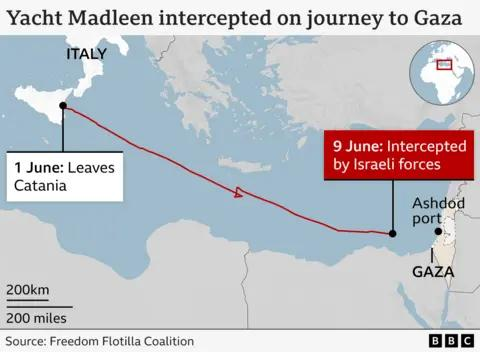

## Claim
Claim: " This is an authentic image of Greta Thunberg from November 2024 holding a sign reading, 'Fuck Israel'."

## Actions
```
image_search("Greta Thunberg sign fuck Israel")
web_search("Greta Thunberg controversy Israel")
```

## Evidence
### Evidence from `image_search`
The Telegraph published a video on December 10, 2024, showing Greta Thunberg at a demonstration in Germany where she said, "And f--- Israel!" () The Guardian published an article on June 1, 2025, about Greta Thunberg joining an aid ship sailing to Gaza ().

*   [https://www.telegraph.co.uk/world-news/2024/12/10/watch-greta-thunberg-declares-f-israel-german-demonstration/](https://www.telegraph.co.uk/world-news/2024/12/10/watch-greta-thunberg-declares-f-israel-german-demonstration/)
*   [https://en.wikipedia.org/wiki/Greta\_Thunberg](https://en.wikipedia.org/wiki/Greta_Thunberg)
*   [https://www.theguardian.com/environment/2025/jun/01/greta-thunberg-joins-aid-ship-sailing-to-gaza-aimed-at-breaking-israels-blockade](https://www.theguardian.com/environment/2025/jun/01/greta-thunberg-joins-aid-ship-sailing-to-gaza-aimed-at-breaking-israels-blockade)


### Evidence from `web_search`
The BBC ([https://www.bbc.com/news/articles/c5y264x3nnno](https://www.bbc.com/news/articles/c5y264x3nnno)), PBS News ([https://www.pbs.org/newshour/world/israel-deports-greta-thunberg-after-seizing-of-gaza-bound-ship](https://www.pbs.org/newshour/world/israel-deports-greta-thunberg-after-seizing-of-gaza-bound-ship)), and The Guardian ([https://www.theguardian.com/world/2025/jun/10/greta-thunberg-accuses-israel-of-kidnapping-yacht-crew-gaza](https://www.theguardian.com/world/2025/jun/10/greta-thunberg-accuses-israel-of-kidnapping-yacht-crew-gaza)) reported that Greta Thunberg was deported by Israel in June 2025 after being intercepted on a Gaza-bound aid boat. Thunberg accused Israel of kidnapping her and other activists. The articles include images of Thunberg in Paris , on a plane , and on the aid ship , , as well as at the airport .

The BBC article also includes a map  and other images , .


## Elaboration
The evidence confirms that Greta Thunberg has expressed anti-Israel sentiments. Specifically, a video from December 2024 shows her saying, "And f--- Israel!" Additionally, in June 2025, she was deported by Israel after being intercepted on a Gaza-bound aid boat. However, the evidence does not include an image of Thunberg holding a sign that says "Fuck Israel." Therefore, the claim cannot be verified.


## Final Judgement
The evidence confirms that Greta Thunberg has expressed anti-Israel sentiments, but there is no evidence to support the claim that she held a sign that said "Fuck Israel."

`false`

### Verdict: FALSE

### Justification
The claim is not supported by the evidence. While Greta Thunberg has expressed anti-Israel sentiments, including saying "And f--- Israel!" in December 2024, and being deported from Israel in June 2025, there is no evidence to support the specific image of her holding a sign that says "Fuck Israel."
