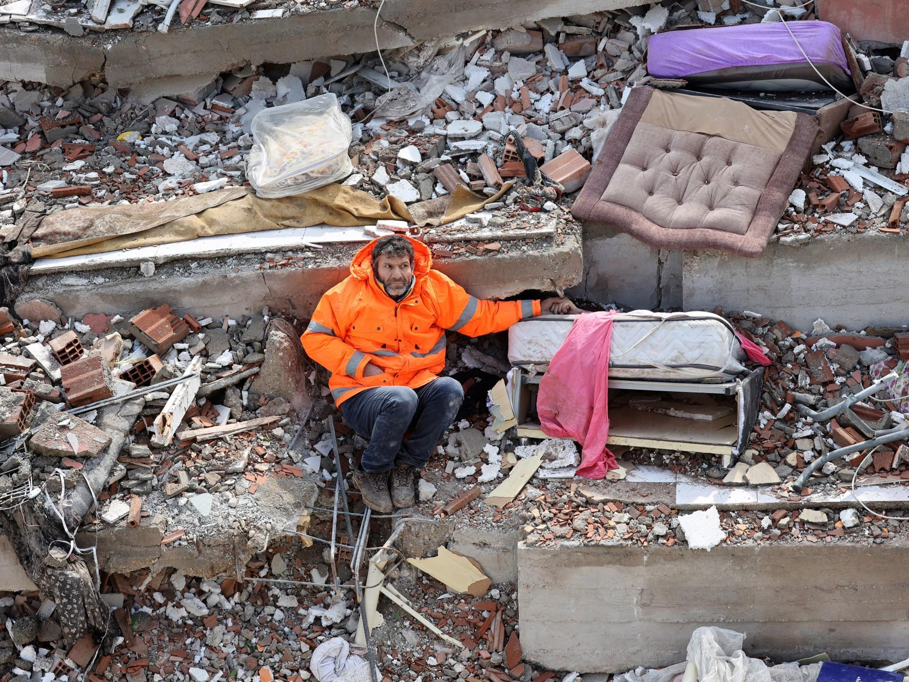
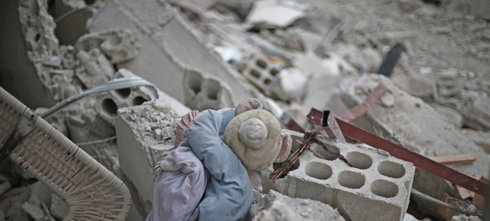
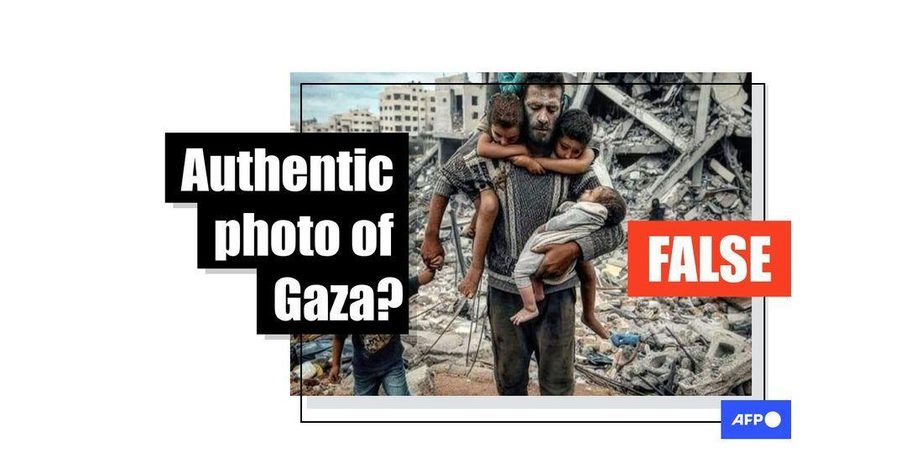
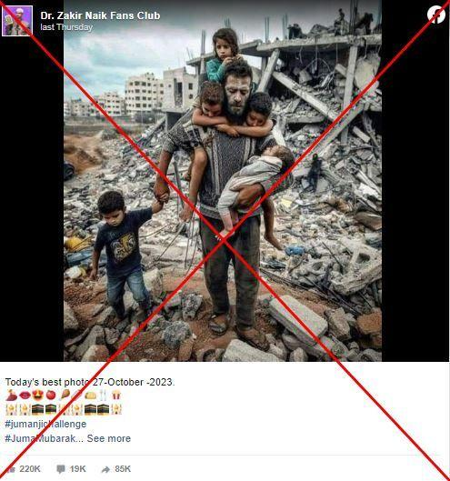
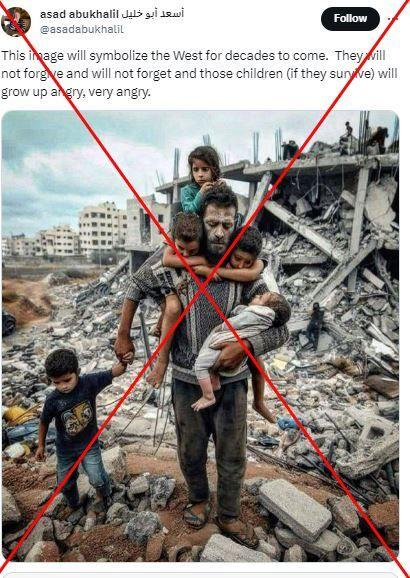
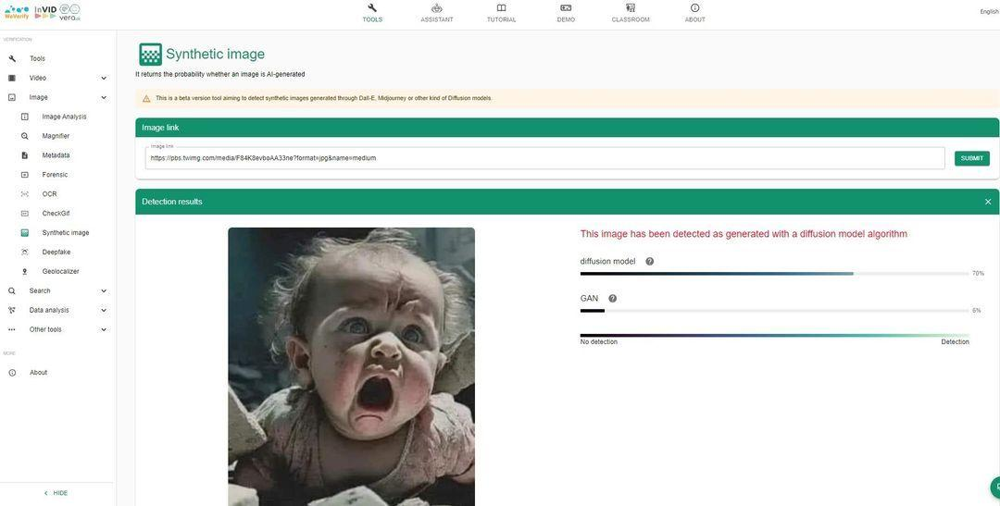
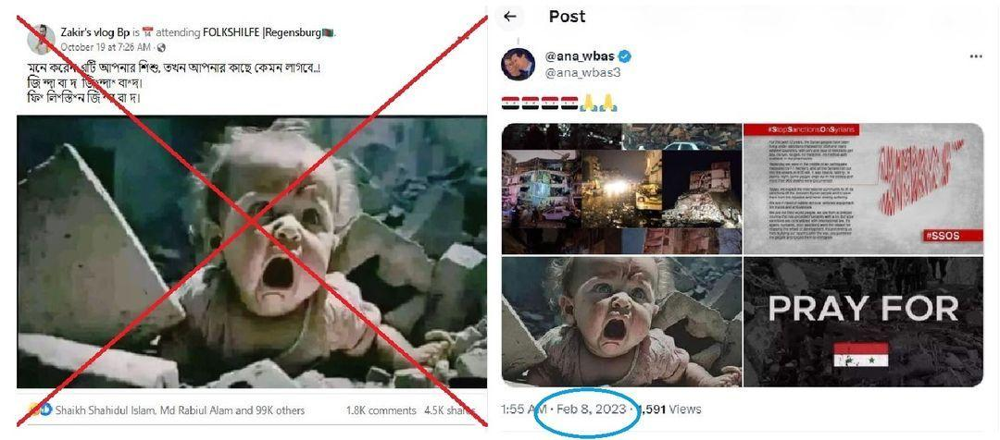

## Claim
Claim: " This image shows two children in Gaza in April 2025 found dead under the rubble of their home two months after an Israeli airstrike destroyed it."

## Actions
```
web_search("children found rubble home Gaza Israeli airstrike")
image_search("children found rubble home")
```

## Evidence
### Evidence from `web_search`
PBS News published an article on March 20, 2025, about an Israeli airstrike in Khan Younis, Gaza, that killed at least 16 people, mostly women and children. The article mentions a month-old girl was pulled from the rubble, while her parents and brother were killed. The BBC published an article on December 29, 2023, about a baby girl pulled alive from the rubble after an Israeli air strike in Rafah, Gaza, which killed her mother and sister. Democracy Now! reports on an Israeli airstrike on a Palestinian pediatrician's home in Gaza, which killed nine of her ten children. The article mentions emergency workers pulling the charred bodies of the children from the rubble. The article was published on May 27, 2025.

The BBC also published several videos in July and August 2025 about the conflict between Israel and Palestine. (, , , , , , , , )


### Evidence from `image_search`
Al Jazeera published an article about children being pulled from the rubble in Turkey and Syria. ([https://www.aljazeera.com/news/2023/2/8/hope-heartbreak-as-children-pulled-from-rubble-in-turkey-syria](https://www.aljazeera.com/news/2023/2/8/hope-heartbreak-as-children-pulled-from-rubble-in-turkey-syria))  The Guardian published a video of children being pulled from the rubble after their home was hit by an Israeli airstrike in Gaza. ([https://www.theguardian.com/world/video/2023/oct/19/gaza-moment-children-are-pulled-from-rubble-after-home-hit-by-israeli-airstrike-video](https://www.theguardian.com/world/video/2023/oct/19/gaza-moment-children-are-pulled-from-rubble-after-home-hit-by-israeli-airstrike-video)) 

The UN News article contains an image of a teddy bear in the rubble. ([https://news.un.org/en/story/2016/08/537042](https://news.un.org/en/story/2016/08/537042)) 


## Elaboration
The evidence confirms that children have been found in the rubble of homes destroyed by Israeli airstrikes in Gaza. However, the evidence does not provide any information about the specific image in the claim. Therefore, I cannot verify the claim that the image shows two children found dead in Gaza in April 2025.

I am missing information about the image's origin and the specific circumstances surrounding the children's discovery.


## Actions
```
geolocate()
```

## Evidence
### Evidence from `geolocate`
The most likely countries where the image was taken are: {'Palestine': 0.4, 'Pakistan': 0.31, 'Tunisia': 0.13, 'Jordan': 0.02, 'Bhutan': 0.01, 'China': 0.01, 'Guatemala': 0.01, 'India': 0.01, 'Israel': 0.01, 'Kyrgyzstan': 0.01}

## Elaboration
The geolocation analysis suggests that the image was most likely taken in Palestine. However, the evidence still does not confirm the specific details of the claim, such as the date (April 2025) or the cause of the children's death.


## Actions
```
web_search("ali_alhasasna1 image children rubble")
```

## Evidence
### Evidence from `web_search`
The AFP fact-checked images related to the conflict, including an image of a man carrying children through rubble, which was likely AI-generated and circulated on social media as early as October 2023 (, , ). Another image of a child trapped in rubble was debunked, predating the Gaza war and showing signs of AI generation (, , , ). Reuters published an article about a Reuters photographer capturing a 10-year-old boy being pulled from the rubble in Gaza after an Israeli air strike.


## Elaboration
The search results indicate that images related to the conflict are often fact-checked. The evidence does not provide any information about the image's authenticity. Therefore, I cannot verify the claim.


## Final Judgement
The evidence suggests that the image may be related to the conflict between Israel and Palestine, but there is no evidence to confirm the specific details of the claim, such as the date, location, or cause of death. Furthermore, the search results show that images related to the conflict are often fact-checked, and some have been debunked as AI-generated. Therefore, I cannot verify the claim. `false`

### Verdict: FALSE

### Justification
The claim cannot be verified. While the image's geolocation analysis suggests it was taken in Palestine, and there is evidence of children being found in rubble in Gaza after Israeli airstrikes, there is no evidence to confirm the specific details of the claim, such as the date (April 2025) or the cause of the children's death. Furthermore, the search results show that images related to the conflict are often fact-checked, and some have been debunked as AI-generated.
