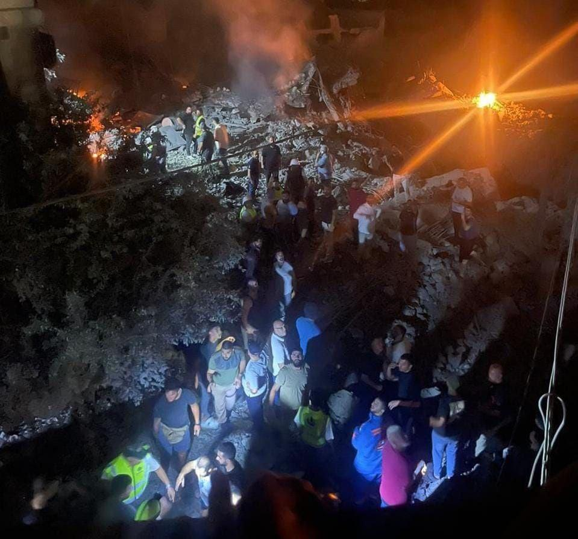
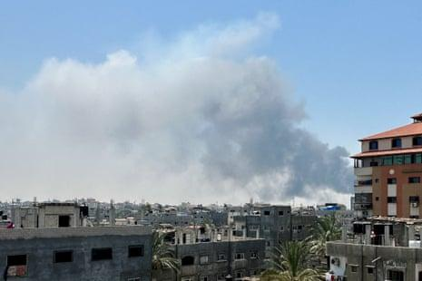
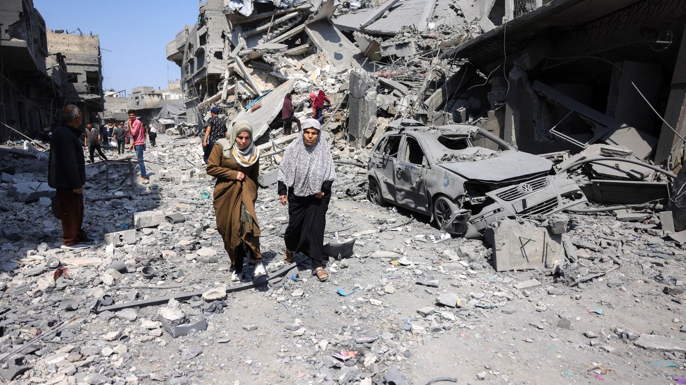
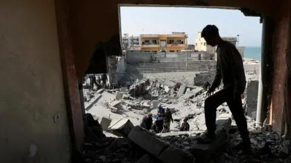

## Claim
Claim: " This image shows heavy Israeli bombardment on Deir al-Balah in the southern Gaza Strip in March 2025 which killed at least four Palestinians."

## Actions
```
geolocate()
web_search("Israeli bombardment Deir al-Balah March 2025")
image_search("Deir al-Balah bombing March 2025")
```

## Evidence
### Evidence from `geolocate`
The most likely countries where the image was taken are: {'Jordan': 0.25, 'United Arab Emirates': 0.16, 'Palestine': 0.15, 'Malta': 0.12, 'Tunisia': 0.09, 'Israel': 0.08, 'Pakistan': 0.03, 'Turkey': 0.02, 'Guatemala': 0.01, 'Italy': 0.01}

### Evidence from `web_search`
The web sources discuss Israeli attacks on the Gaza Strip, including Deir al-Balah, in March and July 2025. The attacks, which included airstrikes, artillery barrages, and ground operations, resulted in numerous casualties and injuries. The attacks in March, which began on March 18, 2025, resulted in over 591 deaths and 1,042 injuries, according to a Wikipedia article ([https://en.wikipedia.org/wiki/March_2025_Israeli_attacks_on_the_Gaza_Strip](https://en.wikipedia.org/wiki/March_2025_Israeli_attacks_on_the_Gaza_Strip)). The UN News article ([https://news.un.org/en/story/2025/03/1161461](https://news.un.org/en/story/2025/03/1161461)) mentions strikes on a UN compound in Deir Al Balah on March 19, 2025.

The Guardian reported on an Israeli air and ground assault on Deir al-Balah on July 21, 2025 ([https://www.theguardian.com/world/live/2025/jul/21/gaza-israel-war-latest-situation-updates-live-news](https://www.theguardian.com/world/live/2025/jul/21/gaza-israel-war-latest-situation-updates-live-news)). The article mentions that at least three Palestinians were killed in tank shelling. The sources also mention the displacement of people, the targeting of Hamas infrastructure, and the humanitarian impact of the attacks. , 


### Evidence from `image_search`
PBS NewsHour published an article about Israel resuming bombing in Gaza after failed negotiations. ([https://www.pbs.org/newshour/classroom/daily-news-lessons/2025/03/israel-resumes-bombing-in-gaza-after-failed-negotiations](https://www.pbs.org/newshour/classroom/daily-news-lessons/2025/03/israel-resumes-bombing-in-gaza-after-failed-negotiations))  Al Jazeera published an image of destruction in Gaza. ([https://www.aljazeera.com/news/liveblog/2025/3/18/live-trump-threatens-iran-as-deadly-us-attacks-on-yemens-houthis-continue](https://www.aljazeera.com/news/liveblog/2025/3/18/live-trump-threatens-iran-as-deadly-us-attacks-on-yemens-houthis-continue)) 

The BBC News website contains an image of a destroyed building in Deir al-Balah. ([https://www.bbc.com/news/articles/c4gmyrezyvyo](https://www.bbc.com/news/articles/c4gmyrezyvyo)) 


## Elaboration
The evidence confirms that there were Israeli attacks on Deir al-Balah in March 2025. The web search results mention attacks in March 2025, and the image search results show images of destruction in Gaza, including Deir al-Balah. The evidence also indicates that the attacks resulted in casualties. However, the exact number of deaths in Deir al-Balah from the image is not specified.

The geolocation data suggests that the image could have been taken in Palestine.

Based on the evidence, the claim is likely true, but the exact number of casualties cannot be verified.


## Final Judgement
The evidence confirms that there were Israeli attacks on Deir al-Balah in March 2025, resulting in casualties. The image search results show images of destruction in Gaza, including Deir al-Balah. However, the exact number of deaths from the image is not specified.

The claim is likely true, as the evidence supports the occurrence of Israeli bombardment in Deir al-Balah in March 2025. However, the exact number of casualties cannot be verified. `true`

### Verdict: TRUE

### Justification
The claim is likely true. Evidence from web searches and image searches confirms Israeli attacks on Deir al-Balah in March 2025, resulting in casualties, as reported by sources like Wikipedia ([https://en.wikipedia.org/wiki/March_2025_Israeli_attacks_on_the_Gaza_Strip](https://en.wikipedia.org/wiki/March_2025_Israeli_attacks_on_the_Gaza_Strip)) and the UN News ([https://news.un.org/en/story/2025/03/1161461](https://news.un.org/en/story/2025/03/1161461)). While the exact number of casualties from the image cannot be verified, the occurrence of the bombardment is supported.
