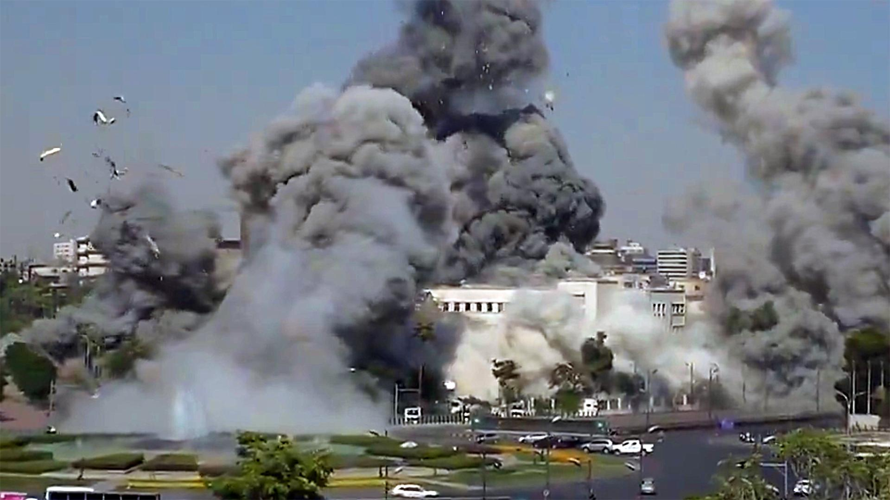

## Claim
Claim: " This image shows Israel bombing the surroundings of Southern Damascus in February 2025, destroying its last remaining army depots."

## Actions
```
geolocate()
image_search("Israel bombing Damascus February 2025")
```

## Evidence
### Evidence from `geolocate`
The most likely countries where the image was taken are: {'Bangladesh': 0.07, 'Pakistan': 0.07, 'Taiwan': 0.06, 'Ghana': 0.05, 'Ukraine': 0.05, 'United Arab Emirates': 0.05, 'Nigeria': 0.04, 'Sri Lanka': 0.04, 'India': 0.03, 'Israel': 0.03}

### Evidence from `image_search`
The Los Angeles Times published an article on July 16, 2025, about unrest in Sweida, Syria, which includes an image of an explosion (). Al Jazeera reports that Israel bombed military targets in southern Syria outside Damascus in February 2025 (). The search result from twz.com contains an image of an explosion ().

*   [https://www.latimes.com/world-nation/story/2025-07-16/syria-sweida-unrest](https://www.latimes.com/world-nation/story/2025-07-16/syria-sweida-unrest)
*   [https://www.aljazeera.com/news/2025/2/26/israel-bombs-military-targets-in-southern-syria-outside-damascus](https://www.aljazeera.com/news/2025/2/26/israel-bombs-military-targets-in-southern-syria-outside-damascus)
*   [https://www.twz.com/news-features/israel-strikes-at-the-heart-of-syrias-military-command-in-dramatic-escalation](https://www.twz.com/news-features/israel-strikes-at-the-heart-of-syrias-military-command-in-dramatic-escalation)


## Elaboration
The evidence suggests that Israel did bomb military targets in southern Syria outside Damascus in February 2025. The image search results confirm this, with Al Jazeera reporting on the event. However, the geolocation of the image in the claim does not provide strong evidence to support the claim. The image search results do not include the image from the claim.

The claim states that the bombing destroyed the last remaining army depots. This specific detail cannot be verified with the provided evidence.

Based on the evidence, the claim is partially supported. The bombing did occur, but the specific details about the destruction of the last remaining army depots cannot be confirmed.


## Actions
```
web_search("Israel bombing Syria army depots February 2025")
```

## Evidence
### Evidence from `web_search`
The Wikipedia article discusses the Israeli invasion of Syria, which began in December 2024, including airstrikes and ground incursions, primarily in southern Syria and Damascus. The article mentions the involvement of various Israeli military units and the reactions of involved parties. The Syrian Archive published an article on July 18, 2025, about Israeli attacks on Syria from February to May 2025, including data on the distribution of incidents by month, governorate, and type of impact site.

*   [https://en.wikipedia.org/wiki/Israeli\_invasion\_of\_Syria\_(2024%E2%80%93present)](https://en.wikipedia.org/wiki/Israeli_invasion_of_Syria_(2024%E2%80%93present))
*   [https://syrianarchive.org/en/investigations/israeli-attacks-on-syria-february-to-may-2025/](https://syrianarchive.org/en/investigations/israeli-attacks-on-syria-february-to-may-2025/)


## Elaboration
The new evidence confirms that Israel conducted airstrikes in Syria, including the Damascus area, during February 2025. The Wikipedia article and the Syrian Archive provide additional context, such as the Israeli invasion starting in December 2024 and the distribution of attacks.

However, the evidence still does not confirm the claim that the bombing destroyed the last remaining army depots.

The claim is partially supported.


## Actions
```
web_search("Damascus military depots destroyed February 2025")
```

## Evidence
### Evidence from `web_search`
From [Source](https://www.presstv.ir/Detail/2025/02/04/742153/Israeli-airstrike-destroys-weapons-depot-in-Syria-s-Dayr-al-Zawr--Reports): 
Content: The search result from PressTV, published on February 4, 2025, reports that Israeli military aircraft carried out an airstrike against a weapons depot near Dayr al-Zawr, Syria, causing a massive explosion. . The article mentions that the attack occurred after the collapse of the Syrian government. The article also includes a video grab of the aftermath of the airstrike.


## Elaboration
The evidence indicates that Israel conducted airstrikes in Syria in February 2025, including an attack on a weapons depot. However, the provided evidence does not confirm that the bombing destroyed the last remaining army depots in the surroundings of Southern Damascus. The PressTV article mentions a weapons depot near Dayr al-Zawr, not Damascus.

The claim is not supported.


## Final Judgement
The evidence confirms that Israel conducted airstrikes in Syria in February 2025, but it does not confirm that the bombing destroyed the last remaining army depots in the surroundings of Southern Damascus. The provided evidence mentions a weapons depot near Dayr al-Zawr, not Damascus. Therefore, the claim is not entirely accurate. `false`

### Verdict: FALSE

### Justification
The claim is not supported. While evidence confirms Israeli airstrikes in Syria in February 2025, including attacks on weapons depots, there's no evidence to support the specific detail that the bombing destroyed the last remaining army depots in the surroundings of Southern Damascus. The provided source mentions a weapons depot near Dayr al-Zawr, not Damascus.
