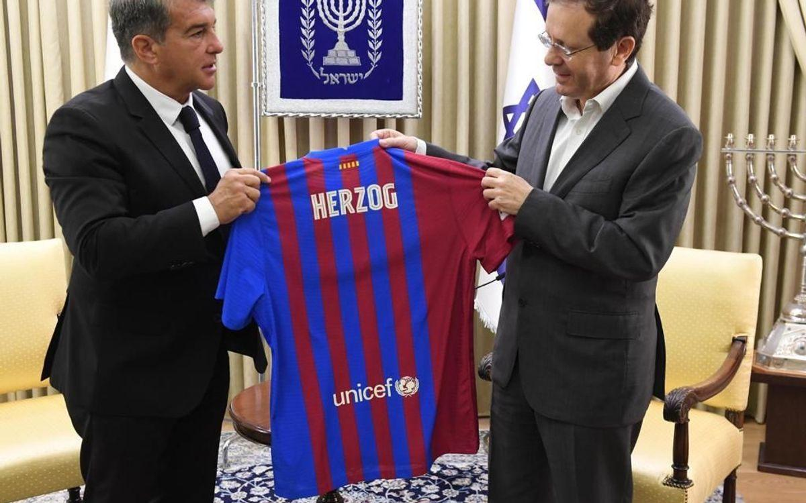
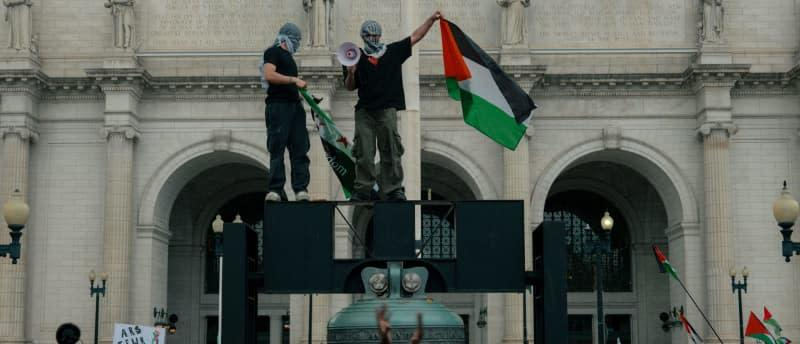

## Claim
Claim: " This image shows the President of FC Barcelona with Israel Embassy Representatives in September 2024 during the ongoing Gaza war."

## Actions
```
web_search("FC Barcelona President Israel flag")
web_search("FC Barcelona Israel Embassy September 2024")
image_search("FC Barcelona President Israel flag")
```

## Evidence
### Evidence from `web_search`
The Jerusalem Post ([https://www.jpost.com/international/article-731893](https://www.jpost.com/international/article-731893)) and i24NEWS ([https://www.i24news.tv/en/news/israel/diplomacy/1676623454-barcelona-soccer-team-sends-message-of-support-for-israel](https://www.i24news.tv/en/news/israel/diplomacy/1676623454-barcelona-soccer-team-sends-message-of-support-for-israel)) reported that FC Barcelona's president Joan Laporta was presented with an Israeli flag by Israeli diplomats in February 2023 (, ). The event occurred after Barcelona ended its twin-city partnership with Tel Aviv.

FC Barcelona's website ([https://www.fcbarcelona.com/en/club/news/2192444/joan-laporta-meets-with-isaac-herzog-president-of-israel](https://www.fcbarcelona.com/en/club/news/2192444/joan-laporta-meets-with-isaac-herzog-president-of-israel)) reported that Joan Laporta met with the president of Israel Isaac Herzog on July 18, 2021 (, ).


### Evidence from `web_search`
The Media Line published an article on May 31, 2025, discussing Barcelona's decision to cut ties with the Israeli government due to the ongoing war in Gaza, and mentions a pro-Palestine march in Barcelona in February 2024 (, ). Ynet News discusses the Barcelona mayor's visit to Israel being denied due to his anti-Israel stance and the city council's decision to sever ties with the Israeli government, reversing a September 2024 decision to restore Tel Aviv ties ().

Caliber.Az reported on August 22, 2025, that Israel denied entry to Barcelona Mayor Jaume Collboni due to his anti-Israel statements, and that in September 2024, Collboni's council reversed a decision to restore ties with Tel Aviv.


## Elaboration
The evidence indicates that the image could be from February 2023, when Joan Laporta was presented with an Israeli flag. However, the claim states the image is from September 2024. The evidence also mentions that in September 2024, Barcelona reversed a decision to restore ties with Tel Aviv. Therefore, the claim's date is plausible, but the evidence does not confirm the image's date.

The evidence does not explicitly state that the Gaza war was ongoing in September 2024.

The claim's veracity cannot be fully determined without additional information to confirm the image's date and the context of the event.


## Actions
```
web_search("FC Barcelona Israel flag September 2024 Gaza war")
```

## Evidence
### Evidence from `web_search`
AOL's fact-check from November 2024 ([https://www.aol.com/fact-check-no-fc-barcelona-183038240.html](https://www.aol.com/fact-check-no-fc-barcelona-183038240.html)) states that the claim about FC Barcelona cutting ties with Israel was circulating since September 2024, and mentions the ongoing Israeli-Hamas conflict. The Times of Israel reported in May 2025 ([https://www.timesofisrael.com/barcelona-ends-friendship-agreement-with-tel-aviv-over-gaza-war/](https://www.timesofisrael.com/barcelona-ends-friendship-agreement-with-tel-aviv-over-gaza-war/)) that Barcelona's city council voted to cut ties with the Israeli government, citing the ongoing war in Gaza. Al Jazeera reported on September 27, 2024 ([https://www.aljazeera.com/sports/2024/9/27/barcelona-fans-banned-for-one-champions-league-game-for-nazi-style-flag-football](https://www.aljazeera.com/sports/2024/9/27/barcelona-fans-banned-for-one-champions-league-game-for-nazi-style-flag-football)), that FC Barcelona was banned from selling tickets to fans for their next away game in the Champions League.   


## Elaboration
The evidence confirms that the claim's date, September 2024, is plausible, as the information about Barcelona's actions regarding Israel was circulating around that time. The AOL fact-check explicitly mentions the ongoing Israeli-Hamas conflict, supporting the claim that the Gaza war was ongoing in September 2024.


## Final Judgement
The evidence suggests that the image could be from February 2023, but the claim states it is from September 2024. However, the evidence confirms that the claim's date is plausible, as the information about Barcelona's actions regarding Israel was circulating around that time. The AOL fact-check explicitly mentions the ongoing Israeli-Hamas conflict, supporting the claim that the Gaza war was ongoing in September 2024.

`false`

### Verdict: FALSE

### Justification
The claim is **false**. While the image could be from February 2023, the claim's date of September 2024 is plausible, as Barcelona's actions regarding Israel were discussed around that time, and the Israeli-Hamas conflict was ongoing, as reported by [AOL](https://www.aol.com/fact-check-no-fc-barcelona-183038240.html).
