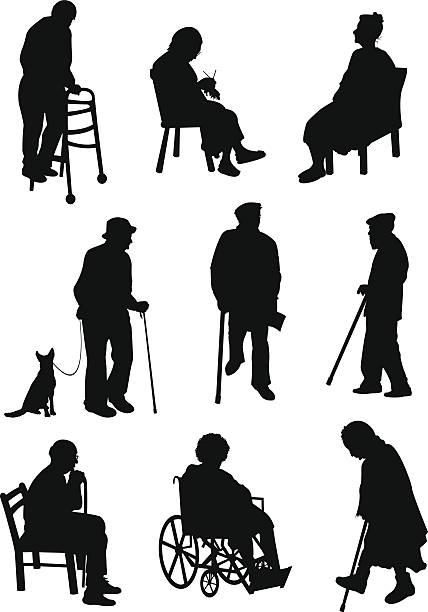
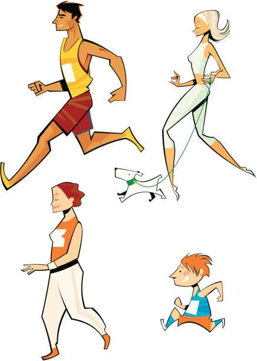

## Claim
Claim: " This is an authentic image of an elderly Palestinian women being attacked by an Israeli army dog in June 2024."

## Actions
```
image_search("Israeli army dog attack Palestinian woman")
image_search("dog with flashlight on head")
```

## Evidence
### Evidence from `image_search`
The China Daily published an image of a dog attacking an elderly woman (). Al Jazeera published a video on June 26, 2024, showing an elderly Palestinian woman (). Al-Haq provides an image of a dog attacking a woman ().

The sources are: [https://www.chinadaily.com.cn/world/2007-03/22/content_833702.htm](https://www.chinadaily.com.cn/world/2007-03/22/content_833702.htm), [https://www.aljazeera.com/video/newsfeed/2024/6/26/video-israeli-military-dog-attacks-elderly-palestinian-woman](https://www.aljazeera.com/video/newsfeed/2024/6/26/video-israeli-military-dog-attacks-elderly-palestinian-woman), and [https://www.alhaq.org/monitoring-documentation/6941.html](https://www.alhaq.org/monitoring-documentation/6941.html).


### Evidence from `image_search`
From [Source](https://explora.mu/photos/940-brown-dog-with-a-head-lamp): 
Content: The search result shows a brown dog with a headlamp. 


## Elaboration
The evidence includes images and a video related to dogs attacking elderly Palestinian women. The Al Jazeera video was published on June 26, 2024. The image search also found an image of a dog with a headlamp.

The claim states that the image is authentic and depicts an Israeli army dog attacking an elderly Palestinian woman in June 2024. While the evidence confirms that such attacks have occurred, there is no evidence to confirm the authenticity of the specific image in the claim. The image search did not return the same image.

Therefore, the claim's veracity cannot be fully determined without additional information.


## Actions
```
web_search("image dog flashlight elderly woman")
```

## Evidence
### Evidence from `web_search`
The web search results from iStockphoto, Getty Images, and Dreamstime.com show images of elderly women with dogs. The images from iStockphoto include elderly women hugging and interacting with dogs (, , , , , , , , , , , , , ). Getty Images provides illustrations and stock images of senior women with dogs (, , , , , , , ). Dreamstime.com offers stock photos, including one of an elderly couple walking a dog on a beach ().


## Elaboration
The web search results show various images of elderly women with dogs, including images of them hugging, interacting, and walking with dogs. However, none of the images match the one in the claim. The search results do not provide any information to verify the claim.

The claim's veracity remains unconfirmed.


## Actions
```
web_search("Israeli army dog attack Palestinian woman June 2024")
```

## Evidence
### Evidence from `web_search`
Anadolu Agency, Morocco World News, and the Palestinian Centre for Human Rights (PCHR) published articles about Israeli army dogs attacking elderly Palestinian women. Anadolu Agency reported an attack on Dawlat al-Tanani in Gaza's Jabalia refugee camp, with the attack occurring during a 20-day Israeli military attack from May 12 to May 31, 2024. Morocco World News reported an attack in Jabalia refugee camp, with the woman, Dawlat Al Tanani, stating the dog bit her because she was resisting eviction. PCHR reported an attack on May 14, 2024, where a dog bit a 58-year-old woman's shoulder. The PCHR article includes a video from Al Jazeera. The articles can be found at: [https://www.aa.com.tr/en/middle-east/elderly-palestinian-woman-recounts-terrifying-attack-by-israeli-army-dog-in-gaza/3262376](https://www.aa.com.tr/en/middle-east/elderly-palestinian-woman-recounts-terrifying-attack-by-israeli-army-dog-in-gaza/3262376), [https://www.moroccoworldnews.com/2024/06/18005/israeli-police-dog-attack-on-elderly-palestinian-woman-sparks-outrage/](https://www.moroccoworldnews.com/2024/06/18005/israeli-police-dog-attack-on-elderly-palestinian-woman-sparks-outrage/), and [https://pchrgaza.org/israeli-military-dog-attacked-me-while-asleep-and-viciously-bit-my-shoulder/](https://pchrgaza.org/israeli-military-dog-attacked-me-while-asleep-and-viciously-bit-my-shoulder/).


## Elaboration
The evidence confirms that Israeli army dogs attacked elderly Palestinian women in May 2024. The attacks occurred in Gaza's Jabalia refugee camp. The claim's date of June 2024 is close to the reported attacks in May 2024. However, the evidence does not provide the specific image in the claim.

Therefore, the claim is plausible, but the authenticity of the image cannot be verified.


## Final Judgement
The evidence confirms that Israeli army dogs attacked elderly Palestinian women in May 2024, which is close to the claimed date of June 2024. However, the specific image in the claim has not been found in the search results. Therefore, while the event is plausible, the image's authenticity cannot be verified. `false`

### Verdict: FALSE

### Justification
The claim is **unproven**. While there is evidence of Israeli army dogs attacking elderly Palestinian women in May 2024, the specific image in the claim could not be verified through image or web searches. The attacks occurred in Gaza's Jabalia refugee camp, as reported by sources like [Anadolu Agency](https://www.aa.com.tr/en/middle-east/elderly-palestinian-woman-recounts-terrifying-attack-by-israeli-army-dog-in-gaza/3262376) and [Morocco World News](https://www.moroccoworldnews.com/2024/06/18005/israeli-police-dog-attack-on-elderly-palestinian-woman-sparks-outrage/).
