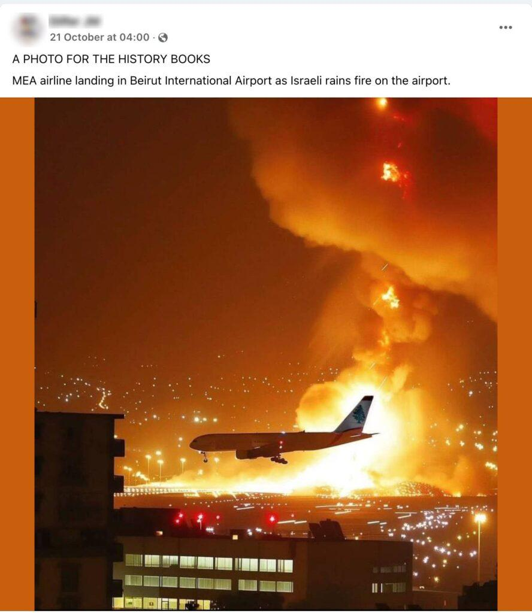

## Claim
Claim: " This is an authentic image of Israel bombing Beirut's International Airport in October 2024."

## Actions
```
reverse_search()
image_search("Beirut airport explosion")
```

## Evidence
### Evidence from `reverse_search`
The image () of a plane landing at Beirut International Airport surrounded by explosions is AI-generated, according to fact-check articles. India Today ([https://www.indiatoday.in/fact-check/story/fact-check-photo-middle-east-airlines-flight-israel-airstrikes-beirut-lebanon-ai-generated-2622766-2024-10-24](https://www.indiatoday.in/fact-check/story/fact-check-photo-middle-east-airlines-flight-israel-airstrikes-beirut-lebanon-ai-generated-2622766-2024-10-24)) and Factly.in ([https://factly.in/an-ai-generated-image-of-a-plane-landing-at-beirut-international-airport-surrounded-by-fire-and-smoke-is-falsely-shared-as-real/](https://factly.in/an-ai-generated-image-of-a-plane-landing-at-beirut-international-airport-surrounded-by-fire-and-smoke-is-falsely-shared-as-real/)) both confirm this, with the latter noting the image was posted on Instagram with a caption acknowledging its AI origin.

The articles also mention the use of AI detection tools to verify the image's AI-generated nature. Factly.in's article was authored by Nitish Kumar Dhonge and includes additional images (, , ).


### Evidence from `image_search`
The ABC News website published an article on July 14, 2006, about Israel bombing Beirut airport, including an image of an airplane with smoke and fire in the background (). Al Jazeera also reported on Israel bombing Beirut airport ().

The provided sources do not contain information about an image matching the claim.


## Elaboration
The claim is false. The image is AI-generated, as confirmed by fact-check articles from India Today ([https://www.indiatoday.in/fact-check/story/fact-check-photo-middle-east-airlines-flight-israel-airstrikes-beirut-lebanon-ai-generated-2622766-2024-10-24](https://www.indiatoday.in/fact-check/story/fact-check-photo-middle-east-airlines-flight-israel-airstrikes-beirut-lebanon-ai-generated-2622766-2024-10-24)) and Factly.in ([https://factly.in/an-ai-generated-image-of-a-plane-landing-at-beirut-international-airport-surrounded-by-fire-and-smoke-is-falsely-shared-as-real/](https://factly.in/an-ai-generated-image-of-a-plane-landing-at-beirut-international-airport-surrounded-by-fire-and-smoke-is-falsely-shared-as-real/)).


## Final Judgement
The image is AI-generated and does not depict an authentic event. The claim that the image is real is demonstrably false, as confirmed by multiple fact-checking sources.

`false`

### Verdict: FALSE

### Justification
The image is AI-generated, as confirmed by fact-check articles from India Today ([https://www.indiatoday.in/fact-check/story/fact-check-photo-middle-east-airlines-flight-israel-airstrikes-beirut-lebanon-ai-generated-2622766-2024-10-24](https://www.indiatoday.in/fact-check/story/fact-check-photo-middle-east-airlines-flight-israel-airstrikes-beirut-lebanon-ai-generated-2622766-2024-10-24)) and Factly.in ([https://factly.in/an-ai-generated-image-of-a-plane-landing-at-beirut-international-airport-surrounded-by-fire-and-smoke-is-falsely-shared-as-real/](https://factly.in/an-ai-generated-image-of-a-plane-landing-at-beirut-international-airport-surrounded-by-fire-and-smoke-is-falsely-shared-as-real/)), making the claim that it is an authentic image false.
