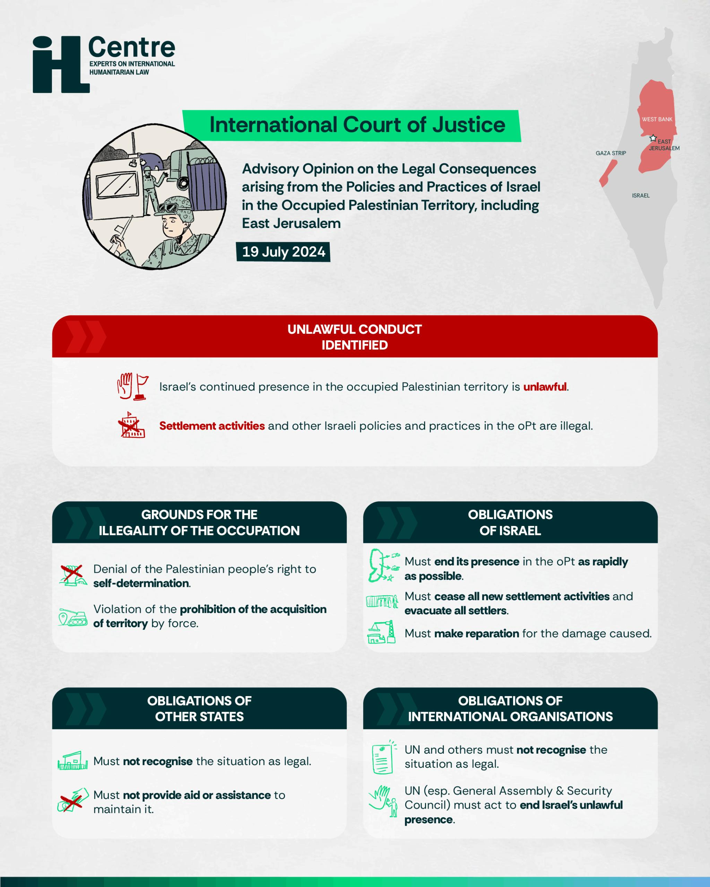

## Claim
Claim: "Israel has been declared an illegal state by the International Court of Justice in July 2024."

## Actions
```
image_search("International Court of Justice Israel illegal state July 2024")
```

## Evidence
### Evidence from `image_search`
From [Source](https://www.diakonia.se/ihl/news/one-year-on-the-devastating-cost-of-ignoring-the-icjs-july-2024-advisory-opinion/): 
Content: The search result contains an image  with the title "Advisory Opinion on the Legal Consequences arising from the Policies and Practices of Israel in the Occupied Palestinian Territory, including East Jerusalem" dated July 19, 2024. The image states that Israel's continued presence in the occupied Palestinian territory is unlawful.


## Elaboration
The International Court of Justice issued an advisory opinion on July 19, 2024, regarding the legal consequences of Israel's policies and practices in the Occupied Palestinian Territory, including East Jerusalem. The opinion identifies Israel's continued presence in the occupied Palestinian territory as unlawful. The image does not explicitly state that Israel has been declared an illegal state.

Therefore, the claim is partially supported. The ICJ did issue an opinion in July 2024 regarding the legality of Israel's actions in the occupied territories. However, the evidence does not support the claim that Israel has been declared an illegal state.


## Final Judgement
The International Court of Justice issued an advisory opinion on July 19, 2024, stating that Israel's continued presence in the occupied Palestinian territory is unlawful. However, the evidence does not support the claim that Israel has been declared an illegal state.

`false`


### Verdict: FALSE

### Justification
The International Court of Justice issued an advisory opinion on July 19, 2024, stating that Israel's continued presence in the occupied Palestinian territory is unlawful, as evidenced by the [image search result](https://www.diakonia.se/ihl/news/one-year-on-the-devastating-cost-of-ignoring-the-icjs-july-2024-advisory-opinion/). However, the opinion does not declare Israel an illegal state.
