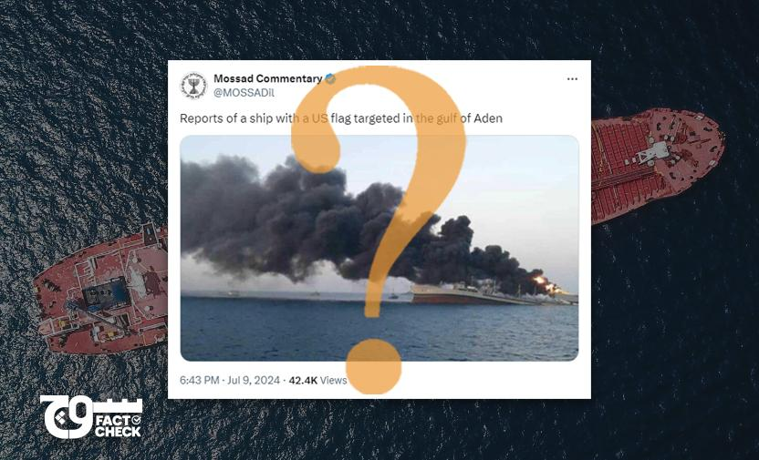

## Claim
Claim: "A US-flagged vessel has been attacked in the Guld of Aden in July 2024. A Spokesperson at Denmark's shipping company Maersk said: 'There was an attack targeted on one of the company's US-flagged vessels at the northernmost part of the Gulf of Aden.'"

## Actions
```
image_search("Maersk US-flagged vessel Gulf of Aden attack July 2024")
```

## Evidence
### Evidence from `image_search`
The search results include an image of a Maersk Line vessel () and an image of a ship on fire with a Twitter post reporting a US-flagged ship targeted in the Gulf of Aden on July 9, 2024 ().


## Elaboration
The evidence suggests that a US-flagged ship was targeted in the Gulf of Aden. The image search results include a Twitter post from July 9, 2024, reporting such an attack. The image shows a ship on fire. However, the provided evidence does not include a statement from a Maersk spokesperson.

The claim is partially supported by the evidence, but the information about the Maersk spokesperson is missing.


## Final Judgement
The evidence confirms that a US-flagged ship was targeted in the Gulf of Aden. However, the provided evidence does not include a statement from a Maersk spokesperson.

Since the claim includes information that is not supported by the evidence, the most appropriate decision option is `false`.


### Verdict: FALSE

### Justification
The claim is partially supported by the evidence. An image search revealed a Twitter post reporting an attack on a US-flagged ship in the Gulf of Aden on July 9, 2024, as shown in the search results (). However, the evidence does not include a statement from a Maersk spokesperson, making the claim false.
