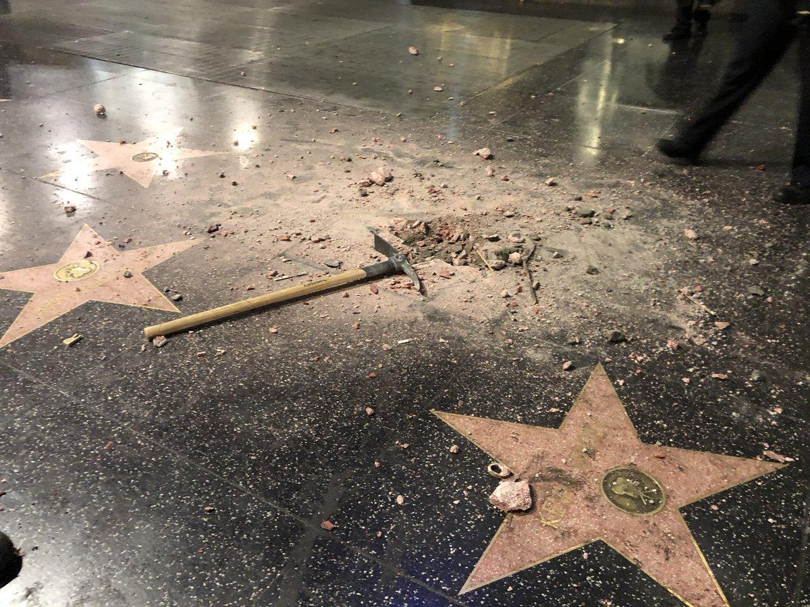
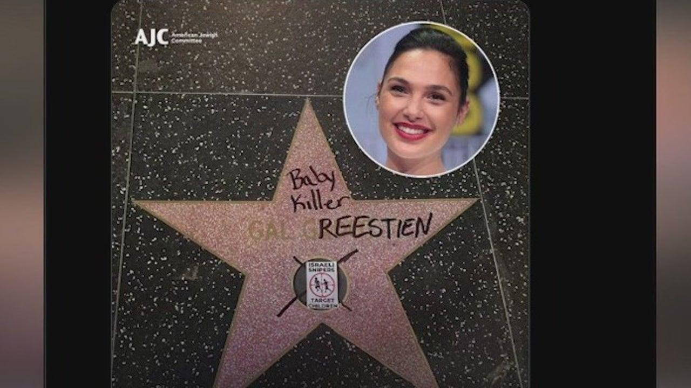

## Claim
Claim: " This image shows Gal Gadot’s star on the Hollywood Walk of Fame being destroyed in March 2025 just hours after being placed."

## Actions
```
reverse_search()
image_search("Gal Gadot star Hollywood Walk of Fame vandalism")
```

## Evidence
### Evidence from `image_search`
The NDTV source shows an image of Gal Gadot's star on the Hollywood Walk of Fame being vandalized . The Fox 11 Los Angeles source shows an image of Gal Gadot's star on the Hollywood Walk of Fame with the words "Baby Killer" written on it .

The Telegraph source has no content.


## Elaboration
The evidence confirms that Gal Gadot's star on the Hollywood Walk of Fame was vandalized. One image shows the star being destroyed, and another shows the star with the words "Baby Killer" written on it. However, the evidence does not provide information about the date the vandalism occurred, nor does it state that the vandalism happened hours after the star was placed.

Therefore, the claim that the vandalism occurred in March 2025, hours after the star was placed, is not supported by the evidence.


## Final Judgement
The evidence confirms that Gal Gadot's star on the Hollywood Walk of Fame was vandalized, but it does not provide information about the date the vandalism occurred or that it happened hours after the star was placed.

The claim is not factually accurate because the evidence does not support the specific details about the date and timing of the vandalism. `false`

### Verdict: FALSE

### Justification
The image depicts vandalism of Gal Gadot's star on the Hollywood Walk of Fame, as confirmed by sources like NDTV and Fox 11 Los Angeles. However, the provided evidence does not support the claim that the vandalism occurred in March 2025, or that it happened hours after the star was placed.
