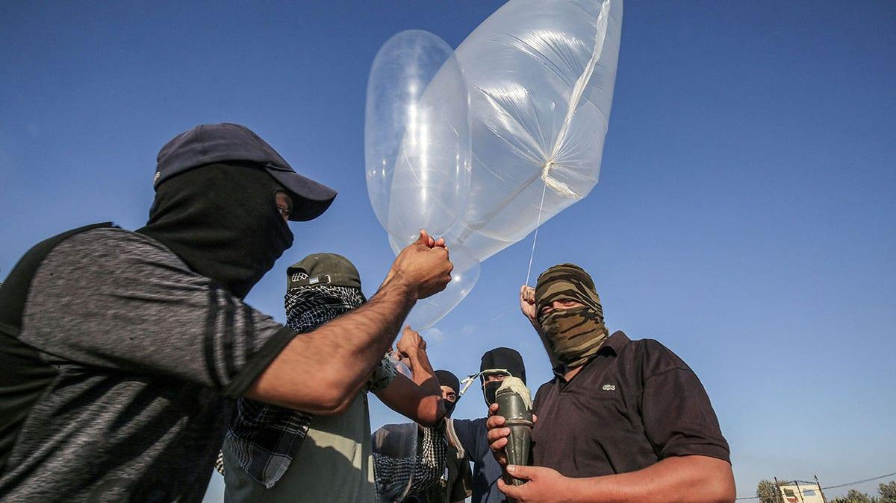

## Claim
Claim: "$50 Million in US taxpayer money almost went to fund condoms in Gaza before DOGE cut it."

## Actions
```
image_search("condoms Gaza funding DOGE")
```

## Evidence
### Evidence from `image_search`
Al Jazeera reported that President Trump claimed his administration stopped a $50 million plan to send condoms to Gaza, but the United States Department of Health and Human Services sent $83 million to two provinces in Mozambique, one of which is called Gaza, not Palestine. []

Fox News reported that the State Department pulled millions in funding for condoms in Gaza. []
*   [https://www.aljazeera.com/news/2025/1/30/is-the-us-sending-50m-in-condoms-to-gaza-as-trump-claims](https://www.aljazeera.com/news/2025/1/30/is-the-us-sending-50m-in-condoms-to-gaza-as-trump-claims)
*   [https://www.aa.com.tr/en/americas/no-us-funding-used-for-condoms-or-family-planning-in-gaza-aid-group/3466324](https://www.aa.com.tr/en/americas/no-us-funding-used-for-condoms-or-family-planning-in-gaza-aid-group/3466324)
*   [https://www.foxnews.com/politics/state-dept-pulls-millions-funding-condoms-gaza-trump-admin-looks-trim-spending](https://www.foxnews.com/politics/state-dept-pulls-millions-funding-condoms-gaza-trump-admin-looks-trim-spending)


## Elaboration
The evidence suggests that the claim is inaccurate. Al Jazeera reported that the Trump administration claimed to have stopped a $50 million plan to send condoms to Gaza, but the funds were actually sent to two provinces in Mozambique, one of which is also called Gaza. Fox News reported that the State Department pulled millions in funding for condoms in Gaza. The evidence does not mention DOGE.

The claim is partially supported by the evidence, as the State Department did pull funding for condoms in Gaza. However, the claim that $50 million in US taxpayer money almost went to fund condoms in Gaza is misleading, as the funds were intended for Mozambique, not Palestine. The evidence does not support the claim that DOGE cut the funding.


## Final Judgement
The claim is misleading. While the State Department did pull funding for condoms in Gaza, the initial funding was not intended for Gaza, but for a province in Mozambique. The claim also incorrectly attributes the funding cut to DOGE. `false`

### Verdict: FALSE

### Justification
The claim is misleading. While the State Department pulled funding for condoms in Gaza, the initial funding was intended for a province in Mozambique, not Palestine, as reported by [Al Jazeera](https://www.aljazeera.com/news/2025/1/30/is-the-us-sending-50m-in-condoms-to-gaza-as-trump-claims). The claim also incorrectly attributes the funding cut to DOGE.
