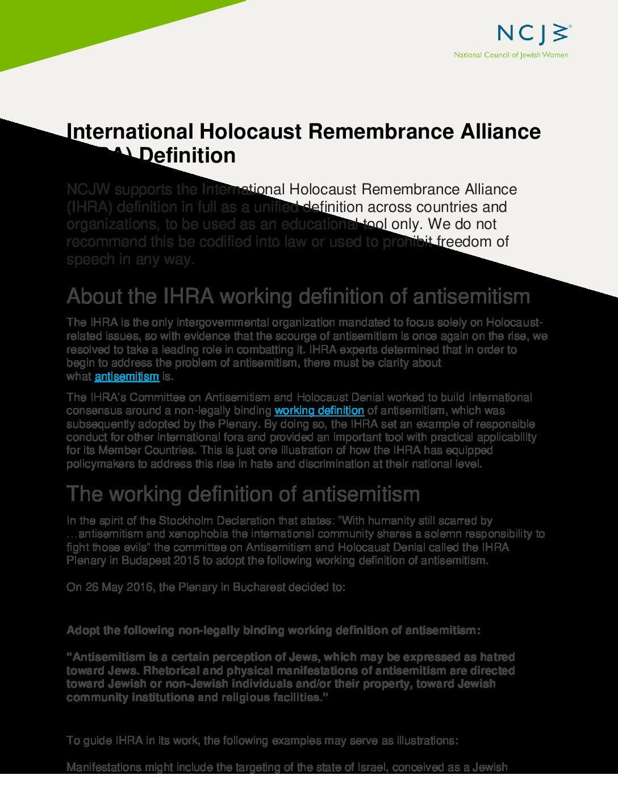

## Claim
Claim: "The World Jewish Congress (WJC) has amended the International Holocaust Remembrance Alliance (IHRA) working definition of antisemitism in March 2025 to include: 'Conflating the assassination of JFK to jews/israel'."

## Actions
```
image_search("World Jewish Congress IHRA antisemitism definition")
image_search("IHRA working definition antisemitism JFK assassination")
```

## Evidence
### Evidence from `image_search`
The World Jewish Congress has a page about the IHRA working definition of antisemitism (). The International Holocaust Remembrance Alliance (IHRA) adopted a non-legally binding working definition of antisemitism on May 26, 2016 ().

Relevant URLs:
*   [https://www.worldjewishcongress.org/en/news/letter-urging-inclusion-of-ihra-working-definition-of-antisemitism-in-un-action-plan](https://www.worldjewishcongress.org/en/news/letter-urging-inclusion-of-ihra-working-definition-of-antisemitism-in-un-action-plan)
*   [https://www.jewishfederations.org/blog/all/jewish-federations-460460](https://www.jewishfederations.org/blog/all/jewish-federations-460460)
*   [https://holocaustremembrance.com/resources/working-definition-antisemitism](https://holocaustremembrance.com/resources/working-definition-antisemitism)


### Evidence from `image_search`
From [Source](https://www.ajc.org/the-working-definition-of-antisemitism): 
Content: The search result contains an image of the word "anti-Semitism" highlighted in yellow. 


## Elaboration
The evidence confirms that the World Jewish Congress is involved with the IHRA working definition of antisemitism. However, the evidence does not contain any information about the claim that the IHRA definition was amended in March 2025 to include "Conflating the assassination of JFK to jews/israel".

Therefore, the claim cannot be verified with the provided evidence.


## Actions
```
image_search("IHRA antisemitism definition JFK assassination")
```

## Evidence
### Evidence from `image_search`
From [Source](https://www.ncjw.org/framing-antisemitism/ihra-definition-of-antisemitism/): 
Content: The National Council of Jewish Women supports the IHRA definition of antisemitism. The IHRA working definition of antisemitism was adopted on May 26, 2016. 


## Elaboration
The new evidence reiterates the IHRA definition's adoption date (May 26, 2016) and support from organizations like the National Council of Jewish Women. However, it still lacks any information about the claim that the IHRA definition was amended in March 2025 to include "Conflating the assassination of JFK to jews/israel".

Therefore, the claim remains unverified.


## Final Judgement
The World Jewish Congress is associated with the IHRA working definition of antisemitism, which was adopted in 2016. However, there is no evidence to support the claim that the definition was amended in March 2025 to include "Conflating the assassination of JFK to jews/israel."

`false`

### Verdict: FALSE

### Justification
The provided evidence confirms the World Jewish Congress's involvement with the IHRA working definition of antisemitism, which was adopted in 2016. However, the search results do not contain any information to support the claim that the IHRA definition was amended in March 2025 to include "Conflating the assassination of JFK to jews/israel." Therefore, the claim is unverified.
