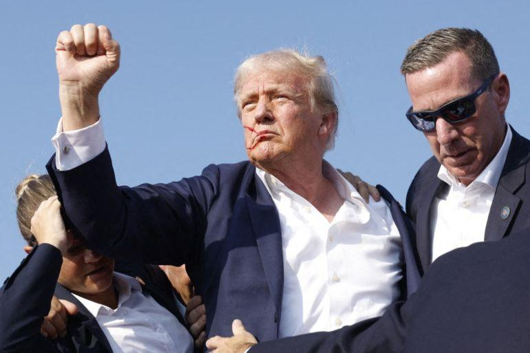
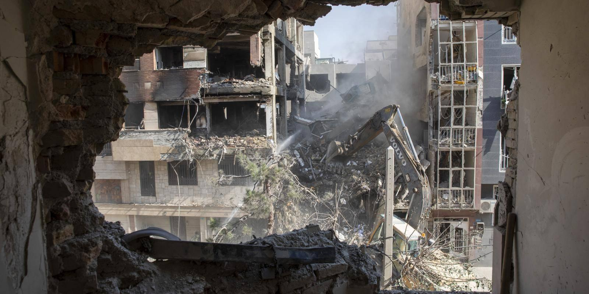
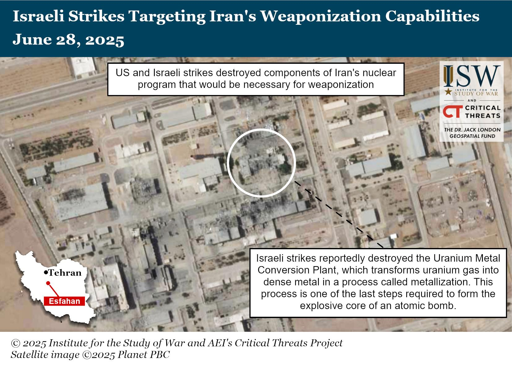
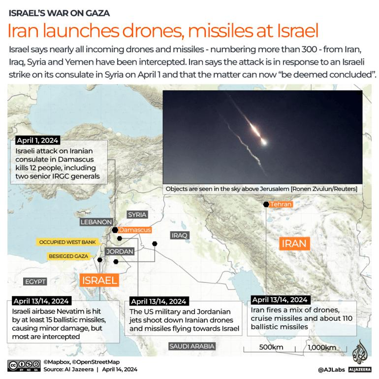

## Claim
Claim: "The assassination plot to kill Donald Trump in 2024 was orchestrated by two Jewish Americans. Israel wants war with Iran but wants American money to fund it and American servicemen to fight it."

## Actions
```
image_search("Donald Trump assassination plot 2024")
image_search("Israel Iran war funding")
```

## Evidence
### Evidence from `image_search`
The BBC News ([Source](https://www.bbc.com/news/articles/cd172rp02e0o)) and Al Jazeera ([Source](https://www.aljazeera.com/opinions/2024/7/14/the-trump-assassination-attempt-a-race-reset-and-more-polarisation)) both contain images of Donald Trump  . The Cato Institute ([Source](https://www.cato.org/blog/trump-assassination-attempt-investigation-update)) does not contain any relevant information.


### Evidence from `image_search`
Chatham House ([Source](https://www.chathamhouse.org/2025/06/iran-israel-conflict-iran-has-run-out-good-options)) contains an image of a building being demolished . The Institute for the Study of War and AEI's Critical Threats Project published an article on June 28, 2025, discussing Israeli strikes targeting Iran's weaponization capabilities, including an image  showing the aftermath of the strikes.

Al Jazeera ([Source](https://www.aljazeera.com/news/2024/4/15/us-will-not-take-part-in-any-israeli-retaliatory-action-against-iran)) published an article on April 14, 2024, about Iran launching drones and missiles at Israel, including a map showing the locations and dates of the attacks .


## Elaboration
The evidence contains images of Donald Trump and articles discussing potential conflicts between Israel and Iran. However, there is no information about an assassination plot against Donald Trump or any Jewish Americans orchestrating it. The evidence also does not support the claim that Israel wants American money and servicemen for a war with Iran.

The provided evidence is insufficient to verify the claim. More information is needed to assess the veracity of the claim.


## Final Judgement
The search results provide images of Donald Trump and discuss potential conflicts between Israel and Iran. However, there is no information about an assassination plot against Donald Trump or any Jewish Americans orchestrating it. The evidence also does not support the claim that Israel wants American money and servicemen for a war with Iran.

The evidence is insufficient to verify the claim. `false`


### Verdict: FALSE

### Justification
The provided evidence, including images from the BBC News and Al Jazeera ([Source](https://www.bbc.com/news/articles/cd172rp02e0o), [Source](https://www.aljazeera.com/opinions/2024/7/14/the-trump-assassination-attempt-a-race-reset-and-more-polarisation)), and articles discussing potential conflicts between Israel and Iran, does not support the claim. There is no information about an assassination plot against Donald Trump or any Jewish Americans orchestrating it. The evidence also does not support the claim that Israel wants American money and servicemen for a war with Iran.
