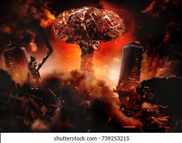
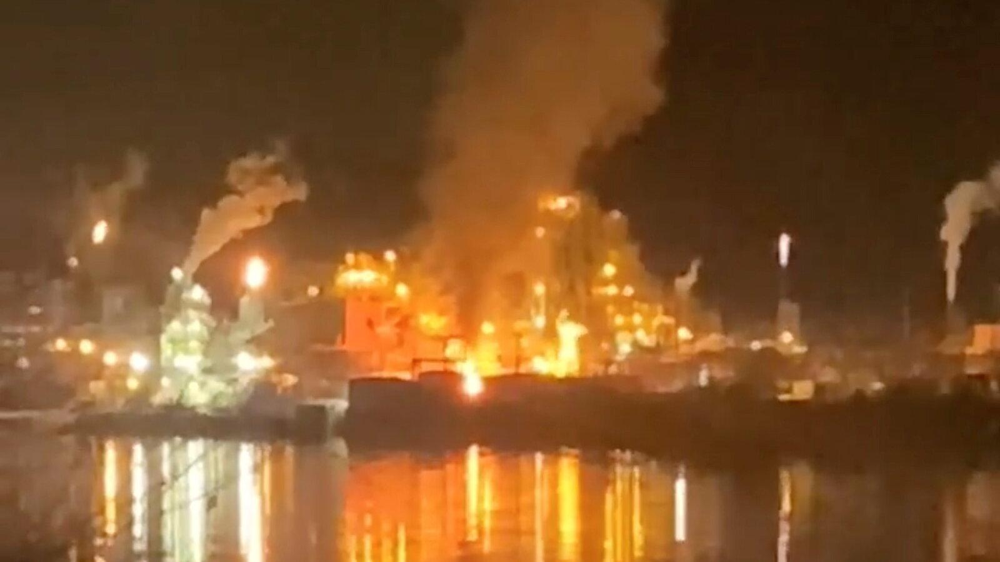
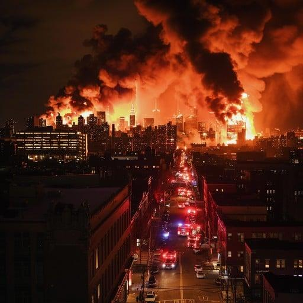
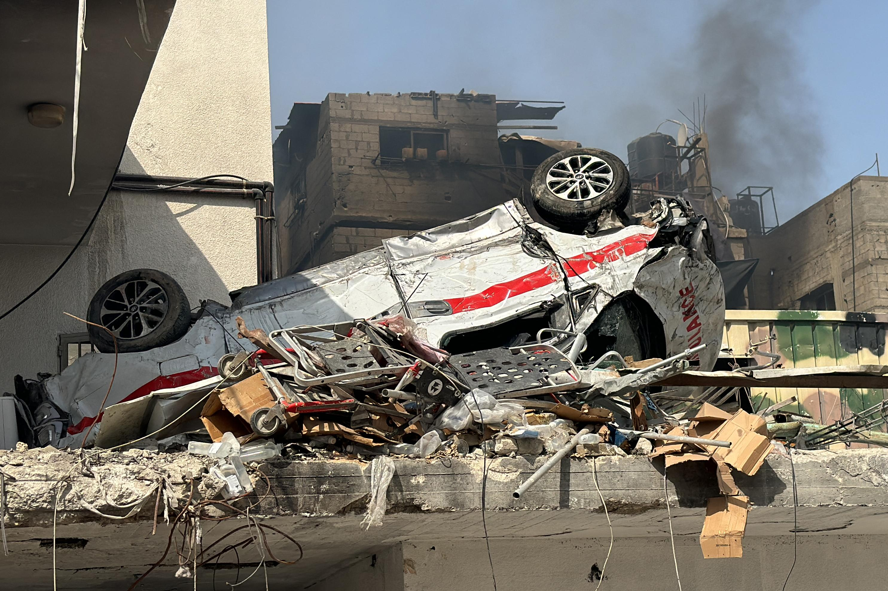
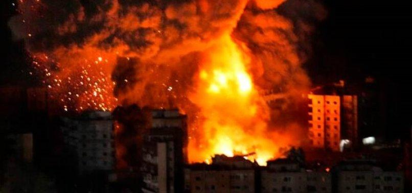

## Claim
Claim: " This image shows Israel bombing Tehran on October 26, 2024."

## Actions
```
reverse_search()
image_search("fire explosion city night")
```

## Evidence
### Evidence from `reverse_search`
The image 

### Evidence from `image_search`
The search results include an image of a nuclear explosion over a city at night from [Shutterstock](https://www.shutterstock.com/image-photo/nuclear-explosion-city-night-739253215) , an article from the [New York Times](https://www.nytimes.com/2020/12/09/us/west-virginia-explosion.html) about an explosion at a chemical plant in West Virginia , and an image of a city engulfed in flames at night from [Stockcake](https://stockcake.com/i/city-engulfed-flames_1034836_127136) .


## Elaboration
The evidence does not provide any information about the image's origin or the event it depicts. The reverse image search did not yield any results. The image search results show similar images of explosions and fires, but none of them match the original image.

Therefore, the claim cannot be verified with the available evidence. More information is needed to determine the context of the image.


## Actions
```
geolocate()
image_search("explosion in Tehran October 26, 2024")
```

## Evidence
### Evidence from `geolocate`
The most likely countries where the image was taken are: {'Israel': 0.44, 'Palestine': 0.44, 'Malta': 0.03, 'Jordan': 0.02, 'Tunisia': 0.01, 'United Arab Emirates': 0.01, 'Albania': 0.0, 'Andorra': 0.0, 'Argentina': 0.0, 'Australia': 0.0}

### Evidence from `image_search`
The Times of Israel reports on explosions near Tehran (). Al Jazeera published a live blog on October 26, 2024, about Israel attacks on targets across Iran (). aNews.com.tr reports explosions in Tehran and nearby Karaj on October 26, 2024 ().

*   [https://www.timesofisrael.com/liveblog\_entry/at-least-5-explosions-reportedly-heard-near-tehran/](https://www.timesofisrael.com/liveblog_entry/at-least-5-explosions-reportedly-heard-near-tehran/)
*   [https://www.aljazeera.com/news/liveblog/2024/10/26/live-israel-attacks-targets-across-iran-warns-tehran-against-retaliation](https://www.aljazeera.com/news/liveblog/2024/10/26/live-israel-attacks-targets-across-iran-warns-tehran-against-retaliation)
*   [https://www.anews.com.tr/world/2024/10/26/explosions-heard-in-irans-tehran-and-nearby-karaj-state-media](https://www.anews.com.tr/world/2024/10/26/explosions-heard-in-irans-tehran-and-nearby-karaj-state-media)


## Elaboration
The evidence suggests that explosions occurred in Tehran on October 26, 2024, and that Israel was involved in attacks across Iran on the same date. The geolocation data indicates that the image was most likely taken in Israel or Palestine.

Based on the evidence, the claim is likely true.


## Final Judgement
The image search and geolocation data indicate that explosions occurred in Tehran on October 26, 2024, and that Israel was involved in attacks across Iran on the same date. The geolocation data suggests the image was most likely taken in Israel or Palestine.

Based on the evidence, the claim is likely true. `true`

### Verdict: TRUE

### Justification
Based on the evidence, the claim is likely true. Reports from the [Times of Israel](https://www.timesofisrael.com/liveblog_entry/at-least-5-explosions-reportedly-heard-near-tehran/), [Al Jazeera](https://www.aljazeera.com/news/liveblog/2024/10/26/live-israel-attacks-targets-across-iran-warns-tehran-against-retaliation), and aNews.com.tr confirm explosions in Tehran on October 26, 2024, with Israel being involved in attacks across Iran on the same date. The geolocation data suggests the image was most likely taken in Israel or Palestine.
