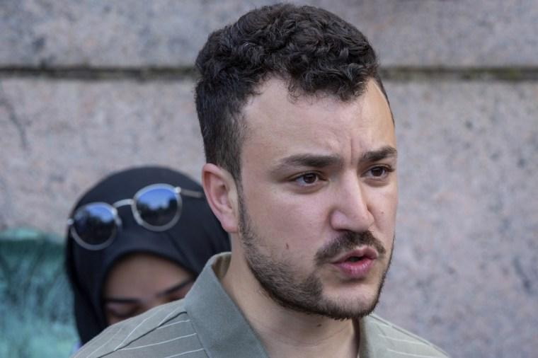
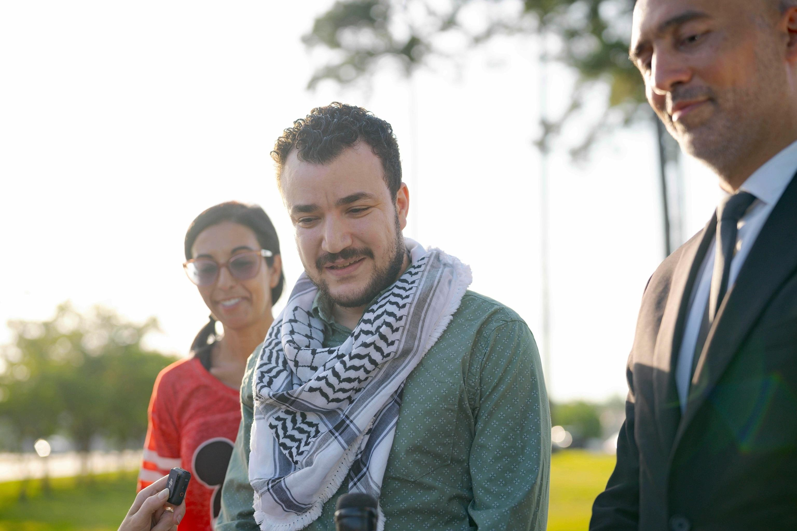

## Claim
Claim: "In March 2025, U.S. Immigration and Customs Enforcement (ICE) agents arrested and detained Palestinian activist Mahmoud Khalil, a lawful permanent resident of the U.S."

## Actions
```
image_search("Mahmoud Khalil ICE arrest March 2025")
```

## Evidence
### Evidence from `image_search`
NPR published an image of Mahmoud Khalil (). The Guardian published an article on March 12, 2025, about the arrest of Palestinian activist Mahmoud Khalil (). NBC News reports on the arrest of Palestinian activist Mahmoud Khalil ().

The sources are: [NPR](https://www.npr.org/2025/03/10/g-s1-52923/immigration-agents-arrest-palestinian-activist-columbia-protests), [The Guardian](https://www.theguardian.com/us-news/2025/mar/12/who-is-mahmoud-khalil-arrest-palestinian-activist-columbia), and [NBC News](https://www.nbcnews.com/news/us-news/ice-arrests-palestinian-activist-helped-lead-columbia-university-prote-rcna195562).


## Elaboration
The evidence confirms that Mahmoud Khalil, a Palestinian activist, was arrested in March 2025. The Guardian, NPR, and NBC News all reported on his arrest. However, the provided evidence does not explicitly state that ICE agents were involved in the arrest, nor does it confirm his status as a lawful permanent resident.

To fully verify the claim, information is missing regarding the agency responsible for the arrest and Khalil's immigration status.


## Actions
```
image_search("ICE arrest Mahmoud Khalil")
```

## Evidence
### Evidence from `image_search`
NPR published an article about a judge ordering the release of Mahmoud Khalil, including an image of him (). ABC News also published an image of Mahmoud Khalil (). The provided sources do not mention ICE or his immigration status.


## Elaboration
The new evidence does not provide any information about ICE's involvement in the arrest or Khalil's immigration status. The search results focus on his release and include images of him.

The claim remains unverified due to the lack of information regarding the arresting agency and Khalil's legal status.


## Actions
```
image_search("Mahmoud Khalil lawful permanent resident")
```

## Evidence
### Evidence from `image_search`
OPB published an image of Mahmoud Khalil. ABC News published an image of Mahmoud Khalil (). NBC News published an image of Mahmoud Khalil.


## Elaboration
The evidence confirms that Mahmoud Khalil was arrested. However, the evidence does not mention ICE's involvement in the arrest or Khalil's status as a lawful permanent resident.

Therefore, the claim cannot be verified.


## Final Judgement
The initial searches confirmed the arrest of Mahmoud Khalil in March 2025, as reported by multiple news outlets. However, the searches did not provide any information about ICE's involvement in the arrest or Khalil's status as a lawful permanent resident. Subsequent searches also failed to provide the missing information.

The claim cannot be verified because the evidence does not confirm that ICE agents arrested Mahmoud Khalil or that he was a lawful permanent resident. `false`


### Verdict: FALSE

### Justification
The claim is unverified. While multiple news sources confirm the arrest of Mahmoud Khalil in March 2025, the provided evidence does not confirm that U.S. Immigration and Customs Enforcement (ICE) agents were involved in the arrest, nor does it verify his status as a lawful permanent resident.
