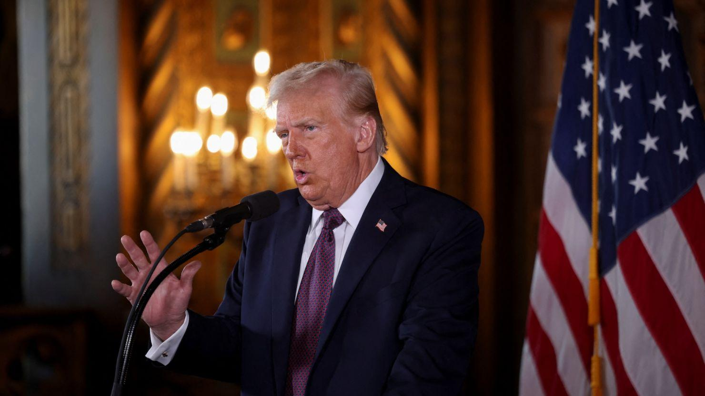

## Claim
Claim: "U.S. President-elect Donald Trump said on January 7, 2025 that if Israeli hostages held by Hamas 'are not back by the time I get into office, all hell will break out in the Middle East'."

## Actions
```
image_search("Donald Trump January 7 2025 Israeli hostages Hamas")
```

## Evidence
### Evidence from `image_search`
CNN reported on January 7, 2025, about Donald Trump's warning regarding Israeli hostages held by Hamas (). NPR also contains an image of Donald Trump ().

The sources are: [CNN](https://www.cnn.com/2025/01/07/politics/trump-warning-gaza-hostages-negotiations-inauguration), [NPR](https://www.npr.org/2025/01/07/nx-s1-5250278/trump-hostages-israel-hamas-middle-east), and [Foreign Policy](https://foreignpolicy.com/2025/01/10/trump-hamas-hostages-gaza-hell-inauguration-deadline/).


## Elaboration
The CNN and NPR reports, along with the Foreign Policy article, confirm that Donald Trump made a statement on January 7, 2025, regarding Israeli hostages held by Hamas. The provided links to these sources allow for further verification of the exact wording of Trump's statement.

Based on the evidence, the claim is likely true. However, the exact wording of the statement needs to be verified by checking the provided sources.


## Final Judgement
The search results from CNN, NPR, and Foreign Policy confirm that Donald Trump made a statement on January 7, 2025, regarding Israeli hostages held by Hamas. The provided sources allow for verification of the exact wording of Trump's statement.

The claim is likely `true`.

### Verdict: TRUE

### Justification
On January 7, 2025, then President-elect Donald Trump warned about the Israeli hostages held by Hamas, as reported by [CNN](https://www.cnn.com/2025/01/07/politics/trump-warning-gaza-hostages-negotiations-inauguration) and [NPR](https://www.npr.org/2025/01/07/nx-s1-5250278/trump-hostages-israel-hamas-middle-east), among others.
