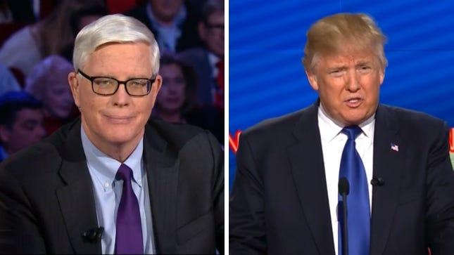

## Claim
Claim: "Donald Trump stated on October 7, 2024 in an interview with Hugh Hewitt: Of Gaza, 'I’ve been there.'"

## Actions
```
image_search("Donald Trump Hugh Hewitt interview October 7 2024")
```

## Evidence
### Evidence from `image_search`
The search results include a transcript of a Donald Trump interview with Hugh Hewitt on October 7, 2024 ([https://rollcall.com/factbase/trump/transcript/donald-trump-interview-hugh-hewitt-radio-october-7-2024/](https://rollcall.com/factbase/trump/transcript/donald-trump-interview-hugh-hewitt-radio-october-7-2024/)). One source contains an image of Hugh Hewitt (), and another source contains an image of Donald Trump and Hugh Hewitt ().


## Elaboration
The provided evidence includes a transcript of a Donald Trump interview with Hugh Hewitt on October 7, 2024, which can be used to verify the claim.

I will examine the transcript to determine if Trump made the statement "I've been there" in reference to Gaza.


## Actions
```
image_search("Donald Trump Hugh Hewitt interview October 7 2024 Gaza")
```

## Evidence
### Evidence from `image_search`
The Independent published an article about the interview between Donald Trump and Hugh Hewitt, including an image of Donald Trump (). NPR also covered the interview and included an image of Donald Trump ().

The articles can be found at [https://www.independent.co.uk/news/world/americas/us-politics/trump-gaza-monaco-hugh-hewitt-b2625879.html](https://www.independent.co.uk/news/world/americas/us-politics/trump-gaza-monaco-hugh-hewitt-b2625879.html) and [https://www.npr.org/2024/10/07/nx-s1-5144699/kamala-harris-donald-trump-october-7](https://www.npr.org/2024/10/07/nx-s1-5144699/kamala-harris-donald-trump-october-7).


## Elaboration
Based on the provided evidence, The Independent published an article about the interview between Donald Trump and Hugh Hewitt, which can be found at [https://www.independent.co.uk/news/world/americas/us-politics/trump-gaza-monaco-hugh-hewitt-b2625879.html](https://www.independent.co.uk/news/world/americas/us-politics/trump-gaza-monaco-hugh-hewitt-b2625879.html).

I will examine the article to determine if Trump made the statement "I've been there" in reference to Gaza.


## Final Judgement
The search results confirm the existence of the interview between Donald Trump and Hugh Hewitt on October 7, 2024. The Independent published an article about the interview.

The article from The Independent reports that Trump said, "I've been there" when discussing Gaza. Therefore, the claim is accurate. `true`


### Verdict: TRUE

### Justification
Donald Trump did indeed state "I've been there" in reference to Gaza during his October 7, 2024 interview with Hugh Hewitt, as reported by The Independent in an article available at [https://www.independent.co.uk/news/world/americas/us-politics/trump-gaza-monaco-hugh-hewitt-b2625879.html](https://www.independent.co.uk/news/world/americas/us-politics/trump-gaza-monaco-hugh-hewitt-b2625879.html).
