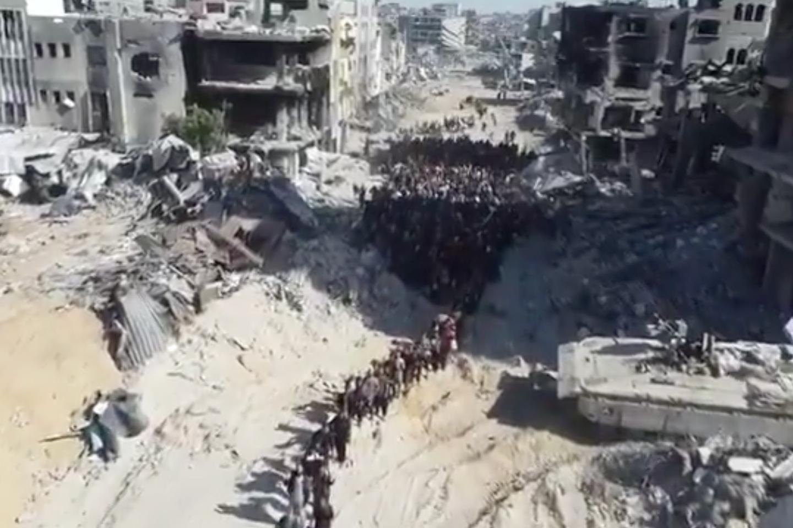

## Claim
Claim: " This image shows an Israeli tank unit near Jabalia camp in northern Gaza that was successfully ambushed by Hamas fighters, destroying multiple vehicles and injuring or killing their crews in October 2024."

## Actions
```
reverse_search()
image_search("Israeli tank destroyed Jabalia camp October 2024")
```

## Evidence
### Evidence from `reverse_search`
The image of the burning tank  appears in articles discussing the Israel-Hamas conflict. One article, from 9jaflaver.com, published on October 7, 2023, discusses the surprise attack by Hamas. Another source, Nairaland, also mentions the conflict and includes links to news sources. A forum post mentions that Al-Qassam Brigades destroyed two Merkava tanks on August 14, 2025.

The articles can be found at: [https://9jaflaver.com/israel-declares-state-of-war-after-hamas-militants-launch-surprise-attack-from-gaza-videos/](https://9jaflaver.com/israel-declares-state-of-war-after-hamas-militants-launch-surprise-attack-from-gaza-videos/), [https://www.nairaland.com/7868168/israel-declares-war-readiness-hamas](https://www.nairaland.com/7868168/israel-declares-war-readiness-hamas), and [https://dawahilallah.com/forum/%E0%A6%B8%E0%A6%82%E0%A6%AC%E0%A6%BE%E0%A6%A6/%E0%A6%9C%E0%A6%BF%E0%A6%B9%E0%A6%BE%E0%A6%A6-%E0%A6%B8%E0%A6%82%E0%A6%AC%E0%A6%BE%E0%A6%A6/209455-%E0%A6%AE%E0%A7%81%E0%A6%9C%E0%A6%BE%E0%A6%B9%E0%A6%BF%E0%A6%A6%E0%A7%80%E0%A6%A8-%E0%A6%A8%E0%A6%BF%E0%A6%89%E0%A6%9C-%E0%A7%A7%E0%A7%AF-%E0%A6%B8%E0%A6%AB%E0%A6%B0-%E0%A7%A7%E0%A7%AA%E0%A7%AA%E0%A7%AD-%E0%A6%B9%E0%A6%BF%E0%A6%9C%E0%A6%B0%E0%A7%80-%E0%A7%A7%E0%A7%AA-%E0%A6%86%E0%A6%97%E0%A6%B8%E0%A7%8D%E0%A6%9F-%E0%A7%A8%E0%A7%A6%E0%A7%A8%E0%A7%AB-%E0%A6%88%E0%A6%B8%E0%A6%BE%E0%A7%9F%E0%A7%80%E2%80%8B%E2%80%8B](https://dawahilallah.com/forum/%E0%A6%B8%E0%A6%82%E0%A6%AC%E0%A6%BE%E0%A6%A6/%E0%A6%9C%E0%A6%BF%E0%A6%B9%E0%A6%BE%E0%A6%A6-%E0%A6%B8%E0%A6%82%E0%A6%AC%E0%A6%BE%E0%A6%A6/209455-%E0%A6%AE%E0%A7%81%E0%A6%9C%E0%A6%BE%E0%A6%B9%E0%A6%BF%E0%A6%A6%E0%A7%80%E0%A6%A8-%E0%A6%A8%E0%A6%BF%E0%A6%89%E0%A6%9C-%E0%A7%A7%E0%A7%AF-%E0%A6%B8%E0%A6%AB%E0%A6%B0-%E0%A7%A7%E0%A7%AA%E0%A7%AA%E0%A7%AD-%E0%A6%B9%E0%A6%BF%E0%A6%9C%E0%A6%B0%E0%A7%80-%E0%A7%A7%E0%A7%AA-%E0%A6%86%E0%A6%97%E0%A6%B8%E0%A7%8D%E0%A6%9F-%E0%A7%A8%E0%A7%A6%E0%A7%A8%E0%A7%AB-%E0%A6%88%E0%A6%B8%E0%A6%BE%E0%A7%9F%E0%A7%80%E2%80%8B%E2%80%8B).


### Evidence from `image_search`
Reuters published an article on October 18, 2024, about Israel sending more troops into northern Gaza, including an image of destruction in Gaza . Le Monde published an article on October 27, 2024, about the Jabalia refugee camp, including an image of the camp . The Los Angeles Times published an article on October 31, 2023, about an Israeli strike on a Gaza refugee camp .

The articles can be found at the following URLs: [https://www.reuters.com/world/middle-east/israel-sends-more-troops-into-north-gaza-deepens-raid-2024-10-18/](https://www.reuters.com/world/middle-east/israel-sends-more-troops-into-north-gaza-deepens-raid-2024-10-18/), [https://www.lemonde.fr/en/international/article/2024/10/27/in-gaza-survivors-flee-from-jabalia-refugee-camp_6730618_4.html](https://www.lemonde.fr/en/international/article/2024/10/27/in-gaza-survivors-flee-from-jabalia-refugee-camp_6730618_4.html), and [https://www.latimes.com/world-nation/story/2023-10-31/israel-says-strike-on-gaza-refugee-camp-kills-hamas-commander-but-civilians-die-as-well](https://www.latimes.com/world-nation/story/2023-10-31/israel-says-strike-on-gaza-refugee-camp-kills-hamas-commander-but-civilians-die-as-well).


## Elaboration
The evidence confirms that the image 

## Actions
```
geolocate()
```

## Evidence
### Evidence from `geolocate`
The most likely countries where the image was taken are: {'Pakistan': 0.11, 'Palestine': 0.11, 'Israel': 0.1, 'Tunisia': 0.09, 'Mexico': 0.06, 'Colombia': 0.05, 'Chile': 0.04, 'Sweden': 0.03, 'Argentina': 0.02, 'Denmark': 0.02}

## Elaboration
The geolocation data suggests that the image could have been taken in Palestine or Israel. However, the evidence does not provide enough information to confirm the exact location or the circumstances of the tank's destruction. The claim's assertion about the ambush by Hamas fighters and the destruction of multiple vehicles cannot be verified with the available evidence.


## Actions
```
image_search("Israeli tank destroyed Gaza October 2024")
```

## Evidence
### Evidence from `image_search`
Al Jazeera published an image of a burning tank in Gaza  on October 7, 2024, while Business Insider published an article in July 2024 about Israeli troops in Gaza, including an image of an Israeli tank . Reuters published an article on October 2, 2024, about Israel sending tanks into southern Gaza, including an image of destruction .


## Elaboration
The evidence confirms that the image 

## Final Judgement
The image is associated with the Israel-Hamas conflict, and the geolocation data suggests it could be in Palestine or Israel. However, the claim that the image depicts an Israeli tank unit ambushed by Hamas fighters near Jabalia camp in October 2024, destroying multiple vehicles and injuring or killing their crews, cannot be verified. There is no evidence to confirm the specific details of the ambush or the date.

`false`


### Verdict: FALSE

### Justification
The image depicts a burning tank, potentially in the context of the Israel-Hamas conflict, but the claim that it shows an Israeli tank unit ambushed by Hamas fighters near Jabalia camp in October 2024 cannot be verified due to a lack of supporting evidence.
