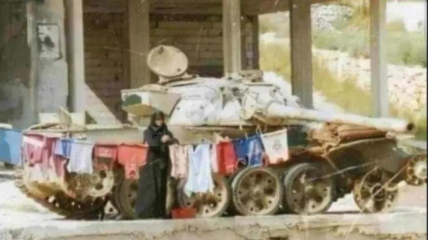
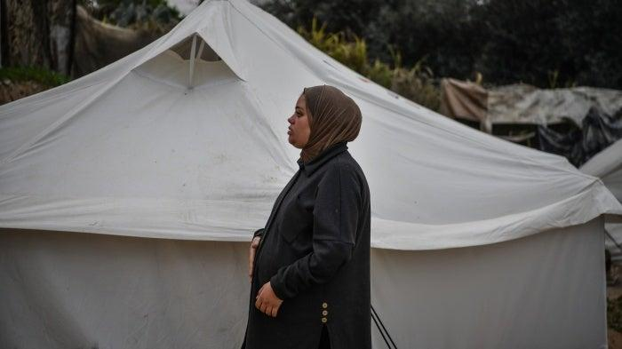
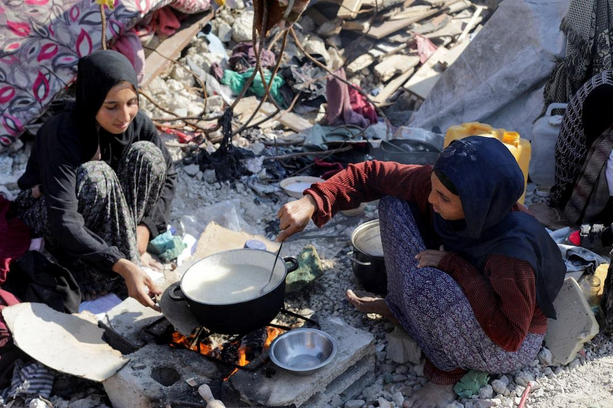
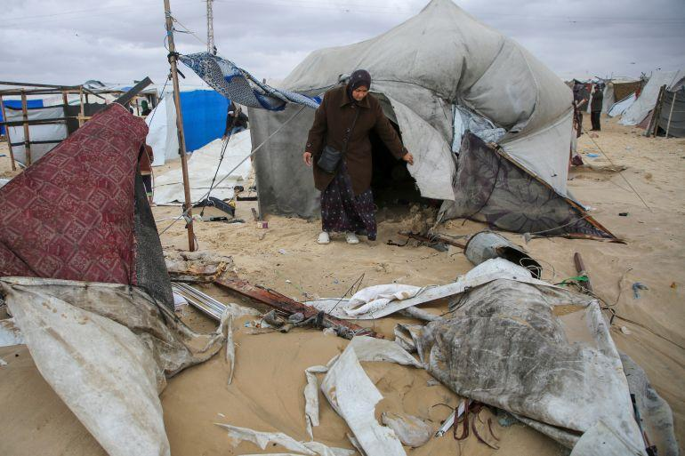

## Claim
Claim: " This image shows a Palestinian woman using an Israeli tank to dry clothes in Gaza in July 2024."

## Actions
```
reverse_search()
geolocate()
```

## Evidence
### Evidence from `geolocate`
The most likely countries where the image was taken are: {'Palestine': 0.29, 'Tunisia': 0.26, 'Jordan': 0.19, 'United Arab Emirates': 0.09, 'Israel': 0.07, 'Pakistan': 0.04, 'China': 0.01, 'Albania': 0.0, 'Andorra': 0.0, 'Argentina': 0.0}

## Elaboration
The evidence suggests the image was most likely taken in Palestine. The claim states the image was taken in Gaza, which is part of Palestine. The evidence does not provide information about the tank being Israeli or the date of the image.

Insufficient information is available to verify the claim.


## Actions
```
image_search("Israeli tank Palestinian woman drying clothes Gaza")
image_search("tank drying clothes Gaza")
```

## Evidence
### Evidence from `image_search`
The Middle East Eye published an article about the struggle of women in Gaza, including a photograph of a woman in Gaza (). Human Rights Watch published a report from January 28, 2025, that includes an image of a pregnant woman in Gaza (). Reuters published an article on January 31, 2025, about the ruins of Gaza homes, including an image of two women cooking ().


### Evidence from `image_search`
From [Source](https://www.aljazeera.com/news/2024/11/25/flooding-in-gaza-compounds-hardship-of-people-displaced-by-israeli-attacks): 
Content: Al Jazeera published an article about flooding in Gaza. The article includes an image of a woman in Gaza. 


## Elaboration
The evidence confirms that images of women in Gaza exist. However, the search results do not provide any information about the tank or the clothes-drying activity.

Insufficient information is available to verify the claim.


## Actions
```
image_search("tank drying clothes Gaza Israeli")
```

## Evidence
### Evidence from `image_search`
The BBC published an article that includes an image of an Israeli tank. Human Rights Watch published a report on December 19, 2024, about the situation in Gaza, including an image of people in Gaza.

The search results do not provide any information about the tank being used to dry clothes.


## Elaboration
The evidence confirms that images of Israeli tanks and people in Gaza exist. However, the search results do not provide any information about the tank being used to dry clothes.

Insufficient information is available to verify the claim.


## Final Judgement
The image search results confirm the existence of Israeli tanks and images of people in Gaza. However, the search results do not provide any information about the tank being used to dry clothes. The claim cannot be verified due to a lack of evidence.

`false`

### Verdict: FALSE

### Justification
The claim cannot be verified. While the image's location is likely Palestine, and other images confirm the existence of Israeli tanks and people in Gaza, there is no evidence to support the specific scenario of a Palestinian woman using an Israeli tank to dry clothes, nor is there any information about the date.
