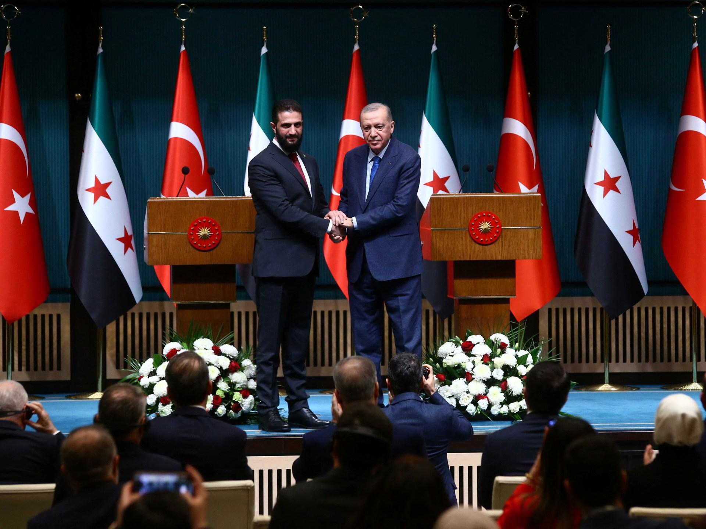

## Claim
Claim: "Turkey's President urged the U.S. in March 2025 to control its ally Israel over its intervention in southern Syria in February 2025."

## Actions
```
image_search("Turkey President US Israel Syria February 2025")
```

## Evidence
### Evidence from `image_search`
The search results include an article from wsws.org featuring an image of Turkish President Erdoğan (). Al Jazeera published an article on February 4, 2025, about a meeting between Syria's al-Sharaa and Erdogan to discuss Kurdish fighters and defense pacts ().

The Times of Israel provides an image of two men shaking hands ().


## Elaboration
The evidence shows that Turkish President Erdoğan met with Syria's al-Sharaa in February 2025 to discuss Kurdish fighters and defense pacts. However, the evidence does not mention any urging by Turkey's President to the U.S. regarding Israel's intervention in southern Syria.

Therefore, the claim cannot be verified with the provided evidence. More information is needed to confirm if Turkey's President urged the U.S. to control Israel.


## Final Judgement
The search results show that Turkish President Erdoğan met with Syria's al-Sharaa in February 2025. However, the provided evidence does not mention any urging by Turkey's President to the U.S. regarding Israel's intervention in southern Syria.

The claim is not supported by the evidence. There is no information about Turkey urging the U.S. to control Israel.

`false`

### Verdict: FALSE

### Justification
The search results reveal that Turkish President Erdoğan met with Syria's al-Sharaa in February 2025, as reported by Al Jazeera, but there is no evidence to support the claim that Turkey urged the U.S. to control Israel regarding its intervention in southern Syria.
