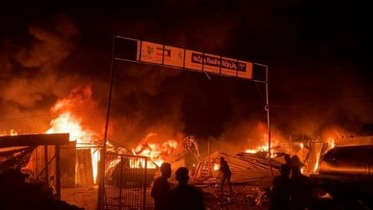

## Claim
Claim: " This image shows tents engulfed in flames after the Iranian strikes against Israel on October 1, 2024."

## Actions
```
reverse_search()
image_search("Iranian strikes against Israel tents on fire")
```

## Evidence
### Evidence from `reverse_search`
The image 

### Evidence from `image_search`
NPR published an article about the Iranian strikes against Israel, which includes an image of a fire at night (). The Guardian published an article about an Israeli airstrike on refugee tents (). Politico published an article on October 14, 2024, about an Israeli strike, which includes an image of a fire ().

The articles can be found at the following URLs: [https://www.npr.org/2025/06/15/nx-s1-5434172/israel-iran-strikes](https://www.npr.org/2025/06/15/nx-s1-5434172/israel-iran-strikes), [https://www.theguardian.com/us-news/article/2024/may/27/first-thing-deadly-israeli-airstrike-on-refugee-tents-in-rafa-leaves-aid-groups-horrified](https://www.theguardian.com/us-news/article/2024/may/27/first-thing-deadly-israeli-airstrike-on-refugee-tents-in-rafa-leaves-aid-groups-horrified), and [https://www.politico.com/news/2024/10/14/israeli-strike-hospital-tent-00183579](https://www.politico.com/news/2024/10/14/israeli-strike-hospital-tent-00183579).


## Elaboration
The evidence suggests that the image depicts a fire, but it does not confirm that it is related to the Iranian strikes against Israel on October 1, 2024. The image search found other images of fires related to the conflict, but none of them match the original image.

Therefore, the claim cannot be verified with the available information. More information is needed to confirm the context of the image.


## Final Judgement
The image search found other images of fires related to the conflict, but none of them match the original image. The evidence suggests that the image depicts a fire, but it does not confirm that it is related to the Iranian strikes against Israel on October 1, 2024.

The claim is not factually accurate because there is not enough evidence to verify the claim. `false`

### Verdict: FALSE

### Justification
The claim is not supported by the evidence. While the image depicts a fire, there is no evidence to confirm that it is related to the Iranian strikes against Israel on October 1, 2024. The image search found other images of fires related to the conflict, but none of them match the original image.
