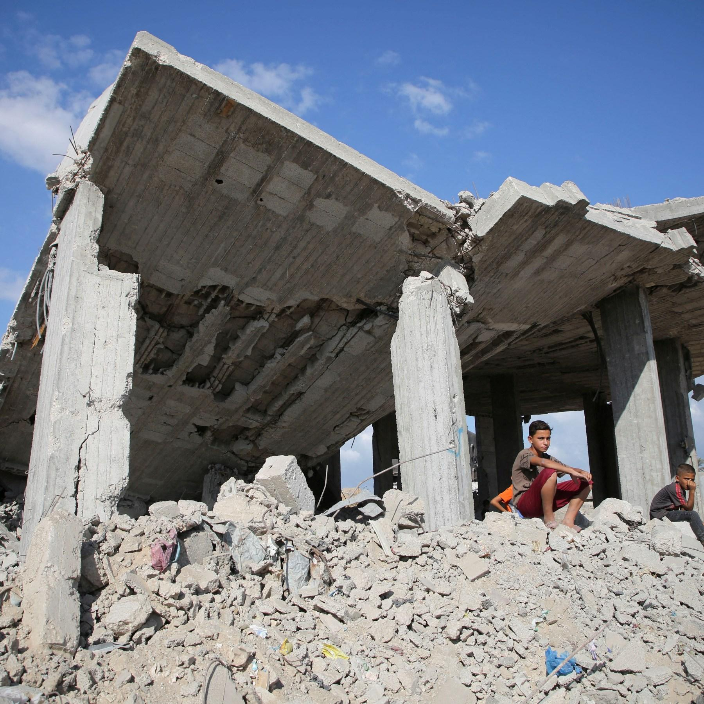
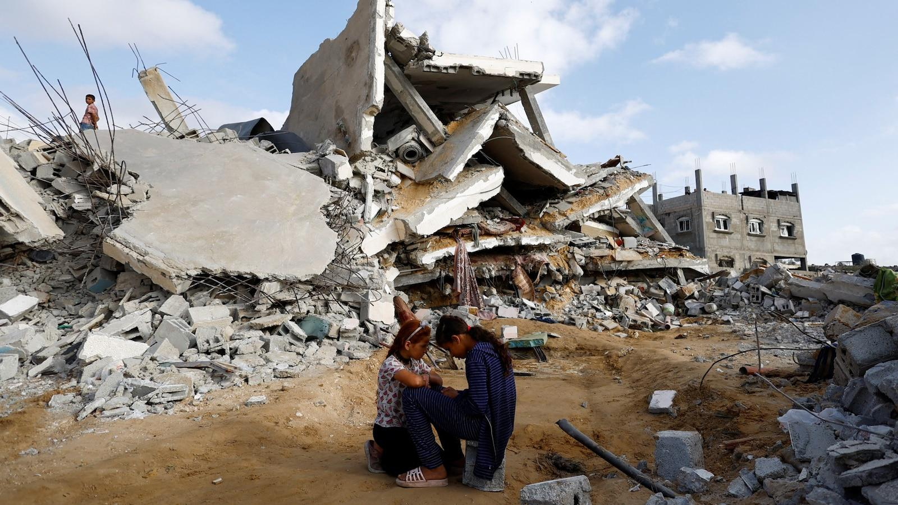
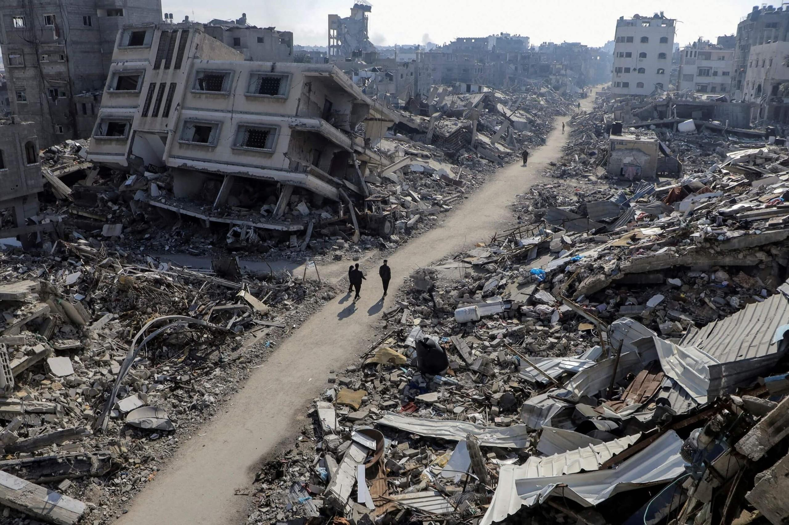

## Claim
Claim: "Israel experienced an earthquake on October 5, 2024."

## Actions
```
image_search("earthquake Israel October 5 2024")
```

## Evidence
### Evidence from `image_search`
The search results include reports from Al Jazeera ([Source](https://www.aljazeera.com/news/2024/10/6/israel-kills-26-in-strike-on-gaza-mosque-school-orders-more-evacuations)) about an Israeli strike on a Gaza mosque, dated October 6, 2024, with an image .

Human Rights Watch ([Source](https://www.hrw.org/world-report/2024/country-chapters/israel-and-palestine)) and The Atlantic Council ([Source](https://www.atlanticcouncil.org/blogs/menasource/one-year-after-hamass-october-7-terrorist-attacks-heres-how-the-region-changed/)) also provide images of destroyed buildings , .


## Elaboration
The evidence does not mention an earthquake in Israel on October 5, 2024. Instead, it shows reports of Israeli strikes on Gaza, with images of destroyed buildings dated around October 6, 2024.

The search results do not provide any information to support the claim.

I need more information to verify the claim.


## Actions
```
image_search("earthquake Israel October 5 2024 news")
```

## Evidence
### Evidence from `image_search`
Al Jazeera reports on the risk of Israeli war crimes, with an image of a destroyed building  from [Source](https://www.aljazeera.com/news/2024/10/4/white-house-warned-of-risk-of-israeli-war-crimes-days-after-oct-7-report).

ABC News also provides an image of destroyed buildings  from [Source](https://abcnews.go.com/International/live-updates/israel-gaza-hamas-war/?id=108860743).


## Elaboration
The new evidence continues to focus on the conflict between Israel and Gaza, with reports and images of destroyed buildings. The sources, such as Al Jazeera and ABC News, do not mention an earthquake in Israel on October 5, 2024.

The search results do not provide any information to support the claim.

I still need more information to verify the claim.


## Actions
```
image_search("Israel earthquake October 2024")
```

## Evidence
### Evidence from `image_search`
From [Source](https://www.ispionline.it/en/publication/october-7-a-year-that-changed-the-middle-east-185909): 
Content: The search result from ISPI Online includes an image of destroyed buildings .


## Elaboration
The evidence consistently points to reports and images related to the conflict between Israel and Gaza, with no mention of an earthquake in Israel in October 2024. The search results focus on the destruction of buildings, likely due to the conflict.

The claim remains unverified due to the lack of supporting evidence.


## Final Judgement
The search results consistently show reports and images related to the conflict between Israel and Gaza, with no mention of an earthquake in Israel on October 5, 2024. The evidence focuses on the destruction of buildings, likely due to the conflict. There is no evidence to support the claim.

`false`


### Verdict: FALSE

### Justification
The fact-check, based on multiple image searches, found no evidence to support the claim of an earthquake in Israel on October 5, 2024. Instead, the search results primarily revealed reports and images related to the ongoing conflict between Israel and Gaza, with sources like [Al Jazeera](https://www.aljazeera.com/news/2024/10/6/israel-kills-26-in-strike-on-gaza-mosque-school-orders-more-evacuations), [Human Rights Watch](https://www.hrw.org/world-report/2024/country-chapters/israel-and-palestine), and [ABC News](https://abcnews.go.com/International/live-updates/israel-gaza-hamas-war/?id=108860743) focusing on the destruction of buildings.
