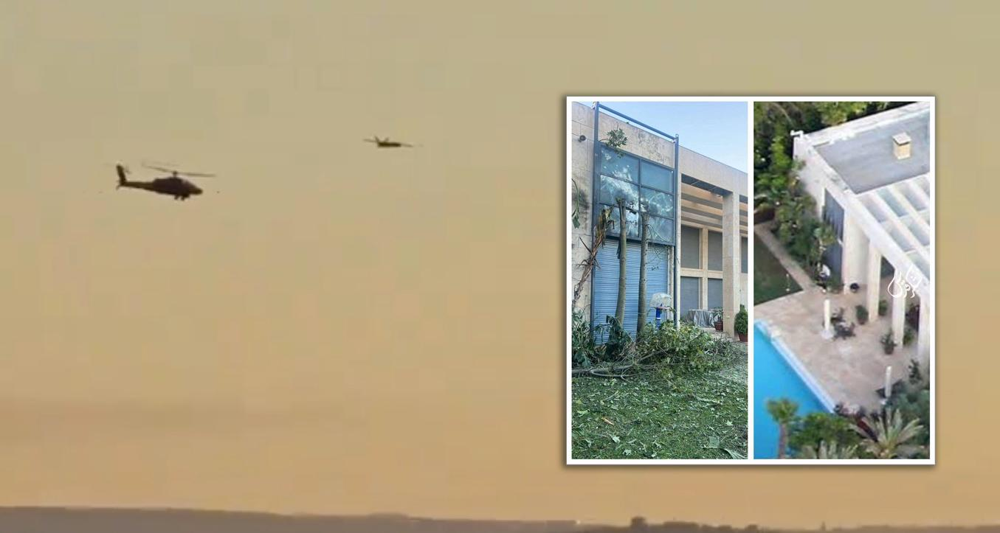
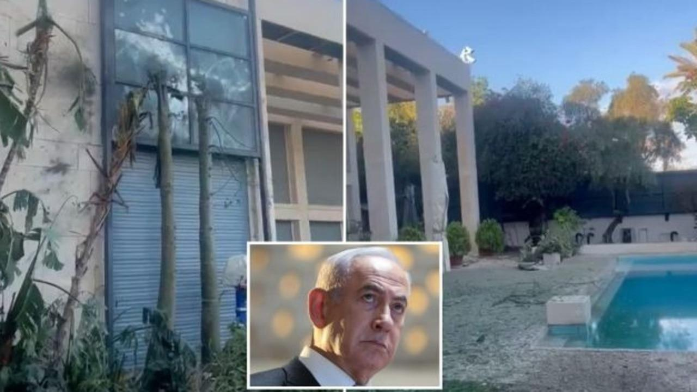
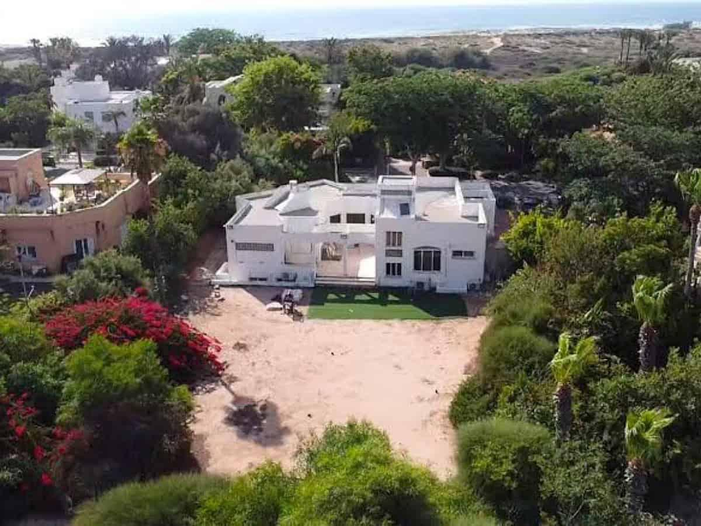

## Claim
Claim: " This image shows Israeli PM Benjamin Netanyahu's house taken by a Hezbollah drone in August 2024."

## Actions
```
geolocate()
reverse_search()
image_search("Benjamin Netanyahu house drone")
```

## Evidence
### Evidence from `geolocate`
The most likely countries where the image was taken are: {'Israel': 0.17, 'Mexico': 0.15, 'Tunisia': 0.11, 'Malta': 0.1, 'Palestine': 0.07, 'Bermuda': 0.05, 'Jordan': 0.05, 'United Arab Emirates': 0.04, 'Dominican Republic': 0.03, 'Pakistan': 0.03}

### Evidence from `reverse_search`
The image () is of Benjamin Netanyahu’s private residence in Caesarea. The image predates the claim and was featured in a 2020 article by _Times of Israel_ and a YouTube video from 2019.

The image was found on the website [PesaCheck](https://pesacheck.org/missing-context-this-image-of-israeli-prime-minister-benjamin-netanyahus-home-was-not-captured-by-9d48e97d86b7) and on the [Times of Israel](https://www.timesofisrael.com/topic/prime-ministers-residence/).


### Evidence from `image_search`
The Aviationist reports on an attack on Benjamin Netanyahu's house (). The Australian reports that a Hezbollah drone cracked a bedroom window at Netanyahu's home (). Siasat.com reports that a Hezbollah drone filmed Benjamin Netanyahu's residence ().

The sources are: [https://theaviationist.com/2024/10/19/netanyahus-house-attacked-by-drone/](https://theaviationist.com/2024/10/19/netanyahus-house-attacked-by-drone/), [https://www.theaustralian.com.au/world/hezbollah-drone-cracked-bedroom-window-at-netanyahu-home/news-story/3b37d4cf0972207541b284a416b09e8d](https://www.theaustralian.com.au/world/hezbollah-drone-cracked-bedroom-window-at-netanyahu-home/news-story/3b37d4cf0972207541b284a416b09e8d) and [https://www.siasat.com/hezbollah-drone-flies-over-films-netanyahus-residence-report-3080894/](https://www.siasat.com/hezbollah-drone-flies-over-films-netanyahus-residence-report-3080894/).


## Elaboration
The claim is not supported by the evidence. The image predates the claim and was featured in a 2020 article and a 2019 YouTube video. The image is of Benjamin Netanyahu’s private residence in Caesarea.


## Final Judgement
The image is of Benjamin Netanyahu's house, but it was taken before August 2024. The claim that it was taken by a Hezbollah drone in August 2024 is not supported by the evidence.

`false`

### Verdict: FALSE

### Justification
The image in the claim is of Benjamin Netanyahu's house, but it predates the claim, appearing in a 2020 article by _Times of Israel_ and a 2019 YouTube video, thus disproving the assertion that it was taken by a Hezbollah drone in August 2024.
