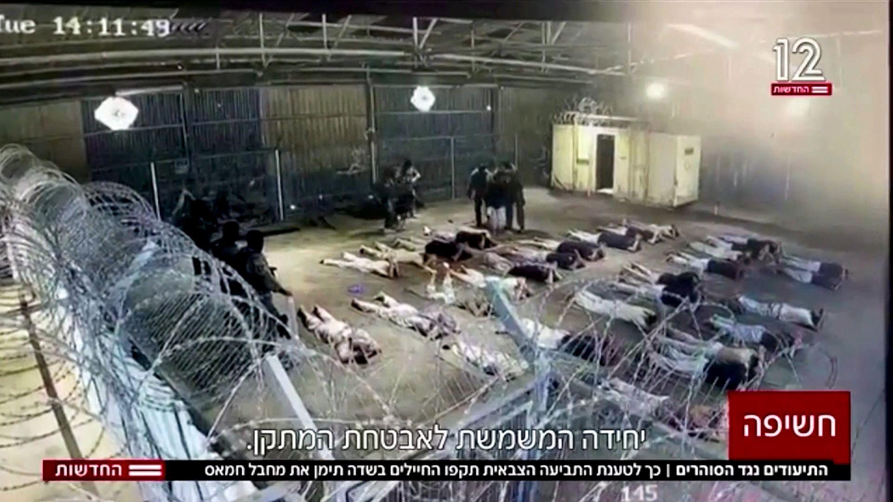

## Claim
Claim: " The image shows a screenshot of an authentic question from Israel's Channel 12 public opinion poll: 'Do you agree with the claim that a solder is allowed to rape a prisoner with his hands tied?'"

## Actions
```
image_search("Channel 12 Israel public opinion poll soldier rape prisoner")
```

## Evidence
### Evidence from `image_search`
The image is doctored, according to the source from [cedmohub.eu](https://cedmohub.eu/posts-share-doctored-prisoner-abuse-poll-from-israeli-tv-channel/). 

Another source from [mondoweiss.net](https://mondoweiss.net/2024/08/65-of-israeli-jews-oppose-criminal-prosecution-for-soldiers-suspected-of-raping-palestinian-detainees/) contains an image from Channel 12. 


## Elaboration
The image in the claim is doctored. The original image from Channel 12 was altered to include a fabricated question about soldiers and rape.


## Final Judgement
The image in the claim is a doctored version of an original image from Israel's Channel 12. The fabricated question about soldiers and rape was added to the original image.

The claim is demonstrably false because the image has been altered to include a false question. `false`


### Verdict: FALSE

### Justification
The image in the claim is a doctored version of an original image from Israel's Channel 12, as confirmed by [cedmohub.eu](https://cedmohub.eu/posts-share-doctored-prisoner-abuse-poll-from-israeli-tv-channel/). The fabricated question about soldiers and rape was added to the original image.
