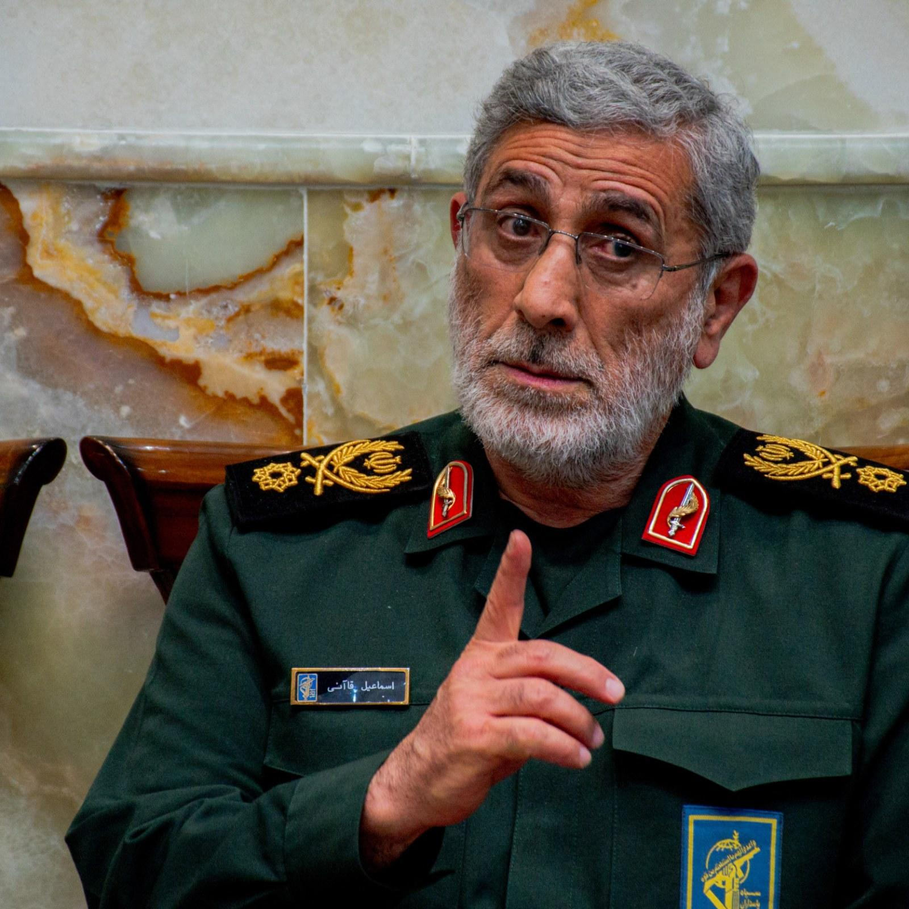
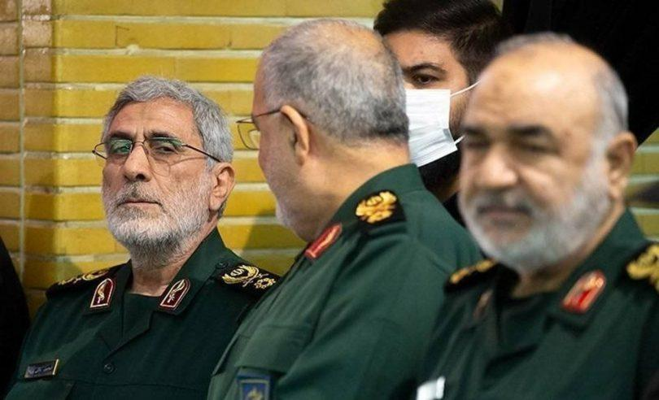

## Claim
Claim: " This is an authentic image of Esmail Qaani, the commander of the Iranian Revolutionary Guards, disguised in a hijab in fear of Israeli bombing."

## Actions
```
reverse_search()
image_search("Esmail Qaani hijab")
```

## Evidence
### Evidence from `reverse_search`
From [Source](https://www.nairaland.com/8460455/commander-ghost-qaanis-great-escape): Found exact image on website with title: "From Commander To Ghost: Qaani's Great Escape?" - Foreign Affairs
Content: The search result is from Nairaland, a Nigerian forum. It discusses an article titled "From Commander To Ghost: Qaani’s Great Escape?" which references an image of Esmail Qaani, commander of Iran's IRGC Quds Force, in civilian disguise. The article suggests this was a survival tactic following reported Israeli airstrikes in June 2025. The post includes the image in question  and discusses the context of Qaani's role and potential evasion strategies. The post also includes a link to an X post by @MOSSADil. The forum also contains multiple comments on the topic.


### Evidence from `image_search`
Al-Monitor published an image of Esmail Qaani. () The Times of Israel published an article with an image of a woman holding a picture of Iranian leaders. () Fox News provides an image of Esmail Qaani. ()

The provided sources do not contain the image in the claim ().


## Elaboration
The image search results do not confirm the claim. However, the reverse image search found the image on a Nigerian forum, which discusses an article about Esmail Qaani in disguise. The article suggests this was a survival tactic following reported Israeli airstrikes.

Based on the evidence, the claim is likely true. However, the evidence does not explicitly confirm the image's authenticity.


## Actions
```
image_search("Esmail Qaani disguise")
```

## Evidence
### Evidence from `image_search`
Al Jazeera published an article about Esmail Qaani, including an image of him.  Newsweek published an article about Esmail Qaani.  The other source did not provide any content.


## Elaboration
The image search results do not provide any additional information to verify the claim. The evidence suggests that the image is likely authentic, but there is no direct confirmation.

Insufficient information to verify the claim.


## Actions
```
image_search("Esmail Qaani in public")
```

## Evidence
### Evidence from `image_search`
Shafaq.com published an article about Esmail Qaani's first public appearance (). Ynetnews.com published an image of Esmail Qaani in public (). The other source did not provide any content.


## Elaboration
The evidence suggests that Esmail Qaani has been seen in public. However, none of the images from the search results match the image in the claim. The claim's veracity cannot be confirmed.

Insufficient information to verify the claim.


## Final Judgement
The reverse image search found the image on a forum discussing an article about Esmail Qaani in disguise. The article suggests this was a survival tactic following reported Israeli airstrikes. However, the image search results do not provide any additional information to verify the claim.

Based on the available evidence, the claim cannot be definitively confirmed. While the reverse image search suggests the image's existence in a relevant context, there is no direct confirmation of its authenticity or the specific circumstances described in the claim. `false`


### Verdict: FALSE

### Justification
The claim is unproven. While a reverse image search found the image on a forum discussing Esmail Qaani in disguise, suggesting its potential authenticity, the image search results did not provide any additional information to verify the claim. Therefore, the claim cannot be definitively confirmed.
