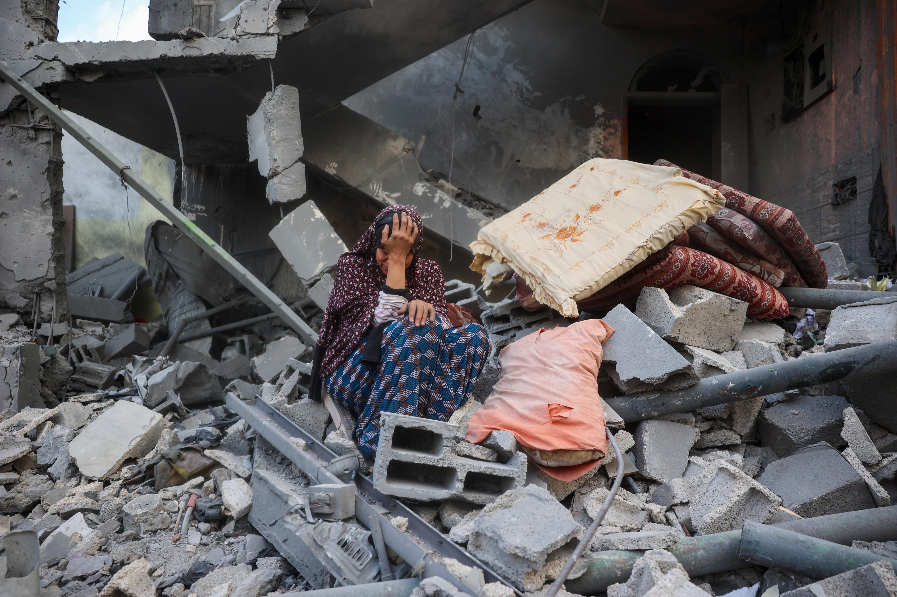
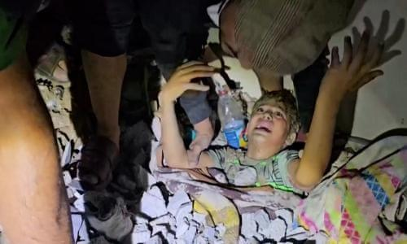

## Claim
Claim: " This image shows a palestinian child stuck under the rubble in Gaza after an Israeli airstrike in July 2024."

## Actions
```
reverse_search()
image_search("child rubble Gaza Israeli airstrike")
```

## Evidence
### Evidence from `reverse_search`
The image () is of a Syrian child named Sham who was rescued from the rubble in Armanaz, Idlib, after an earthquake on February 7, 2023. The image was featured in articles discussing Sham's journey to a hospital in Abu Dhabi, published on March 14, 2023, by both [Enab Baladi](https://english.enabbaladi.net/archives/2023/03/shams-journey-from-under-the-rubble-to-abu-dhabis-burjeel-hospital/) and [UAE Times](https://uaetimes.ae/shams-journey-from-under-the-rubble-to-abu-dhabis-burjeel-hospital/).

The image was also used in an article from [El País](https://english.elpais.com/international/2023-07-20/the-manual-of-repression-shared-by-modern-tyrants.html) published on July 20, 2023, which discussed the "manual of repression" shared by modern tyrants. The article showed the image () during a presentation at the Oslo Freedom Forum.


### Evidence from `image_search`
NPR published an article about Israeli airstrikes on Gaza ([https://www.npr.org/2025/03/17/g-s1-54401/israel-launches-deadly-series-of-attack-on-gaza](https://www.npr.org/2025/03/17/g-s1-54401/israel-launches-deadly-series-of-attack-on-gaza)). The Guardian published a video of children being pulled from the rubble after a home was hit by an Israeli airstrike in Gaza ([https://www.theguardian.com/world/video/2023/oct/19/gaza-moment-children-are-pulled-from-rubble-after-home-hit-by-israeli-airstrike-video](https://www.theguardian.com/world/video/2023/oct/19/gaza-moment-children-are-pulled-from-rubble-after-home-hit-by-israeli-airstrike-video)). Al Jazeera published an article about the war against Gaza's children ([https://www.aljazeera.com/news/2023/10/19/israels-war-against-gazas-children-explained](https://www.aljazeera.com/news/2023/10/19/israels-war-against-gazas-children-explained)). , , 


## Elaboration
The image (

## Final Judgement
The image in the claim is of a Syrian child, Sham, who was rescued from the rubble after an earthquake in February 2023, not a Palestinian child in Gaza after an Israeli airstrike in July 2024. The image has been used in various articles, including those discussing Sham's rescue and recovery.

The claim is demonstrably false because the image is misrepresented. The image is not of a Palestinian child in Gaza after an Israeli airstrike, but of a Syrian child rescued after an earthquake. `false`

### Verdict: FALSE

### Justification
The image in the claim depicts a Syrian child, Sham, rescued from the rubble after an earthquake in February 2023, as reported by [Enab Baladi](https://english.enabbaladi.net/archives/2023/03/shams-journey-from-under-the-rubble-to-abu-dhabis-burjeel-hospital/) and [UAE Times](https://uaetimes.ae/shams-journey-from-under-the-rubble-to-abu-dhabis-burjeel-hospital/). The claim misrepresents the image's context, incorrectly associating it with a Palestinian child in Gaza after an Israeli airstrike in July 2024.
