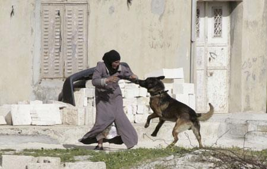

## Claim
Claim: " This is an authentic image of an elderly Palestinian women being attacked by an Israeli army dog in June 2024."

## Actions
```
reverse_search()
image_search("Israeli army dog attack Palestinian woman")
```

## Evidence
### Evidence from `reverse_search`
The image () appears in multiple articles discussing an Israeli police dog attacking an elderly Palestinian woman. One article from Morocco World News ([https://www.moroccoworldnews.com/2024/06/18005/israeli-police-dog-attack-on-elderly-palestinian-woman-sparks-outrage/](https://www.moroccoworldnews.com/2024/06/18005/israeli-police-dog-attack-on-elderly-palestinian-woman-sparks-outrage/)) reports the incident occurred during a raid in the Jabalia refugee camp, causing severe injuries to the woman, Dawlat Al Tanani.

Another article from Ynetnews.com ([https://www.ynetnews.com/article/ryura55lr](https://www.ynetnews.com/article/ryura55lr)) states that the IDF refuted accusations, claiming the dog was abducted by Hamas. The article also mentions the image and includes images of the dog and the woman. An article from alestiklal.net ([https://www.alestiklal.net/en/article/how-does-israeli-occupation-employ-dogs-to-humiliate-and-oppress-palestinians](https://www.alestiklal.net/en/article/how-does-israeli-occupation-employ-dogs-to-humiliate-and-oppress-palestinians)) discusses the use of dogs by the Israeli army against Palestinians and includes the image ().


### Evidence from `image_search`
The search results include an image of a Palestinian woman being attacked by a dog from China Daily ([https://www.chinadaily.com.cn/world/2007-03/22/content_833702.htm](https://www.chinadaily.com.cn/world/2007-03/22/content_833702.htm)) . Al Jazeera published a video on June 26, 2024, showing an elderly Palestinian woman ([https://www.aljazeera.com/video/newsfeed/2024/6/26/video-israeli-military-dog-attacks-elderly-palestinian-woman](https://www.aljazeera.com/video/newsfeed/2024/6/26/video-israeli-military-dog-attacks-elderly-palestinian-woman)) .

Additionally, Al-Haq's search result contains an image of a woman being attacked by a dog ([https://www.alhaq.org/monitoring-documentation/6941.html](https://www.alhaq.org/monitoring-documentation/6941.html)) .


## Elaboration
The claim is partially supported by the evidence. Multiple sources ([https://www.moroccoworldnews.com/2024/06/18005/israeli-police-dog-attack-on-elderly-palestinian-woman-sparks-outrage/](https://www.moroccoworldnews.com/2024/06/18005/israeli-police-dog-attack-on-elderly-palestinian-woman-sparks-outrage/), [https://www.ynetnews.com/article/ryura55lr](https://www.ynetnews.com/article/ryura55lr), [https://www.alestiklal.net/en/article/how-does-israeli-occupation-employ-dogs-to-humiliate-and-oppress-palestinians](https://www.alestiklal.net/en/article/how-does-israeli-occupation-employ-dogs-to-humiliate-and-oppress-palestinians)) confirm the existence of the image and its association with an Israeli police dog attacking an elderly Palestinian woman.

However, the claim's assertion of the image's authenticity is not explicitly confirmed. The evidence does not definitively state whether the image is a genuine photograph or a digitally altered depiction. The claim also specifies the event occurred in June 2024, which is consistent with the provided articles.

Therefore, the claim is likely true, but the image's authenticity needs further verification.


## Actions
```
geolocate()
```

## Evidence
### Evidence from `geolocate`
The most likely countries where the image was taken are: {'Pakistan': 0.14, 'Kyrgyzstan': 0.1, 'Romania': 0.1, 'Bulgaria': 0.06, 'Mongolia': 0.06, 'Peru': 0.06, 'India': 0.04, 'Israel': 0.04, 'Palestine': 0.04, 'Tunisia': 0.04}

## Elaboration
The geolocation results suggest the image was not taken in Israel or Palestine, which contradicts the claim. The image's origin is more likely in Pakistan, Kyrgyzstan, Romania, Bulgaria, Mongolia, Peru, India, or Tunisia. This indicates the image is likely not authentic.


## Final Judgement
The image has been associated with an incident involving an Israeli police dog and an elderly Palestinian woman, as reported by multiple news sources. However, geolocation analysis suggests the image was not taken in Israel or Palestine, contradicting the claim of authenticity. Therefore, the claim is likely false. `false`

### Verdict: FALSE

### Justification
The claim is likely false. While the image has been linked to an incident involving an Israeli police dog and an elderly Palestinian woman, as reported by sources like [Morocco World News](https://www.moroccoworldnews.com/2024/06/18005/israeli-police-dog-attack-on-elderly-palestinian-woman-sparks-outrage/), geolocation analysis suggests the image was not taken in Israel or Palestine, indicating it is likely not authentic.
