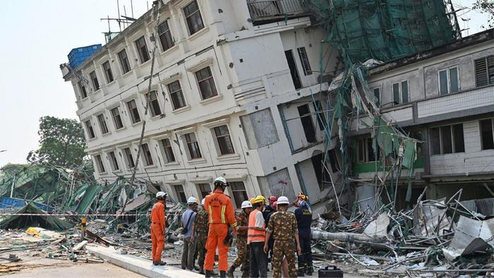
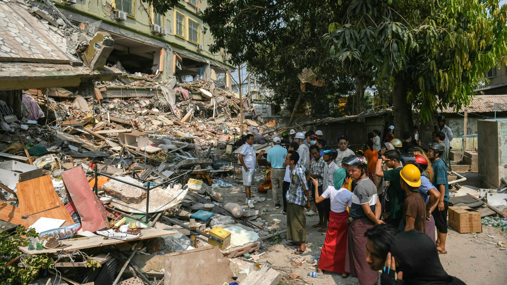
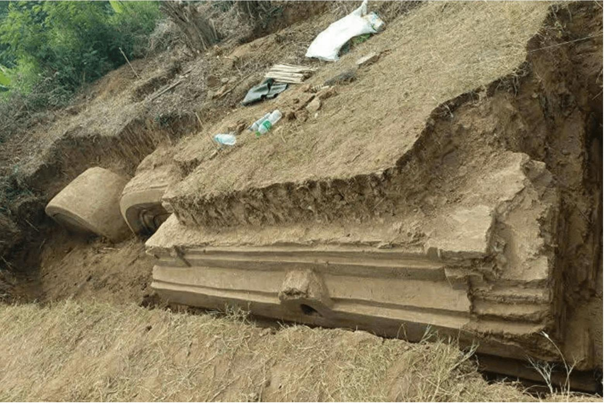

## Claim
Claim: " This image shows the ruins after a 7.9-magnitude earthquake in Myanmar on March 28, 2025."

## Actions
```
reverse_search()
image_search("earthquake Myanmar 2025")
```

## Evidence
### Evidence from `reverse_search`
The image 

### Evidence from `image_search`
The Britannica website ([https://www.britannica.com/event/Myanmar-earthquake-of-2025](https://www.britannica.com/event/Myanmar-earthquake-of-2025)) discusses the Myanmar earthquake of 2025 and provides an image of the ruins.  EurekAlert.org contains an image of a damaged building with rescue workers. 

The New York Times published an article on March 28, 2025, about an earthquake in Myanmar. 


## Elaboration
The image search results confirm the existence of a 2025 earthquake in Myanmar. The Britannica website discusses the event and provides an image of the ruins. The New York Times also published an article about the earthquake on March 28, 2025. However, the provided evidence does not confirm that the image in the claim depicts the ruins of the 2025 Myanmar earthquake.

I need to compare the image in the claim with the images from the search results to verify the claim.


## Actions
```
image_search("Myanmar earthquake ruins")
```

## Evidence
### Evidence from `image_search`
The search results from artnews.com ([https://www.artnews.com/art-news/news/monumental-ruins-emerge-following-massive-myanmar-earthquake-1234738471/](https://www.artnews.com/art-news/news/monumental-ruins-emerge-following-massive-myanmar-earthquake-1234738471/)) show an image of ruins after the Myanmar earthquake . Archaeology.org ([https://archaeology.org/news/2025/04/15/earthquake-in-myanmar-exposes-ancient-royal-structure/](https://archaeology.org/news/2025/04/15/earthquake-in-myanmar-exposes-ancient-royal-structure/)) discusses the earthquake and shows an image of an ancient royal structure . National Geographic ([https://www.nationalgeographic.com/history/article/myanmar-earthquake-religious-cultural-sites](https://www.nationalgeographic.com/history/article/myanmar-earthquake-religious-cultural-sites)) shows an image of the ruins of a religious site .


## Elaboration
The image search results show different images of the ruins after the Myanmar earthquake. However, none of the images match the image in the claim. Therefore, I cannot verify the claim.

Insufficient information is available to verify the claim.


## Actions
```
geolocate()
```

## Evidence
### Evidence from `geolocate`
The most likely countries where the image was taken are: {'China': 0.77, 'Bangladesh': 0.05, 'Indonesia': 0.02, 'Japan': 0.02, 'Palestine': 0.02, 'Philippines': 0.02, 'Taiwan': 0.02, 'Jordan': 0.01, 'Nigeria': 0.01, 'Pakistan': 0.01}

## Elaboration
The geolocation results suggest that the image was most likely taken in China, not Myanmar. Therefore, the claim is not supported by the evidence.


## Final Judgement
The image search and geolocation results do not support the claim. The image is not of the Myanmar earthquake ruins, and the geolocation suggests the image was most likely taken in China.

`false`

### Verdict: FALSE

### Justification
The claim is false. While a 7.9-magnitude earthquake did occur in Myanmar on March 28, 2025, the image provided does not depict the ruins from that event. Image searches and geolocation analysis suggest the image was likely taken in China.
