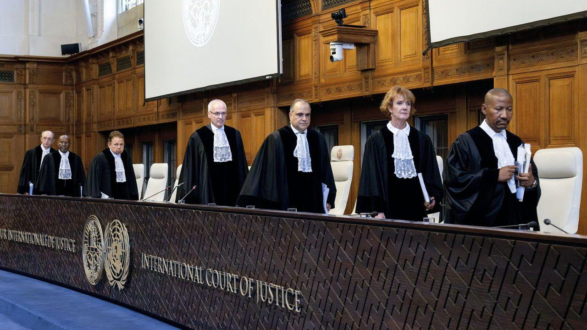

## Claim
Claim: "Israel has been declared an illegal state by the International Court of Justice in July 2024."

## Actions
```
image_search("International Court of Justice Israel illegal state July 2024")
```

## Evidence
### Evidence from `image_search`
From [Source](https://www.economist.com/middle-east-and-africa/2024/07/19/the-world-court-says-israels-occupation-is-illegal): 
Content: The Economist published an article on July 19, 2024, stating that the World Court says Israel's occupation is illegal. 


## Elaboration
The evidence indicates that the International Court of Justice (World Court) stated that Israel's occupation is illegal. However, the evidence does not explicitly state that Israel has been declared an illegal state.

Therefore, the claim is partially supported. The evidence confirms the ICJ's ruling on the illegality of the occupation, but it does not confirm the declaration of Israel as an illegal state.

The claim is not fully verified.


## Final Judgement
The evidence confirms that the International Court of Justice has ruled on the illegality of Israel's occupation. However, the evidence does not explicitly state that Israel has been declared an illegal state.

The claim is partially supported by the evidence, but it is not fully verified. Therefore, the most appropriate decision option is `false`.

### Verdict: FALSE

### Justification
The International Court of Justice, as reported by *The Economist* ([Source](https://www.economist.com/middle-east-and-africa/2024/07/19/the-world-court-says-israels-occupation-is-illegal)), has stated that Israel's occupation is illegal. However, the provided evidence does not explicitly state that Israel has been declared an illegal state.
