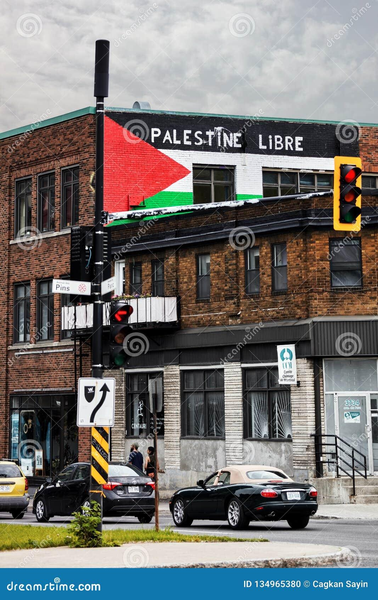
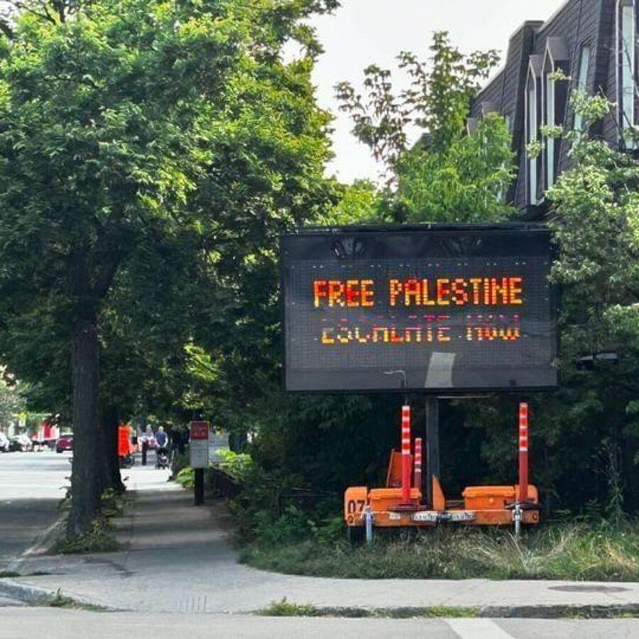
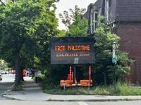
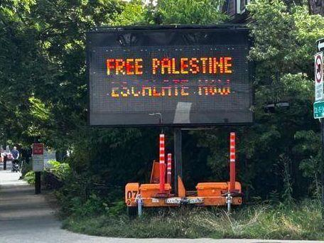
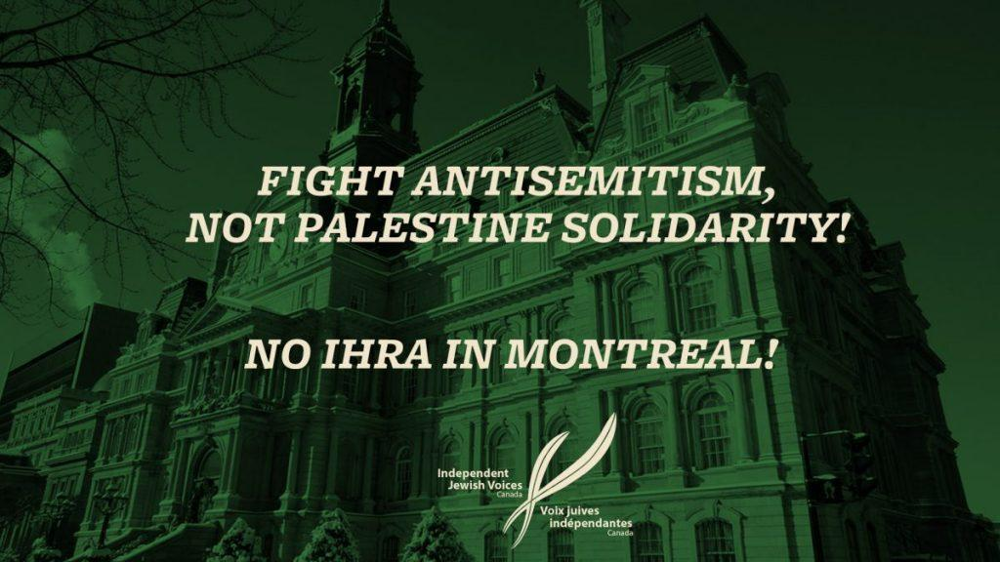

## Claim
Claim: " This image shows a traffic sign in Montreal in July 2024 which displays a 'Free Palestine. Escalate now' message and was authorized by Montreal's Mayor Valérie Plante."

## Actions
```
image_search("traffic sign Free Palestine Montreal")
geolocate()
```

## Evidence
### Evidence from `image_search`
From [Source](https://www.dreamstime.com/montreal-canada-june-palestine-flag-free-palestine-palestine-libre-slogan-french-painted-brick-walls-building-image134965380): 
Content: The search result contains an image of a building in Montreal with a Palestine flag and the words "PALESTINE LIBRE". 


### Evidence from `geolocate`
The most likely countries where the image was taken are: {'Palestine': 0.85, 'Canada': 0.07, 'Germany': 0.02, 'Austria': 0.01, 'Israel': 0.01, 'Poland': 0.01, 'Slovenia': 0.01, 'South Korea': 0.01, 'Albania': 0.0, 'Andorra': 0.0}

## Elaboration
The image search confirms that there are images related to Palestine in Montreal. The geolocation analysis suggests that the image was most likely taken in Palestine, with a smaller probability of being in Canada. The evidence does not provide information about the traffic sign's message or the authorization by Montreal's Mayor.

Insufficient information is available to verify the claim.


## Actions
```
image_search("Montreal traffic sign Free Palestine")
image_search("Valérie Plante Free Palestine Montreal")
```

## Evidence
### Evidence from `image_search`
The Globe and Mail ([https://www.theglobeandmail.com/canada/article-montreal-traffic-signs-apparently-hacked-to-display-pro-palestinian/](https://www.theglobeandmail.com/canada/article-montreal-traffic-signs-apparently-hacked-to-display-pro-palestinian/)) and The Canadian Press News ([https://www.thecanadianpressnews.ca/quebec/montreal-electronic-traffic-signs-altered-to-display-pro-palestinian-slogans/article_20202caf-5885-5c90-a4ff-eda9db2799be.html](https://www.thecanadianpressnews.ca/quebec/montreal-electronic-traffic-signs-altered-to-display-pro-palestinian-slogans/article_20202caf-5885-5c90-a4ff-eda9db2799be.html)) both reported on Montreal traffic signs displaying a "Free Palestine. Escalate now" message. The articles include images of the traffic signs.  


### Evidence from `image_search`
The National Post published an article about anti-Israel road sign messages in Montreal, including an image of a traffic sign that reads "FREE PALESTINE. ESCALATE NOW."  Another search result from Independent Jewish Voices Canada contains an image with the text "FIGHT ANTISEMITISM, NOT PALESTINE SOLIDARITY!" and "NO IHRA IN MONTREAL!"  The CBC article does not contain any relevant information.


## Elaboration
The image search results confirm that traffic signs in Montreal displayed the message "FREE PALESTINE. ESCALATE NOW." The articles from The Globe and Mail and The Canadian Press News indicate that the signs were apparently hacked. The evidence does not mention the date or Mayor Valérie Plante's authorization.

Insufficient information is available to verify the claim.


## Final Judgement
The image search results confirm that traffic signs in Montreal displayed the message "FREE PALESTINE. ESCALATE NOW." However, the evidence indicates that the signs were hacked, and there is no information about the date or Mayor Valérie Plante's authorization. Therefore, the claim is not entirely accurate.

`false`

### Verdict: FALSE

### Justification
The claim is false. While traffic signs in Montreal did display the message "FREE PALESTINE. ESCALATE NOW," according to reports from sources like the [Globe and Mail](https://www.theglobeandmail.com/canada/article-montreal-traffic-signs-apparently-hacked-to-display-pro-palestinian/) and The Canadian Press News, the signs were apparently hacked, and there is no evidence to support the claim that the message was authorized by Montreal's Mayor Valérie Plante.
