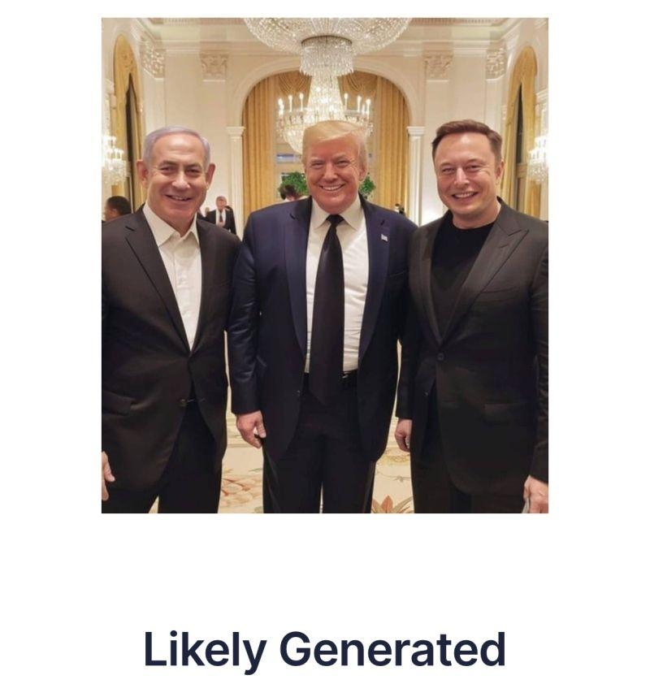

## Claim
Claim: " This is an authentic image of Donald Trump, Benjamin Netanyahu and Elon Musk during Netanyahu's official visit to the U.S. in February 2025."

## Actions
```
image_search("Donald Trump Benjamin Netanyahu Elon Musk meeting")
```

## Evidence
### Evidence from `image_search`
One source contains an image of Donald Trump, Benjamin Netanyahu, and Elon Musk, labeled as "Likely Generated" (). Another source mentions a New York Times article from 2023 about a meeting between Benjamin Netanyahu and Elon Musk ().

The first source is available at [https://www.linkedin.com/posts/uncovai_this-week-a-photo-of-a-meeting-between-donald-activity-7293197209175527425-l1kD](https://www.linkedin.com/posts/uncovai_this-week-a-photo-of-a-meeting-between-donald-activity-7293197209175527425-l1kD). The second source is available at [https://www.nytimes.com/2023/09/18/world/middleeast/netanyahu-musk-meeting.html](https://www.nytimes.com/2023/09/18/world/middleeast/netanyahu-musk-meeting.html).


## Elaboration
The evidence suggests the image is "Likely Generated" and therefore not authentic. The image search results also show a meeting between Netanyahu and Musk in 2023, but not with Trump.

The claim that the image is authentic is not supported by the evidence.


## Final Judgement
The image search results indicate that the image is "Likely Generated" and therefore not authentic. The search also reveals a meeting between Netanyahu and Musk in 2023, but not with Trump.

The claim is demonstrably false because the image is likely generated and the date provided is incorrect. `false`


### Verdict: FALSE

### Justification
The image is likely AI-generated, as indicated by the image search results, and therefore not authentic. The search also revealed a meeting between Netanyahu and Musk in 2023, but not with Trump, and the date provided in the claim is incorrect.
