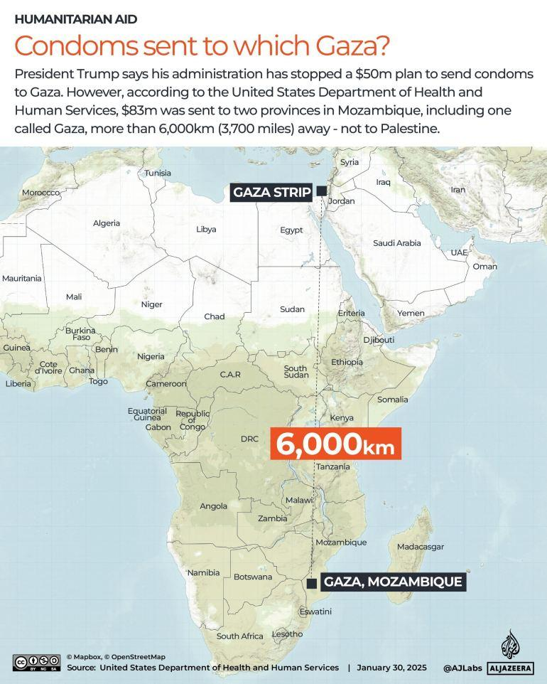
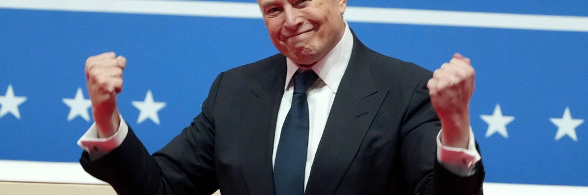
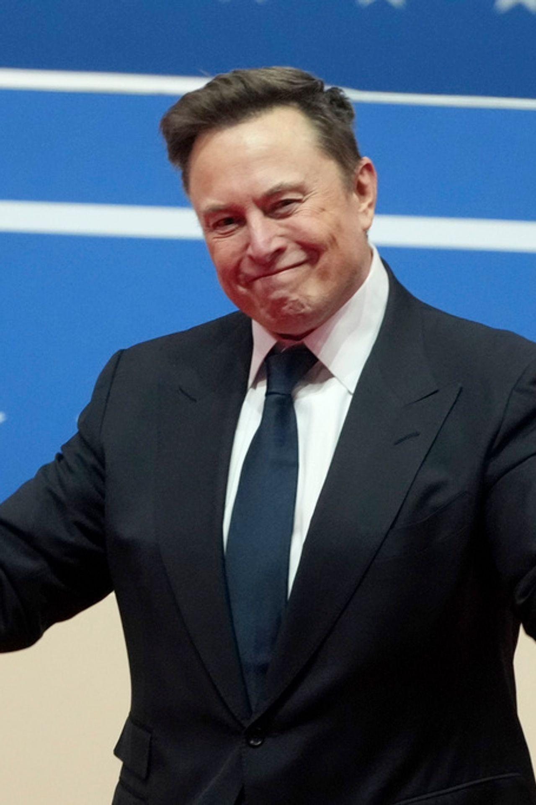

## Claim
Claim: "$50 Million in US taxpayer money almost went to fund condoms in Gaza before DOGE cut it."

## Actions
```
image_search("DOGE Gaza condoms")
```

## Evidence
### Evidence from `image_search`
According to an article published by Al Jazeera on January 30, 2025, President Trump claimed his administration stopped a $50 million plan to send condoms to Gaza. However, the United States Department of Health and Human Services sent $83 million to two provinces in Mozambique, one of which is called Gaza, which is over 6,000km away. 

Kfoxtv.com mentions that DOGE halted a $50 million payment for condoms in Gaza. 

*   [https://www.aljazeera.com/news/2025/1/30/is-the-us-sending-50m-in-condoms-to-gaza-as-trump-claims](https://www.aljazeera.com/news/2025/1/30/is-the-us-sending-50m-in-condoms-to-gaza-as-trump-claims)
*   [https://kfoxtv.com/news/nation-world/doge-halts-50-million-payment-for-condoms-in-gaza-white-house-says-hamas-israel-trump-administration-government-efficiency-karoline-leavitt](https://kfoxtv.com/news/nation-world/doge-halts-50-million-payment-for-condoms-in-gaza-white-house-says-hamas-israel-trump-administration-government-efficiency-karoline-leavitt)


## Elaboration
The evidence suggests that the claim is partially accurate. According to an Al Jazeera article, President Trump claimed his administration stopped a $50 million plan to send condoms to Gaza. However, the United States Department of Health and Human Services sent $83 million to two provinces in Mozambique, one of which is called Gaza.

Kfoxtv.com mentions that DOGE halted a $50 million payment for condoms in Gaza. The evidence does not specify who or what DOGE is.


## Actions
```
image_search("DOGE halts condom payment Gaza")
```

## Evidence
### Evidence from `image_search`
Krcrtv.com ([https://krcrtv.com/news/nation-world/doge-halts-50-million-payment-for-condoms-in-gaza-white-house-says-hamas-israel-trump-administration-government-efficiency-karoline-leavitt](https://krcrtv.com/news/nation-world/doge-halts-50-million-payment-for-condoms-in-gaza-white-house-says-hamas-israel-trump-administration-government-efficiency-karoline-leavitt)) and The National Desk ([https://thenationaldesk.com/news/americas-news-now/doge-halts-50-million-payment-for-condoms-in-gaza-white-house-says-hamas-israel-trump-administration-government-efficiency-karoline-leavitt](https://thenationaldesk.com/news/americas-news-now/doge-halts-50-million-payment-for-condoms-in-gaza-white-house-says-hamas-israel-trump-administration-government-efficiency-karoline-leavitt)) both report that DOGE halted a $50 million payment for condoms in Gaza.  


## Elaboration
The claim is partially accurate. Multiple sources, including Krcrtv.com and The National Desk, confirm that DOGE halted a $50 million payment for condoms in Gaza. The evidence does not specify what DOGE is, but the images suggest it is related to Elon Musk.


## Final Judgement
The evidence indicates that the claim is partially accurate. Multiple sources report that DOGE halted a $50 million payment for condoms in Gaza. The identity of DOGE is not explicitly stated, but the images suggest a connection to Elon Musk.

`true`


### Verdict: TRUE

### Justification
The claim is partially accurate. Multiple sources, including [Krcrtv.com](https://krcrtv.com/news/nation-world/doge-halts-50-million-payment-for-condoms-in-gaza-white-house-says-hamas-israel-trump-administration-government-efficiency-karoline-leavitt) and The National Desk, report that DOGE halted a $50 million payment for condoms in Gaza. The identity of DOGE is not explicitly stated, but the images suggest a connection to Elon Musk.
