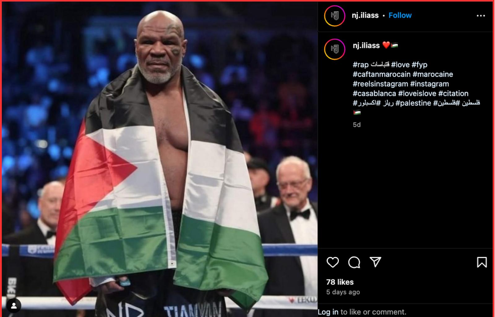
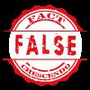
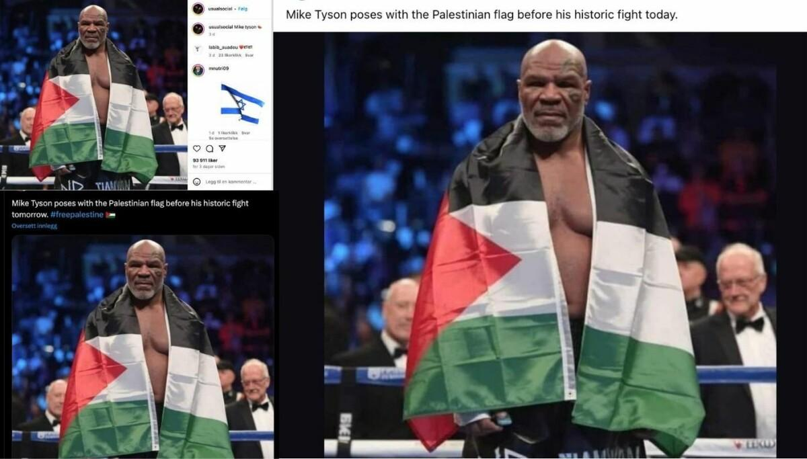

## Claim
Claim: " This is an authentic image of Mike Tyson posing with the Palestinian flag in the ring before his fight against Jake Paul on November, 15, 2024."

## Actions
```
reverse_search()
image_search("Mike Tyson Palestinian flag boxing match")
```

## Evidence
### Evidence from `reverse_search`
From [Source](https://srilanka.factcrescendo.com/english/ai-generated-image-falsely-shows-mike-tyson-with-palestinian-flag/): Found exact image on website with title: Mike Tyson did not pose with the Palestine flag
Content: The website srilanka.factcrescendo.com published on July 20, 2025, states that the image of Mike Tyson with the Palestinian flag is AI-generated and not authentic. , , , , . The website also mentions that the image was widely shared on social media, and that the Fact Crescendo team watched the fight and did not see Tyson with the flag. The website also includes a link to a TrueMedia.org analysis that indicates substantial evidence of manipulation. . The website also searched Getty Images and found no images of Tyson with the flag. . The conclusion is that the image is false. .


### Evidence from `image_search`
From [Source](https://www.faktisk.no/faktasjekk/mike-tyson-poserte-ikke-med-palestinsk-flagg/122105): 
Content: The search result from Faktisk.no shows an image of Mike Tyson posing with the Palestinian flag. 


## Elaboration
The evidence indicates that the image is not authentic. Multiple sources, including srilanka.factcrescendo.com, have identified the image as AI-generated and not a real photo of Mike Tyson. Furthermore, the Fact Crescendo team watched the fight and did not see Tyson with the flag. TrueMedia.org also found substantial evidence of manipulation.


## Final Judgement
The claim is demonstrably false. Multiple sources confirm that the image is AI-generated and not authentic. The fact-checkers watched the fight and did not see Tyson with the flag.

`false`

### Verdict: FALSE

### Justification
The claim is false. The image of Mike Tyson with the Palestinian flag is AI-generated, as confirmed by fact-checkers at [srilanka.factcrescendo.com](https://srilanka.factcrescendo.com/english/ai-generated-image-falsely-shows-mike-tyson-with-palestinian-flag/) and supported by evidence of manipulation from TrueMedia.org.
