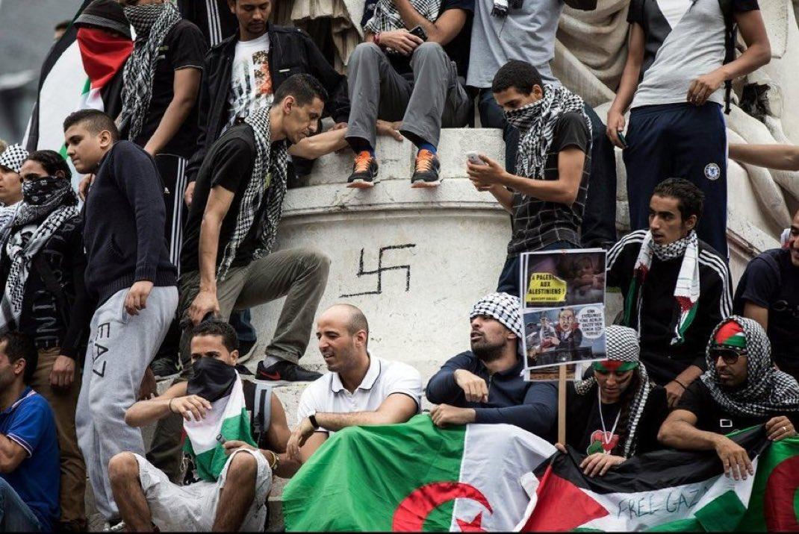
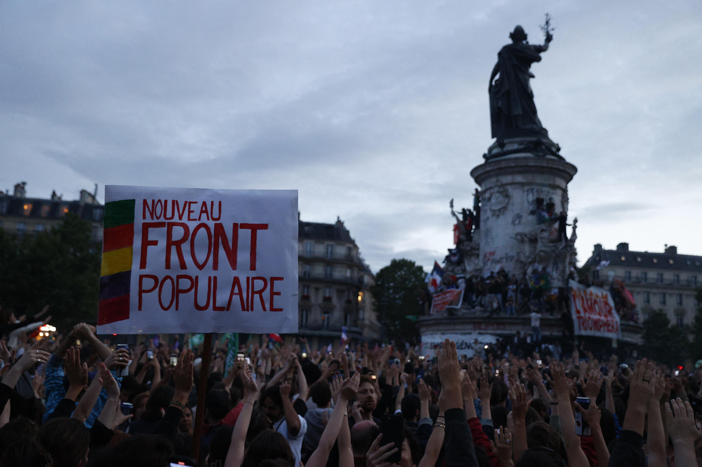

## Claim
Claim: " This image shows the 'French' Left who is rioting against Le Pen's victory in the first round of the French parliamentary elections in 2024."

## Actions
```
geolocate()
image_search("French protest Le Pen victory 2024")
reverse_search()
```

## Evidence
### Evidence from `geolocate`
The most likely countries where the image was taken are: {'Palestine': 0.38, 'France': 0.31, 'Germany': 0.1, 'Tunisia': 0.05, 'Belgium': 0.03, 'Sweden': 0.03, 'Israel': 0.02, 'Jordan': 0.02, 'Hungary': 0.01, 'Italy': 0.01}

### Evidence from `image_search`
Al Jazeera published an article on July 6, 2024, about the French parliamentary elections, including an image of a protest (). Bloomberg published an article on June 10, 2024, about French far-right parties, including an image of Marine Le Pen ().

Reuters published an article on July 8, 2024, about the shift to the left in France, including an image of a protest ().


### Evidence from `reverse_search`
The image () appears in a Vanity Fair article from July 2015, discussing rising antisemitism in France and a pro-Palestinian demonstration in Paris on July 26, 2014, where a swastika was painted on a statue. The same image () is also found in a World Jewish Congress article from June 2017, about a German TV documentary on European anti-Semitism.

Additionally, The Jerusalem Post published an article by Adam Milstein on July 27, 2023, discussing antisemitism in Europe, which includes the image (<image:k>) and describes the event as a protest in support of Palestinians on July 26, 2014.


## Elaboration
The image is from a pro-Palestinian demonstration in Paris on July 26, 2014, not a protest against Le Pen's victory in 2024. The image was used in articles discussing antisemitism. The claim is therefore false.


## Final Judgement
The image is from a 2014 pro-Palestinian demonstration in Paris, not a 2024 protest against Le Pen's victory. The image has been misrepresented by the claim.

`false`

### Verdict: FALSE

### Justification
The image in the claim is from a pro-Palestinian demonstration in Paris on July 26, 2014, as evidenced by a Vanity Fair article from July 2015 and a Jerusalem Post article from July 2023, not a protest against Le Pen's victory in the 2024 French parliamentary elections.
