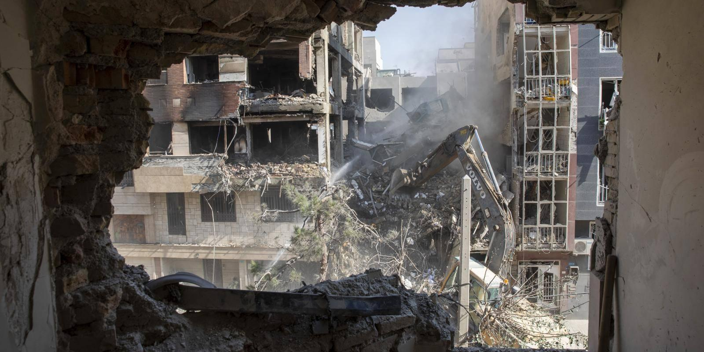
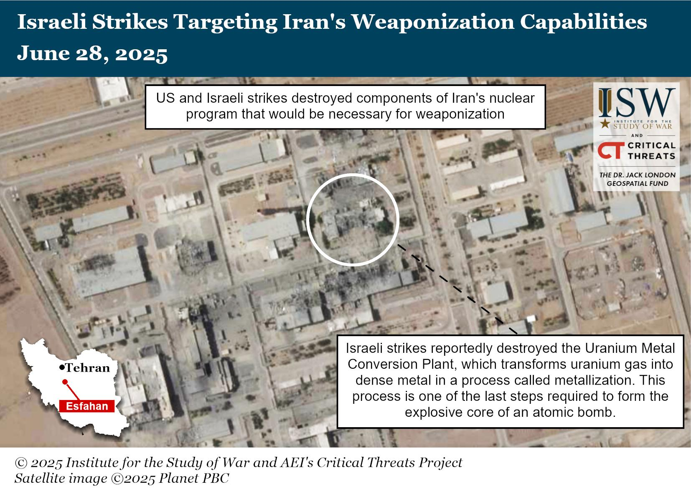
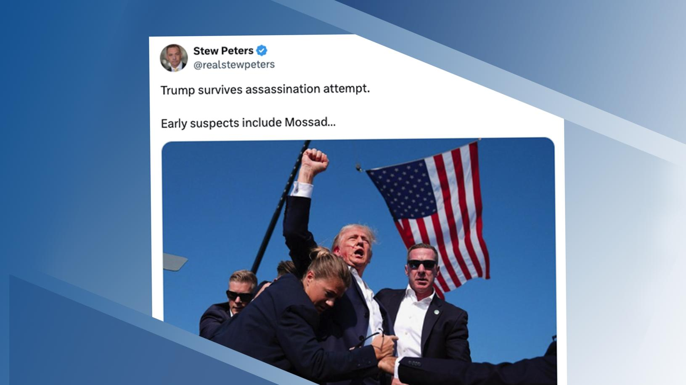
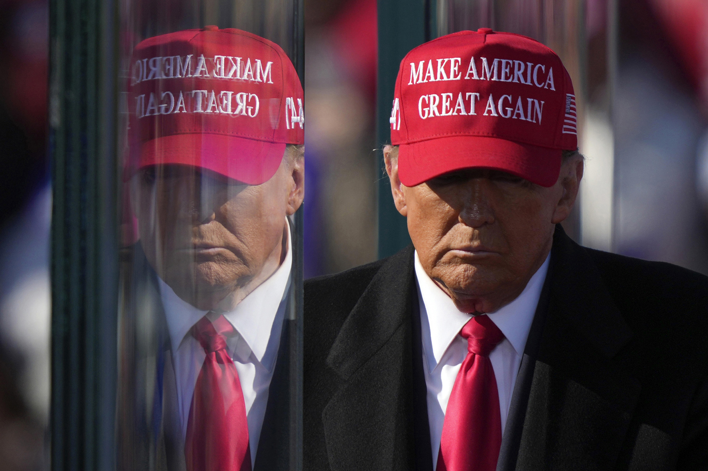
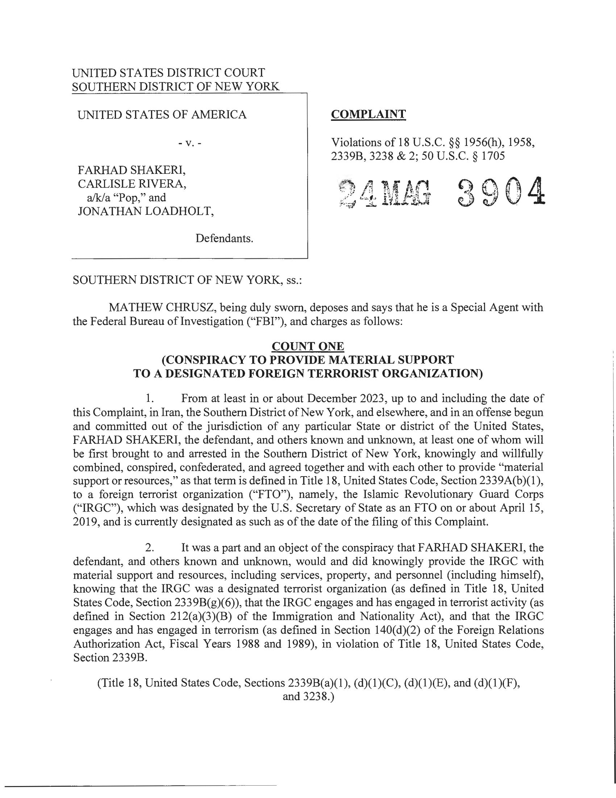
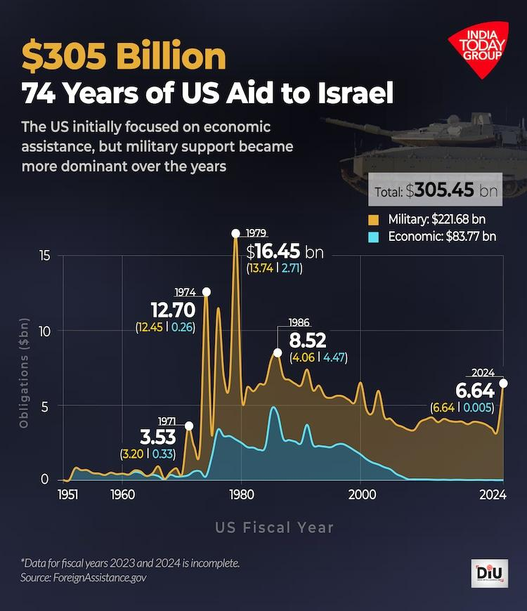
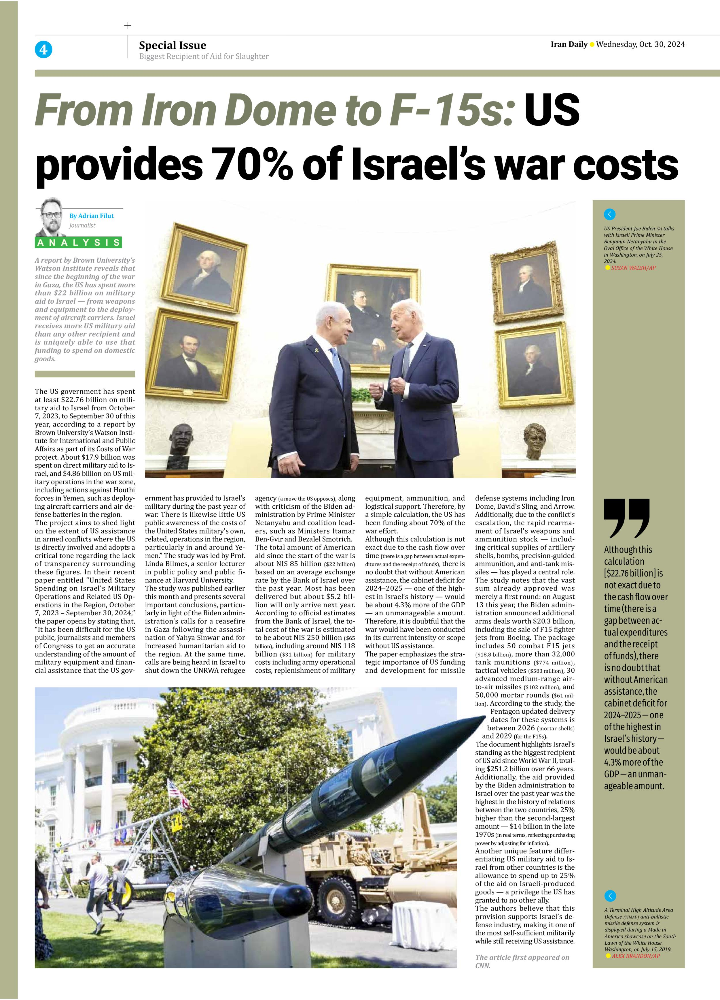

## Claim
Claim: "The assassination plot to kill Donald Trump in 2024 was orchestrated by two Jewish Americans. Israel wants war with Iran but wants American money to fund it and American servicemen to fight it."

## Actions
```
image_search("Donald Trump assassination plot 2024")
image_search("Israel Iran war funding")
```

## Evidence
### Evidence from `image_search`
The BBC News source contains an image of Donald Trump with a cut on his face (). A TIME Magazine cover from August 5, 2024, shows an image of Donald Trump with the title "Attack On Trump" (). Al Jazeera published an article on July 14, 2024, discussing a possible assassination attempt on Donald Trump, which includes an image of Donald Trump with a wound on his face ().

The sources are: [Source](https://www.bbc.com/news/articles/cd172rp02e0o), [Source](https://www.amazon.com/TIME-Magazine-Assassination-Pennsylvania-Republican/dp/B0DB6K7F64), and [Source](https://www.aljazeera.com/opinions/2024/7/14/the-trump-assassination-attempt-a-race-reset-and-more-polarisation).


### Evidence from `image_search`
Chatham House published an article with an image of a building being demolished  ([Source](https://www.chathamhouse.org/2025/06/iran-israel-conflict-iran-has-run-out-good-options)). The Institute for the Study of War and AEI's Critical Threats Project published an article discussing Israeli strikes targeting Iran's weaponization capabilities, including a satellite image of the destruction of the Uranium Metal Conversion Plant in Esfahan, Iran  ([Source](https://www.understandingwar.org/backgrounder/iran-update-june-28-2025)).

Al Jazeera published an article about Iran launching drones and missiles at Israel, mentioning an Israeli attack on an Iranian consulate in Damascus  ([Source](https://www.aljazeera.com/news/2024/4/15/us-will-not-take-part-in-any-israeli-retaliatory-action-against-iran)).


## Elaboration
The evidence suggests that there was an assassination attempt on Donald Trump in 2024, as indicated by images and articles from various news sources ([Source](https://www.bbc.com/news/articles/cd172rp02e0o), [Source](https://www.amazon.com/TIME-Magazine-Assassination-Pennsylvania-Republican/dp/B0DB6K7F64), and [Source](https://www.aljazeera.com/opinions/2024/7/14/the-trump-assassination-attempt-a-race-reset-and-more-polarisation)). However, the evidence does not mention who orchestrated the assassination attempt.

Regarding the second part of the claim, the evidence shows that there was a conflict between Israel and Iran, with Israel striking Iranian targets ([Source](https://www.chathamhouse.org/2025/06/iran-israel-conflict-iran-has-run-out-good-options), [Source](https://www.understandingwar.org/backgrounder/iran-update-june-28-2025), and [Source](https://www.aljazeera.com/news/2024/4/15/us-will-not-take-part-in-any-israeli-retaliatory-action-against-iran)). However, the evidence does not provide information about Israel's intentions to involve the United States in the conflict, nor does it mention Israel's desire for American money or servicemen.

Therefore, the claim cannot be fully verified due to a lack of information about the orchestrators of the assassination attempt and Israel's intentions regarding the US involvement in the conflict with Iran.


## Actions
```
image_search("Jewish Americans Donald Trump assassination plot")
image_search("Israel Iran war US funding")
```

## Evidence
### Evidence from `image_search`
The Anti-Defamation League (ADL) published an article discussing antisemitic conspiracy theories related to the assassination attempt on Donald Trump, including an image of a tweet by Stew Peters that mentions "Mossad" (). NPR published an article about an Iran-related murder-for-hire plot against Donald Trump (). The New York Times published a document from the United States District Court Southern District of New York, which includes a complaint against Farhad Shakeri, Carlisle Rivera, and Jonathan Loadholt, alleging a conspiracy to provide material support to a designated foreign terrorist organization ().

*   [https://www.adl.org/resources/article/trump-assassination-attempt-sparks-antisemitic-conspiracy-theories-and-violent](https://www.adl.org/resources/article/trump-assassination-attempt-sparks-antisemitic-conspiracy-theories-and-violent)
*   [https://www.npr.org/2024/11/08/nx-s1-5184549/iran-donald-trump-murder-for-hire-plot-justice-department](https://www.npr.org/2024/11/08/nx-s1-5184549/iran-donald-trump-murder-for-hire-plot-justice-department)
*   [https://www.nytimes.com/interactive/2024/11/08/nyregion/us-v-shakeri-et-al-complaint.html](https://www.nytimes.com/interactive/2024/11/08/nyregion/us-v-shakeri-et-al-complaint.html)

### Evidence from `image_search`
India Today published an article on June 20, 2025, showing that the US has provided $305 billion in aid to Israel over 74 years, with the majority being military aid (). The Council on Foreign Relations published an article with an image of Israeli and American military personnel (). Iran Daily published an article on October 30, 2024, stating that the US provides 70% of Israel's war costs and has spent at least $22.76 billion on military aid to Israel from October 2023 to September 2024 ().

The sources are: [Source](https://www.indiatoday.in/india/story/israel-iran-conflict-how-has-united-states-financed-israel-over-the-years-dollars-all-the-way-2743451-2025-06-20), [Source](https://www.cfr.org/article/us-aid-israel-four-charts), and [Source](https://newspaper.irandaily.ir/7685/4/11893).


## Elaboration
The evidence suggests that the claim is partially verifiable. The ADL article mentions antisemitic conspiracy theories related to the assassination attempt on Donald Trump, including a tweet mentioning "Mossad" ([Source](https://www.adl.org/resources/article/trump-assassination-attempt-sparks-antisemitic-conspiracy-theories-and-violent)). However, the evidence does not confirm that the plot was orchestrated by Jewish Americans.

Regarding the second part of the claim, the evidence indicates that the US has provided significant financial aid to Israel, with a large portion being military aid ([Source](https://www.indiatoday.in/india/story/israel-iran-conflict-how-has-united-states-financed-israel-over-the-years-dollars-all-the-way-2743451-2025-06-20) and [Source](https://newspaper.irandaily.ir/7685/4/11893)). The evidence also shows that the US and Israeli military personnel are working together ([Source](https://www.cfr.org/article/us-aid-israel-four-charts)). However, the evidence does not explicitly state that Israel wants American servicemen to fight in a war with Iran.


## Final Judgement
The claim is partially false. While there is evidence of an assassination attempt on Donald Trump and significant US financial and military support for Israel, the claim incorrectly attributes the plot to Jewish Americans and does not fully support the assertion about Israel's intentions regarding US involvement in a war with Iran. `false`

### Verdict: FALSE

### Justification
The claim is partially false. While there is evidence of an assassination attempt on Donald Trump and significant US financial and military support for Israel ([Source](https://www.indiatoday.in/india/story/israel-iran-conflict-how-has-united-states-financed-israel-over-the-years-dollars-all-the-way-2743451-2025-06-20)), the claim incorrectly attributes the plot to Jewish Americans and does not fully support the assertion about Israel's intentions regarding US involvement in a war with Iran.
