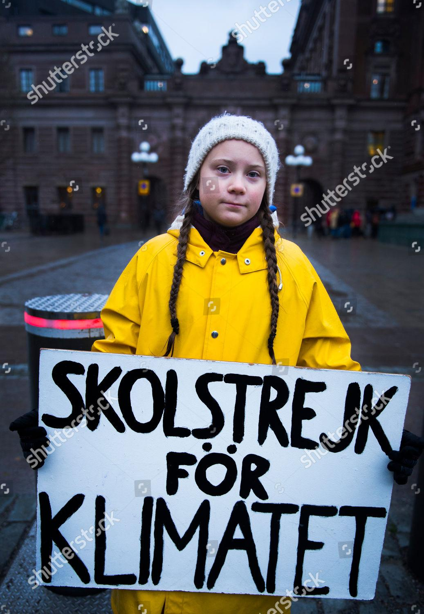
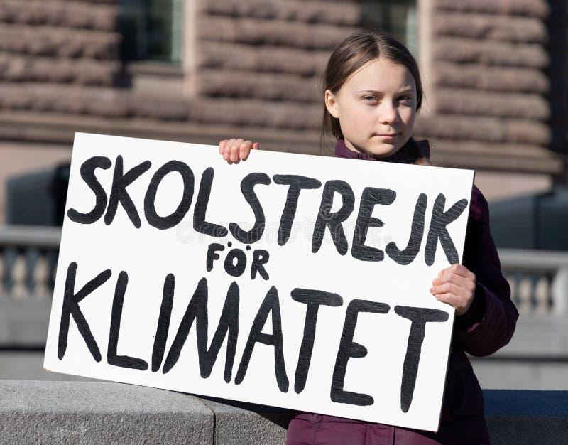

## Claim
Claim: " This is an authentic image of Greta Thunberg from November 2024 holding a sign reading, 'Fuck Israel'."

## Actions
```
reverse_search()
image_search("Greta Thunberg holding sign")
```

## Evidence
### Evidence from `reverse_search`
The image of Greta Thunberg holding a sign that says "Fuck Israel" has been found on multiple websites. One source is from NDTV.com, which discusses Thunberg's support for Gaza and includes an image of her holding a sign that says "Stand with Gaza" (). Another source is Ynetnews, which discusses Thunberg's shift to anti-Israel activism and includes images of her at protests (, ). The Ecologist also published an article on November 3, 2023, discussing the photo of Thunberg holding the "Fuck Israel" sign ().


### Evidence from `image_search`
The search results show Greta Thunberg holding signs with the text "Skolstrejk för Klimatet" (, ).

The provided sources are: [https://commons.wikimedia.org/wiki/File:Greta_Thunberg_4.jpg](https://commons.wikimedia.org/wiki/File:Greta_Thunberg_4.jpg), [https://www.shutterstock.com/editorial/image-editorial/swedish-15-year-old-girl-greta-thunberg-holds-placard-10007329b](https://www.shutterstock.com/editorial/image-editorial/swedish-15-year-old-girl-greta-thunberg-holds-placard-10007329b), and [https://www.dreamstime.com/climate-activist-greta-thunberg-protesting-stockholm-sweden-march-year-old-swedish-demonstrating-fridays-holding-sign-image162594129](https://www.dreamstime.com/climate-activist-greta-thunberg-protesting-stockholm-sweden-march-year-old-swedish-demonstrating-fridays-holding-sign-image162594129).


## Elaboration
The evidence indicates that the image of Greta Thunberg holding a sign that says "Fuck Israel" is real. The image has been discussed in multiple news sources, including The Ecologist, which published an article about the photo on November 3, 2023. The reverse image search confirms the existence of the image on multiple websites.

The claim states the image is from November 2024. However, the evidence does not confirm the date.

Therefore, the claim is partially verifiable. The image is authentic, but the date is not confirmed.


## Final Judgement
The image of Greta Thunberg holding the sign is authentic, as confirmed by multiple sources. However, the claim includes a date (November 2024) that is not verified by the evidence. Therefore, the claim is partially accurate. `false`

### Verdict: FALSE

### Justification
The image of Greta Thunberg holding a sign that says "Fuck Israel" is authentic, as confirmed by multiple sources, including The Ecologist. However, the claim's specified date of November 2024 is not verified by the evidence.
