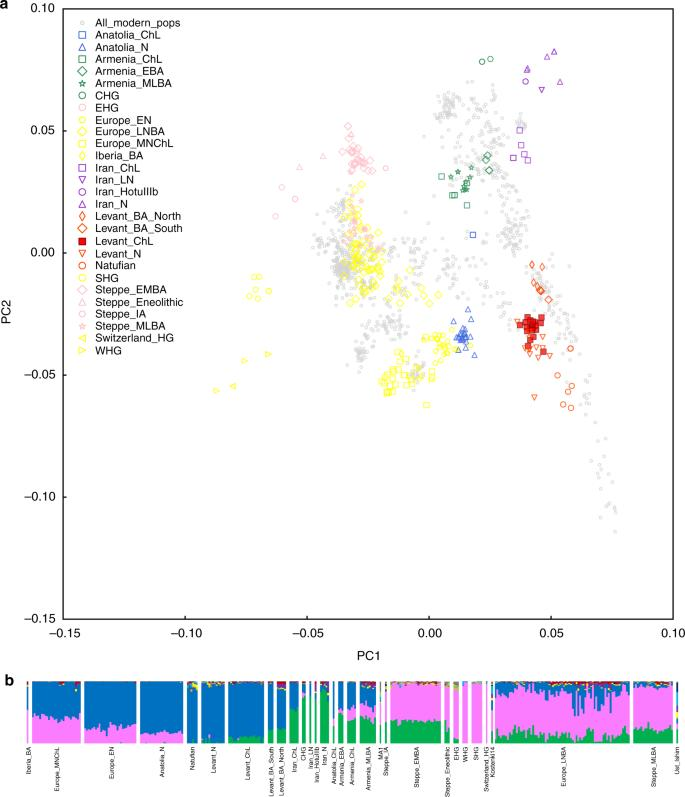

## Claim
Claim: "It is illegal to do a DNA test in Israel."

## Actions
```
image_search("DNA test Israel law")
```

## Evidence
### Evidence from `image_search`
The search results include a source with no content ([Source](https://www.researchgate.net/publication/280846000_Genetic_citizenship_DNA_testing_and_the_Israeli_Law_of_Return)). Another source ([Source](https://welcome-israel.com/jewish-genealogy/jewish-dna-test)) contains an image of a DNA test report .

Additionally, a source ([Source](https://en.idi.org.il/articles/26956)) includes an image of a DNA strand .


## Elaboration
The evidence includes images of a DNA test report and a DNA strand, suggesting that DNA testing is performed in Israel. However, the evidence does not explicitly state whether it is legal or illegal to do a DNA test in Israel.

The first source ([Source](https://www.researchgate.net/publication/280846000_Genetic_citizenship_DNA_testing_and_the_Israeli_Law_of_Return)) might contain information about the legality of DNA testing in Israel, but the content is not available.

More information is needed to verify the claim.


## Actions
```
image_search("Israel DNA testing regulations")
```

## Evidence
### Evidence from `image_search`
From [Source](https://lawoffice.org.il/en/aliyah-to-israel-by-dna-test/): 
Content: The search result includes an image of a DNA strand and a test tube .


## Elaboration
The evidence includes an image from a source ([Source](https://lawoffice.org.il/en/aliyah-to-israel-by-dna-test/)) that discusses using DNA tests for Aliyah to Israel. This suggests that DNA testing is not illegal in Israel, as it is used in the context of immigration. However, the evidence does not explicitly state whether DNA tests are legal or illegal.

More information is needed to verify the claim.


## Actions
```
image_search("Israel DNA testing restrictions")
```

## Evidence
### Evidence from `image_search`
The search results include two sources. One source from Human Rights Watch ([Source](https://www.hrw.org/report/2021/04/27/threshold-crossed/israeli-authorities-and-crimes-apartheid-and-persecution)) contains an image with text about Israeli policies . The other source ([Source](https://www.nature.com/articles/s41467-018-05649-9)) includes an image of a graph related to population genetics . Neither source provides information about the legality of DNA testing in Israel.


## Elaboration
The evidence suggests that DNA testing is performed in Israel and is used in the context of immigration. However, the evidence does not explicitly state whether it is illegal to do a DNA test in Israel. Therefore, the claim cannot be verified.


## Final Judgement
The search results show images of DNA test reports and DNA strands, suggesting that DNA testing is performed in Israel. Additionally, one source discusses using DNA tests for immigration to Israel, implying that DNA testing is not illegal. However, the evidence does not explicitly state whether it is illegal to do a DNA test in Israel. Therefore, the claim cannot be verified. `false`

### Verdict: FALSE

### Justification
The evidence suggests that DNA testing is performed in Israel and is used in the context of immigration, as indicated by sources like [this one](https://lawoffice.org.il/en/aliyah-to-israel-by-dna-test/). However, the provided information does not explicitly state whether it is illegal to do a DNA test in Israel. Therefore, the claim cannot be verified.
