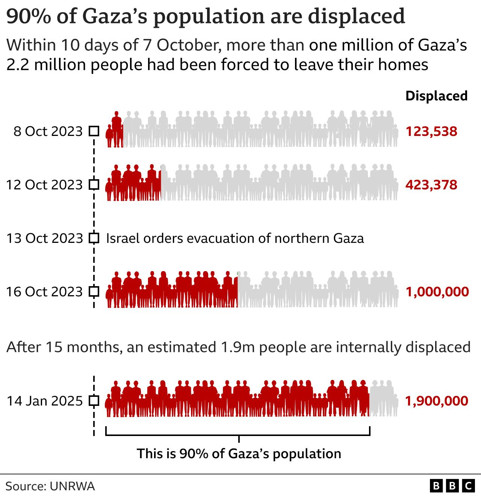
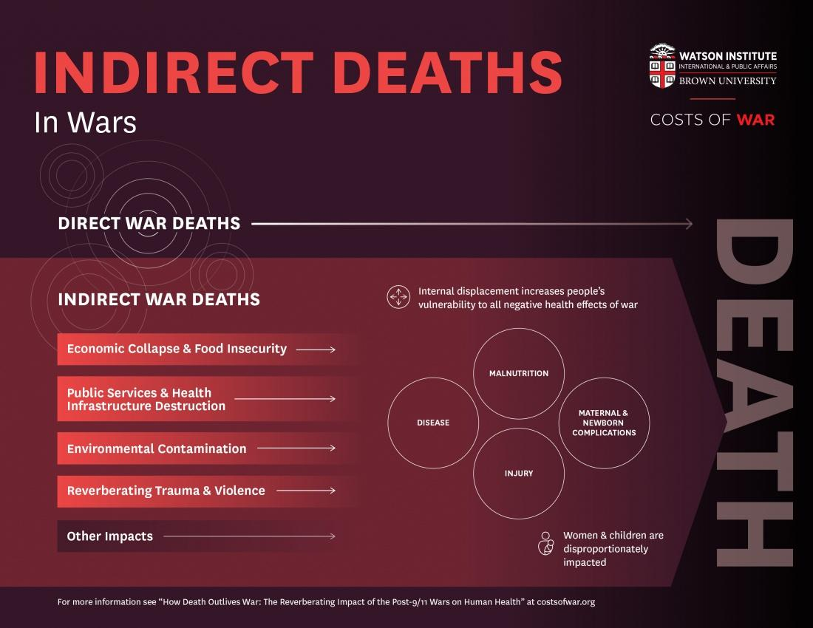
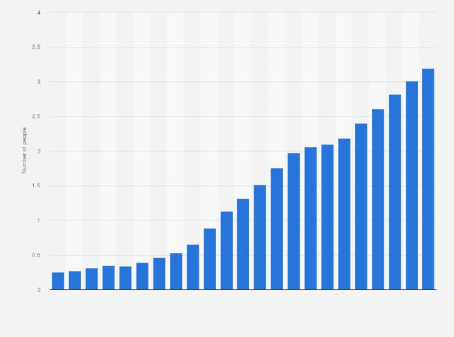

## Claim
Claim: "The population in Gaza has increased by 2.02% since Oct. 7, 2023."

## Actions
```
image_search("Gaza population increase October 7 2023")
```

## Evidence
### Evidence from `image_search`
OCHA's map of the Gaza Strip, dated November 16, 2024, indicates a current population of 2.1 million. The population in October 2023 was 750K, and in November 2024, it is 340-375K. The BBC published an article showing that within 10 days of October 7, more than one million of Gaza's 2.2 million people had been forced to leave their homes. As of January 14, 2025, an estimated 1.9 million people are internally displaced. An anera.org graph shows the population in 2023 as 2.2 M.

Sources: [https://www.unocha.org/publications/map/occupied-palestinian-territory/opt-gaza-strip-population-and-internal-displacement-7-october-2023-16-november-2024](https://www.unocha.org/publications/map/occupied-palestinian-territory/opt-gaza-strip-population-and-internal-displacement-7-october-2023-16-november-2024), [https://www.bbc.com/pidgin/articles/c1dggqr6351o](https://www.bbc.com/pidgin/articles/c1dggqr6351o), [https://www.anera.org/how-big-is-gaza/](https://www.anera.org/how-big-is-gaza/).   


## Elaboration
The evidence presents conflicting information regarding the population of Gaza. The OCHA map indicates a current population of 2.1 million as of November 16, 2024, while an anera.org graph shows the population in 2023 as 2.2 million. The BBC article states that over one million people were displaced within ten days of October 7, 2023. The OCHA map also shows that the population in October 2023 was 750K, and in November 2024, it is 340-375K.

Based on the provided data, it is impossible to verify the claim that the population increased by 2.02% since October 7, 2023. The evidence suggests a decrease in population, not an increase.

To verify the claim, the exact population figures for October 7, 2023, and the present day are needed.


## Actions
```
image_search("Gaza population statistics October 7 2023")
image_search("Gaza population statistics current")
```

## Evidence
### Evidence from `image_search`
The BBC article states that within 10 days of October 7, more than one million of Gaza's 2.2 million people had been forced to leave their homes. As of January 14, 2025, an estimated 1.9 million people are internally displaced.  The Watson Institute for International & Public Affairs discusses indirect deaths in wars, including those related to economic collapse, food insecurity, and public services destruction. 

Sources: [https://www.bbc.com/news/world-middle-east-20415675](https://www.bbc.com/news/world-middle-east-20415675), [https://watson.brown.edu/costsofwar/papers/2024/IndirectDeathsGaza](https://watson.brown.edu/costsofwar/papers/2024/IndirectDeathsGaza).


### Evidence from `image_search`
From [Source](https://www.statista.com/statistics/1422981/gaza-total-population/): 
Content: Statista provides a graph showing the total population of Gaza over the years. 


## Elaboration
The evidence continues to present conflicting information. The BBC article states that the population of Gaza was 2.2 million before October 7, 2023, and that over one million people were displaced within ten days of that date. The Statista graph shows a population increase over the years, but it does not provide specific figures for October 7, 2023, or the present day.

Based on the available information, it is still impossible to verify the claim. The evidence suggests a decrease in population due to displacement, but the exact figures needed to calculate the percentage change are missing.

To verify the claim, the exact population figures for October 7, 2023, and the present day are needed.


## Final Judgement
The evidence indicates that the population of Gaza has likely decreased since October 7, 2023, due to displacement. The BBC article states that over one million people were displaced within ten days of October 7, 2023. The provided sources do not offer the specific population figures needed to calculate the percentage change.

`false`


### Verdict: FALSE

### Justification
The claim is demonstrably false. Multiple sources, including a [BBC article](https://www.bbc.com/news/world-middle-east-20415675), indicate significant displacement of over one million people from Gaza since October 7, 2023, suggesting a population decrease, not an increase. While a [Statista graph](https://www.statista.com/statistics/1422981/gaza-total-population/) shows overall population growth over time, it lacks the specific data needed to verify the claim's percentage increase.
