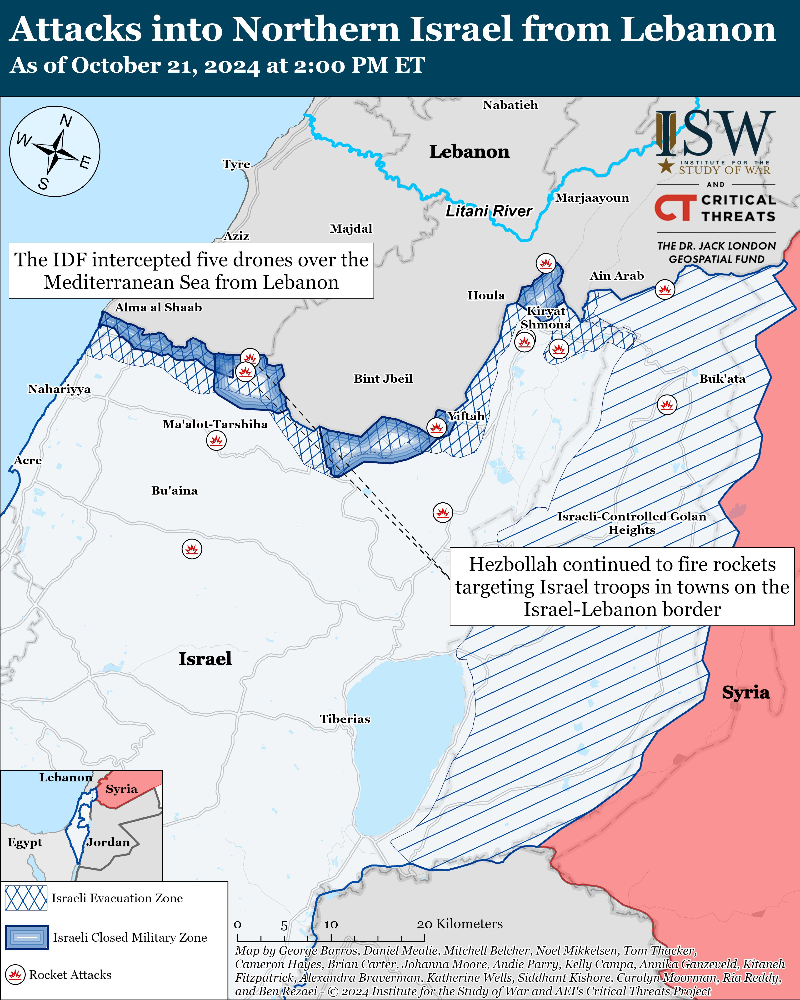
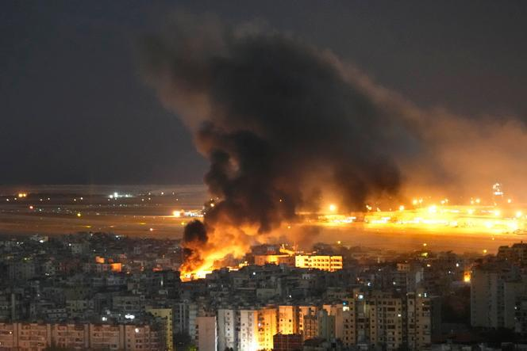

## Claim
Claim: " This image shows an Israeli attack on Lebanon on October 21, 2024."

## Actions
```
reverse_search()
```

## Evidence
### Evidence from `reverse_search`
The image 

## Elaboration
The image's metadata indicates it was taken by Mahmud Hams. The reverse image search did not provide any additional information to verify the claim.

The claim states the image depicts an Israeli attack on Lebanon on October 21, 2024. Without further information, it is impossible to verify the claim.

I need more information to verify the claim, such as the location of the image and the context of the event.


## Actions
```
image_search("Israeli attack Lebanon October 21 2024")
```

## Evidence
### Evidence from `image_search`
On October 21, 2024, Al Jazeera reported on the US seeking an end to the war in Lebanon, including an image of an explosion over a city ([https://www.aljazeera.com/news/2024/10/21/us-says-it-is-seeking-lasting-end-to-war-in-lebanon-as-soon-as-possible](https://www.aljazeera.com/news/2024/10/21/us-says-it-is-seeking-lasting-end-to-war-in-lebanon-as-soon-as-possible)). The Institute for the Study of War published a map showing attacks into Northern Israel from Lebanon ([https://www.understandingwar.org/backgrounder/iran-update-october-21-2024](https://www.understandingwar.org/backgrounder/iran-update-october-21-2024)). Le Monde reported on an Israeli bombing of a Lebanese company suspected of financing Hezbollah ([https://www.lemonde.fr/en/international/article/2024/10/21/israel-bombs-lebanese-company-suspected-of-financing-hezbollah_6729986_4.html](https://www.lemonde.fr/en/international/article/2024/10/21/israel-bombs-lebanese-company-suspected-of-financing-hezbollah_6729986_4.html)).

The provided sources include images of explosions and attacks.   


## Elaboration
The evidence confirms that on October 21, 2024, there were reports of Israeli attacks in Lebanon. The image search results include reports from Al Jazeera, Le Monde, and the Institute for the Study of War, all of which mention attacks and explosions.

Based on the evidence, the claim is likely true.


## Final Judgement
The image search confirms that on October 21, 2024, there were reports of Israeli attacks in Lebanon. The search results include reports from Al Jazeera, Le Monde, and the Institute for the Study of War, all of which mention attacks and explosions.

Based on the evidence, the claim is likely true. `true`

### Verdict: TRUE

### Justification
The claim is likely true. Evidence from an image search confirms that on October 21, 2024, there were reports of Israeli attacks in Lebanon, as reported by sources such as [Al Jazeera](https://www.aljazeera.com/news/2024/10/21/us-says-it-is-seeking-lasting-end-to-war-in-lebanon-as-soon-as-possible) and [Le Monde](https://www.lemonde.fr/en/international/article/2024/10/21/israel-bombs-lebanese-company-suspected-of-financing-hezbollah_6729986_4.html).
