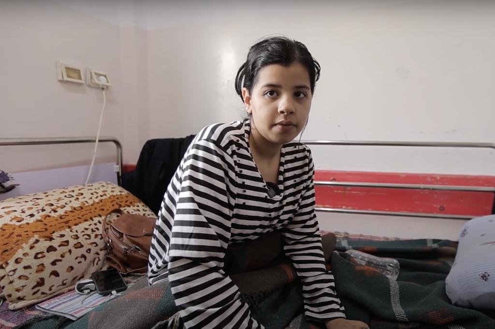
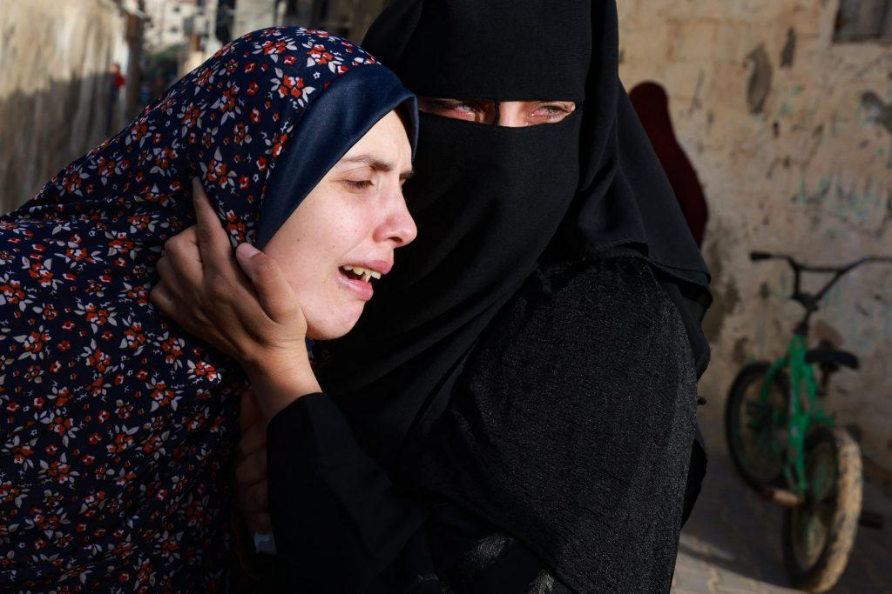
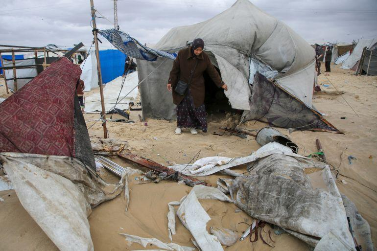
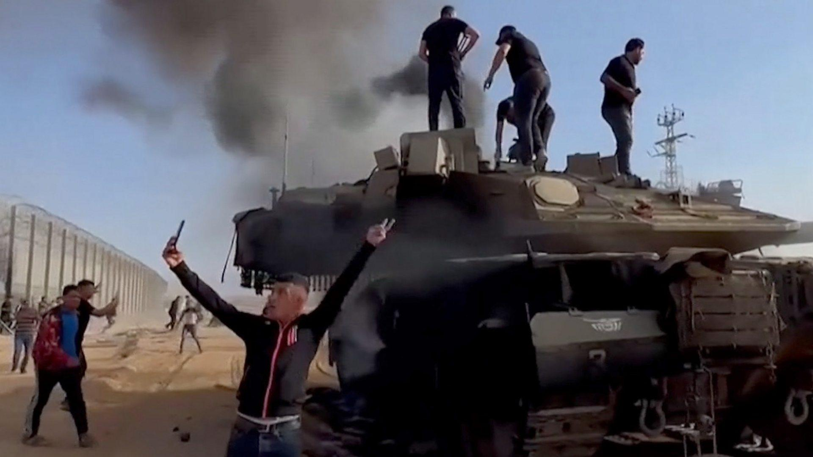

## Claim
Claim: " This image shows a Palestinian woman using an Israeli tank to dry clothes in Gaza in July 2024."

## Actions
```
reverse_search()
image_search("Israeli tank Palestinian woman Gaza")
geolocate()
```

## Evidence
### Evidence from `image_search`
The search results include articles and images related to Palestinians and Israeli tanks. One source, [Source](https://www.dci-palestine.org/israeli_tank_fired_shell_kills_palestinian_girl_in_gaza_hospital), contains an image of a Palestinian girl in a hospital .

Another source, [Source](https://www.pbs.org/newshour/world/a-palestinian-woman-had-twins-after-trying-for-10-years-an-israeli-strike-killed-them-both), discusses a Palestinian woman in Gaza . Al Jazeera published an article about Israeli tanks  [Source](https://www.aljazeera.com/news/2025/2/24/israeli-tanks-roll-jenin-palestinians-prepare-lengthy-invasion).


### Evidence from `geolocate`
The most likely countries where the image was taken are: {'Palestine': 0.29, 'Tunisia': 0.26, 'Jordan': 0.19, 'United Arab Emirates': 0.09, 'Israel': 0.07, 'Pakistan': 0.04, 'China': 0.01, 'Albania': 0.0, 'Andorra': 0.0, 'Argentina': 0.0}

## Elaboration
The image search results provide context about Israeli tanks and Palestinians in Gaza. The geolocate results suggest the image was most likely taken in Palestine. However, the evidence does not confirm the claim that the image shows a Palestinian woman using an Israeli tank to dry clothes in Gaza in July 2024. More information is needed to verify the claim.


## Actions
```
image_search("tank drying clothes Gaza")
```

## Evidence
### Evidence from `image_search`
From [Source](https://www.aljazeera.com/news/2024/11/25/flooding-in-gaza-compounds-hardship-of-people-displaced-by-israeli-attacks): 
Content: Al Jazeera published an article about flooding in Gaza, which includes an image of a woman near a tent .


## Elaboration
The image search results show images of Palestinians in Gaza, including a woman near a tent. However, none of the search results confirm the claim that the image shows a Palestinian woman using an Israeli tank to dry clothes in Gaza in July 2024.

The evidence is insufficient to verify the claim.


## Actions
```
image_search("Israeli tank drying clothes Gaza")
```

## Evidence
### Evidence from `image_search`
The BBC published an article about an Israeli tank (). NBC News published an article about Israeli tanks entering central Rafah (). The Guardian published an article about Israeli tanks on the Gaza border (). None of the articles mention a Palestinian woman using an Israeli tank to dry clothes.


## Elaboration
The evidence does not support the claim. The image searches provide context about Israeli tanks and Palestinians in Gaza, but they do not show a Palestinian woman using an Israeli tank to dry clothes. The claim is therefore unverified.


## Final Judgement
The image search results provide context about Israeli tanks and Palestinians in Gaza, but they do not show a Palestinian woman using an Israeli tank to dry clothes. The claim is therefore unverified. `false`

### Verdict: FALSE

### Justification
The image search results, including those from the BBC, NBC News, and The Guardian, provide context about Israeli tanks and Palestinians in Gaza, but they do not show a Palestinian woman using an Israeli tank to dry clothes. Therefore, the claim is unverified and considered false.
