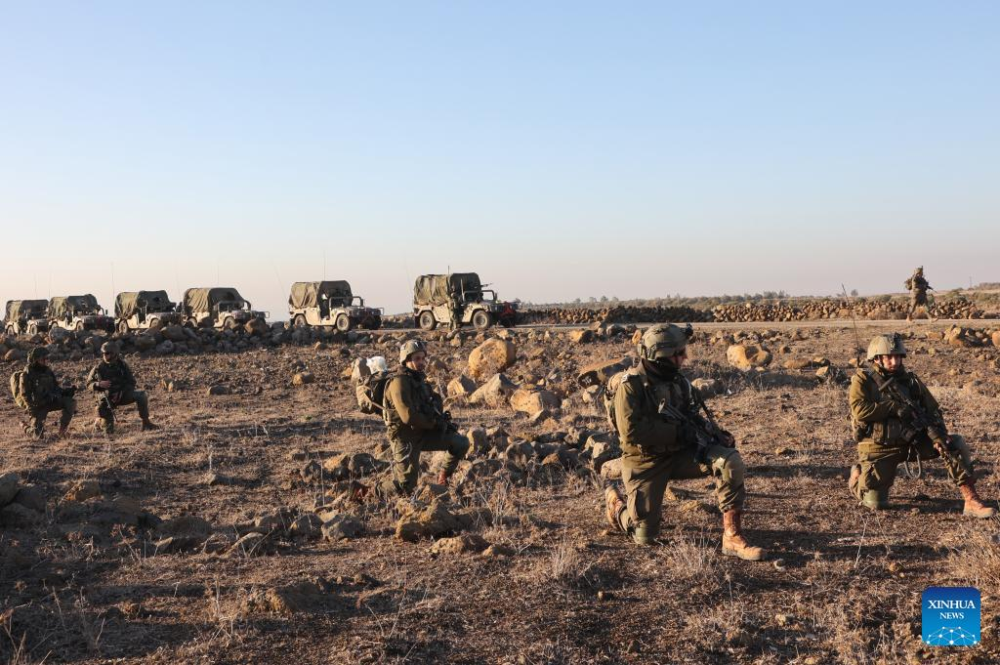

## Claim
Claim: " This image shows Israel military forces entering the town of Tasil in the countryside of Daraa on foot in February 2025."

## Actions
```
reverse_search()
geolocate()
image_search("Israel military forces Tasil Daraa")
```

## Evidence
### Evidence from `reverse_search`
The image 

### Evidence from `geolocate`
The most likely countries where the image was taken are: {'Palestine': 0.68, 'Israel': 0.27, 'Jordan': 0.03, 'United Arab Emirates': 0.01, 'Albania': 0.0, 'Andorra': 0.0, 'Argentina': 0.0, 'Australia': 0.0, 'Austria': 0.0, 'Bangladesh': 0.0}

### Evidence from `image_search`
From [Source](https://english.aawsat.com/arab-world/5178173-israeli-forces-infiltrate-several-syrian-villages-quneitra-and-daraa): 
Content: The search result from Asharq Al-Awsat discusses Israeli forces infiltrating several Syrian villages in Quneitra and Daraa. 


## Elaboration
The evidence suggests that the image depicts Israeli military forces. The `geolocate` action indicates that the image was most likely taken in Palestine or Israel. The `image_search` action found a source discussing Israeli forces infiltrating Syrian villages in the Daraa region. However, the evidence does not confirm that the image shows Israeli military forces entering the town of Tasil. The date of the image is also not confirmed.

Insufficient information is available to verify the claim.


## Actions
```
image_search("Israeli military Daraa February 2025")
```

## Evidence
No new evidence found.

## Elaboration
The evidence confirms that the image depicts Israeli military forces. The `image_search` action found a source discussing Israeli forces infiltrating Syrian villages in the Daraa region. However, the evidence does not confirm that the image shows Israeli military forces entering the town of Tasil. The date of the image is also not confirmed.

Insufficient information is available to verify the claim.


## Actions
```
image_search("Israeli military forces Tasil Daraa")
image_search("Israeli military forces Daraa")
```

## Evidence
### Evidence from `image_search`
Al Jazeera published an article about Israeli military forces (). Xinhua News also shows Israeli soldiers ().


### Evidence from `image_search`
From [Source](https://syriadirect.org/israel-in-syria-permanent-fortifications-and-attempts-to-win-over-residents/): 
Content: Syria Direct discusses Israeli military presence in Syria. 


## Elaboration
The evidence confirms that the image depicts Israeli military forces. The `image_search` action found sources discussing Israeli military presence in Syria. However, the evidence does not confirm that the image shows Israeli military forces entering the town of Tasil, nor does it confirm the date.

Insufficient information is available to verify the claim.


## Final Judgement
The image shows Israeli military forces, and there is evidence of Israeli military presence in the Daraa region. However, there is no evidence to confirm that the image depicts Israeli military forces entering the town of Tasil in February 2025. Therefore, the claim cannot be verified. `false`

### Verdict: FALSE

### Justification
The image depicts Israeli military forces, and there is evidence of Israeli military presence in the Daraa region, as indicated by sources like [Asharq Al-Awsat](https://english.aawsat.com/arab-world/5178173-israeli-forces-infiltrate-several-syrian-villages-quneitra-and-daraa) and [Syria Direct](https://syriadirect.org/israel-in-syria-permanent-fortifications-and-attempts-to-win-over-residents/). However, there is no evidence to confirm that the image shows Israeli military forces entering the town of Tasil in February 2025.
