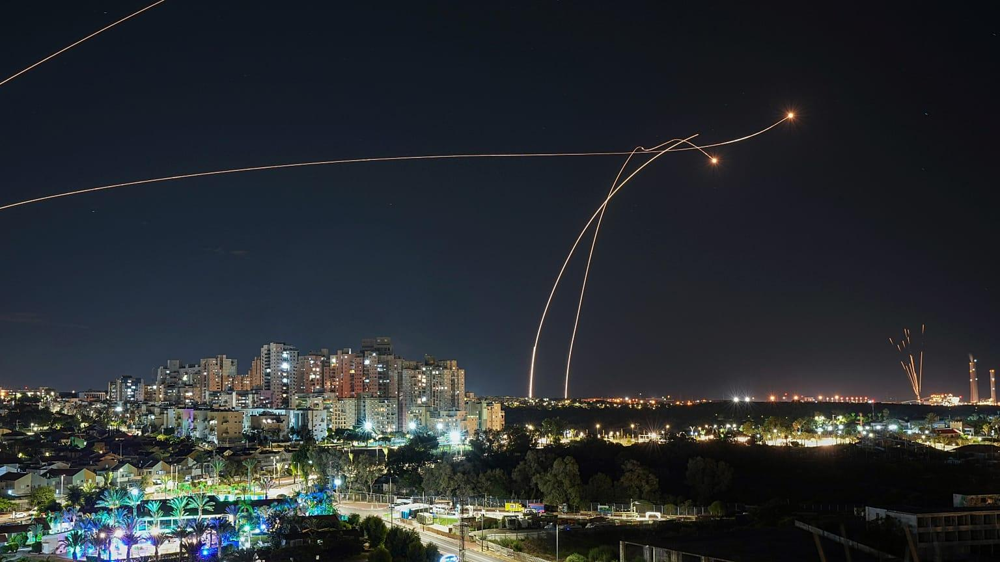
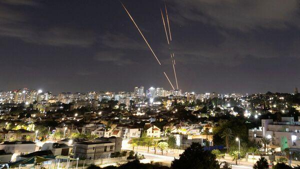
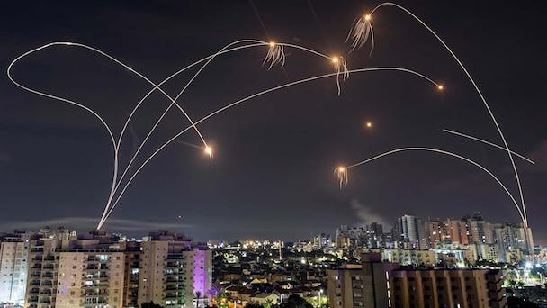
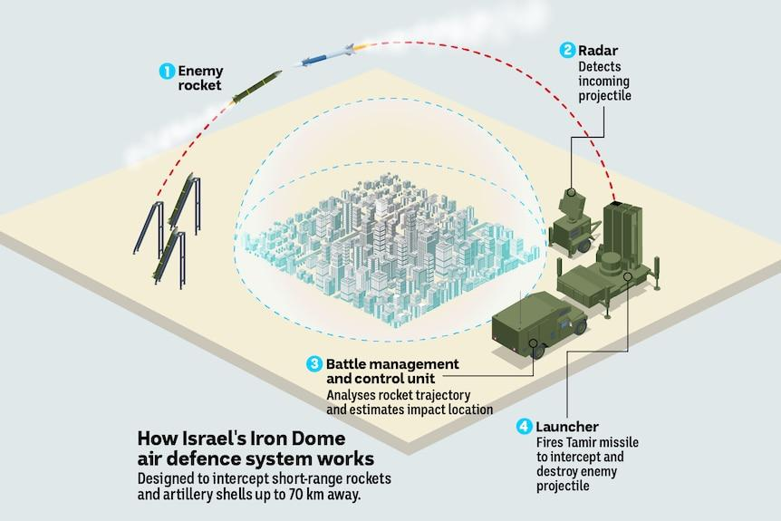
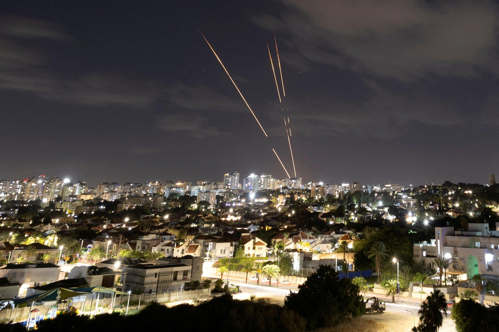
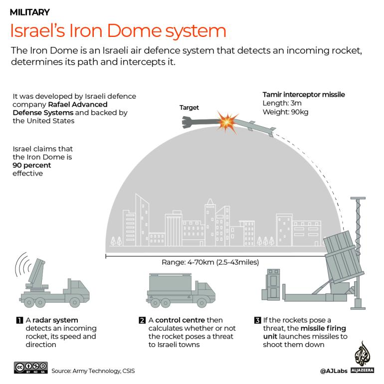

## Claim
Claim: "The Iron Dome intercepted 90% of ballistic missiles fired at Israel in Iran's attack on October 1, 2024."

## Actions
```
image_search("Iron Dome Israel missile interception rate October 1 2024")
```

## Evidence
### Evidence from `image_search`
Reuters ([Source](https://www.reuters.com/pictures/latest-photos-missiles-rain-down-israel-2024-10-01/AIRIZRLERFN2FMZKBADVKDEC24/)) has an image of the Iron Dome intercepting missiles over Israel . Euronews ([Source](https://www.euronews.com/next/2024/10/02/the-iron-dome-how-does-israels-missile-defence-system-work)) published an article on October 2, 2024, about the Iron Dome, including an image of the system in action .

The Associated Press ([Source](https://apnews.com/article/israel-defense-iron-dome-iran-hezbollah-hamas-326cd1e9484dd38c430d62739b7f2ef3)) provides an image of Israeli air defenses, including the Iron Dome, which is designed to intercept short-range missiles .


## Elaboration
The evidence confirms that the Iron Dome system was active during the October 1, 2024, attack on Israel. Images from Reuters ([Source](https://www.reuters.com/pictures/latest-photos-missiles-rain-down-israel-2024-10-01/AIRIZRLERFN2FMZKBADVKDEC24/)) and Euronews ([Source](https://www.euronews.com/next/2024/10/02/the-iron-dome-how-does-israels-missile-defence-system-work)) show the system in action. However, the provided evidence does not contain any information about the interception rate of the Iron Dome during the attack.

Therefore, the claim cannot be verified with the available evidence. The percentage of intercepted missiles is not mentioned in any of the provided sources.


## Actions
```
image_search("Iron Dome Israel interception rate October 1 2024 Iran attack")
```

## Evidence
### Evidence from `image_search`
The search results include articles and images related to the Iron Dome intercepting missiles during the Iranian attack on Israel. Livemint ([Source](https://www.livemint.com/news/world/not-a-science-fiction-israel-shares-video-of-iron-dome-intercepting-iranian-missiles-israel-iran-war-news-11727844421348.html)) and ABC News ([Source](https://abcnews.go.com/International/iran-launches-attack-israel-what-is-iron-dome/story?id=109218962)) both provide images of the Iron Dome in action , . However, none of the sources mention the interception rate of the Iron Dome.


## Elaboration
The new evidence, similar to the previous one, shows the Iron Dome in action during the Iranian attack. However, it still does not provide any information about the interception rate.

Therefore, the claim remains unverified due to the lack of data on the Iron Dome's success rate during the specified event.


## Actions
```
image_search("Iron Dome effectiveness Iran attack October 1 2024")
```

## Evidence
### Evidence from `image_search`
ABC News ([Source](https://www.abc.net.au/news/2024-10-02/iran-ballistic-missile-attack-israel-iron-dome-air-defence/104420966)) published an article about the Iron Dome, including an image explaining how the system works . The Independent ([Source](https://www.independent.co.uk/news/world/middle-east/israel-iran-war-iron-dome-missiles-nuclear-weapons-b2623680.html)) also published an article with an image of the Iron Dome intercepting missiles .

Al Jazeera ([Source](https://www.aljazeera.com/news/2024/10/2/iran-and-israel-what-are-their-attack-and-defence-capabilities)) published an infographic stating that Israel claims the Iron Dome is 90 percent effective .


## Elaboration
The evidence includes an infographic from Al Jazeera ([Source](https://www.aljazeera.com/news/2024/10/2/iran-and-israel-what-are-their-attack-and-defence-capabilities)) stating that Israel claims the Iron Dome is 90 percent effective. However, this information refers to the general effectiveness of the Iron Dome and not specifically to the October 1, 2024, attack.

Therefore, the claim cannot be verified. While the evidence provides a general effectiveness rate, it does not confirm the interception rate during the specific event mentioned in the claim.


## Final Judgement
The fact-check reveals that while the Iron Dome was active during the Iranian attack on October 1, 2024, and that Israel claims the Iron Dome is 90 percent effective, there is no specific data in the provided sources to confirm that the Iron Dome intercepted 90% of ballistic missiles during that particular attack. Therefore, the claim cannot be verified. `false`

### Verdict: FALSE

### Justification
The claim cannot be verified. While images from sources like Reuters ([Source](https://www.reuters.com/pictures/latest-photos-missiles-rain-down-israel-2024-10-01/AIRIZRLERFN2FMZKBADVKDEC24/)) and Euronews ([Source](https://www.euronews.com/next/2024/10/02/the-iron-dome-how-does-israels-missile-defence-system-work)) show the Iron Dome in action during the attack, and Al Jazeera ([Source](https://www.aljazeera.com/news/2024/10/2/iran-and-israel-what-are-their-attack-and-defence-capabilities)) states that Israel claims the Iron Dome is 90 percent effective, none of the provided sources specify the interception rate for the October 1, 2024, attack.
