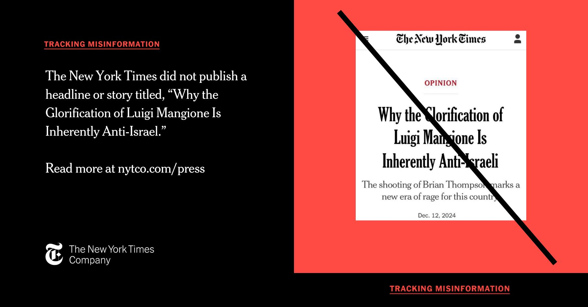

## Claim
Claim: " This image shows a screenshot of an authentic New York Times article from December, 12, 2024 with the title 'Why the Glorification of Luigi Mangione Is Inherently Anti-Israeli."

## Actions
```
image_search("New York Times Luigi Mangione Anti-Israeli")
```

## Evidence
### Evidence from `image_search`
The New York Times did not publish an article with the title "Why the Glorification of Luigi Mangione Is Inherently Anti-Israeli." () The New York Times published an article on December 10, 2024, which included a photograph of a man being arrested by police officers. ()

Sources: [https://www.nytco.com/press/tracking-misinformation-fabricated-opinion-headline/](https://www.nytco.com/press/tracking-misinformation-fabricated-opinion-headline/), [https://www.yahoo.com/news/york-times-didnt-publish-anti-232547549.html](https://www.yahoo.com/news/york-times-didnt-publish-anti-232547549.html), [https://www.nytimes.com/2024/12/10/briefing/the-search-ends.html](https://www.nytimes.com/2024/12/10/briefing/the-search-ends.html)


## Elaboration
The evidence indicates that the New York Times did not publish the article with the title "Why the Glorification of Luigi Mangione Is Inherently Anti-Israeli." The New York Times itself has identified this headline as misinformation. The evidence also shows that the New York Times published an article on December 10, 2024, which included a photograph of a man being arrested by police officers.


## Final Judgement
The claim is demonstrably false. The New York Times did not publish the article as presented in the image. The New York Times itself has identified this headline as misinformation.

`false`

### Verdict: FALSE

### Justification
The New York Times did not publish an article with the title "Why the Glorification of Luigi Mangione Is Inherently Anti-Israeli," as confirmed by the newspaper itself and other sources ([https://www.nytco.com/press/tracking-misinformation-fabricated-opinion-headline/](https://www.nytco.com/press/tracking-misinformation-fabricated-opinion-headline/)).
