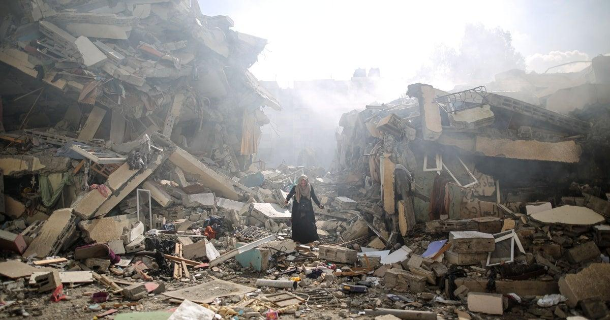
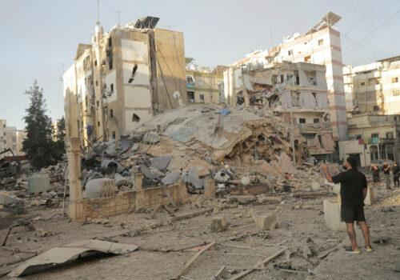

## Claim
Claim: "Israel experienced an earthquake on October 5, 2024."

## Actions
```
image_search("earthquake Israel October 5 2024")
```

## Evidence
### Evidence from `image_search`
Al Jazeera ([https://www.aljazeera.com/news/2024/10/6/israel-kills-26-in-strike-on-gaza-mosque-school-orders-more-evacuations](https://www.aljazeera.com/news/2024/10/6/israel-kills-26-in-strike-on-gaza-mosque-school-orders-more-evacuations)) reports on an Israeli strike on a Gaza mosque, published on October 6, 2024. 

The other sources ([https://www.hrw.org/world-report/2024/country-chapters/israel-and-palestine](https://www.hrw.org/world-report/2024/country-chapters/israel-and-palestine)) and ([https://www.atlanticcouncil.org/blogs/menasource/one-year-after-hamass-october-7-terrorist-attacks-heres-how-the-region-changed/](https://www.atlanticcouncil.org/blogs/menasource/one-year-after-hamass-october-7-terrorist-attacks-heres-how-the-region-changed/)) provide images of destroyed buildings. , 


## Elaboration
The provided evidence does not mention an earthquake in Israel on October 5, 2024. The evidence includes reports and images related to the conflict in the region, including an Israeli strike on a Gaza mosque.

The images show destroyed buildings, but the cause of the destruction is not specified as an earthquake.

To verify the claim, information about seismic activity on the specified date is needed.


## Final Judgement
The search results do not provide any information about an earthquake in Israel on October 5, 2024. The evidence focuses on the conflict in the region. Therefore, there is not enough evidence to verify the claim. `false`


### Verdict: FALSE

### Justification
The search results from Al Jazeera ([https://www.aljazeera.com/news/2024/10/6/israel-kills-26-in-strike-on-gaza-mosque-school-orders-more-evacuations](https://www.aljazeera.com/news/2024/10/6/israel-kills-26-in-strike-on-gaza-mosque-school-orders-more-evacuations)) and other sources ([https://www.hrw.org/world-report/2024/country-chapters/israel-and-palestine](https://www.hrw.org/world-report/2024/country-chapters/israel-and-palestine), [https://www.atlanticcouncil.org/blogs/menasource/one-year-after-hamass-october-7-terrorist-attacks-heres-how-the-region-changed/](https://www.atlanticcouncil.org/blogs/menasource/one-year-after-hamass-october-7-terrorist-attacks-heres-how-the-region-changed/)) do not mention an earthquake in Israel on October 5, 2024. Instead, they focus on the conflict in the region, showing images of destroyed buildings.
