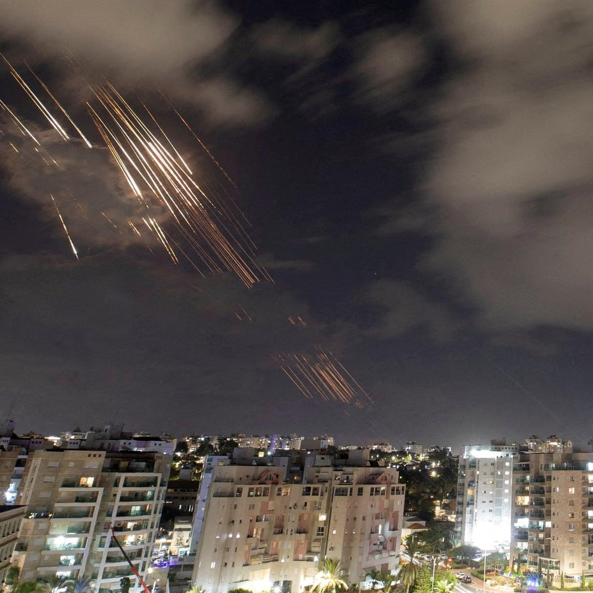

## Claim
Claim: "Netanyahu left Israel and fled to Poland amid Iran's missile attack on Israel on October 1, 2024."

## Actions
```
image_search("Netanyahu Poland October 1 2024")
```

## Evidence
### Evidence from `image_search`
The Los Angeles Times published an article on January 9, 2025, about the Polish president seeking protection for Netanyahu if he attends an Auschwitz anniversary event, including an image of Netanyahu . The Intercept published an article on January 23, 2025, about Netanyahu, including an image of Netanyahu . Reuters published an article about the Polish president's wish for Netanyahu to be able to attend the Auschwitz anniversary .

The articles can be found at the following URLs: [https://www.latimes.com/world-nation/story/2025-01-09/polish-president-seeks-protection-for-netanyahu-if-he-attends-auschwitz-anniversary-event](https://www.latimes.com/world-nation/story/2025-01-09/polish-president-seeks-protection-for-netanyahu-if-he-attends-auschwitz-anniversary-event), [https://theintercept.com/2025/01/23/netanyahu-auschwitz-memorial-poland-icc-warrant/](https://theintercept.com/2025/01/23/netanyahu-auschwitz-memorial-poland-icc-warrant/), and [https://www.reuters.com/world/polish-president-wants-icc-indictee-netanyahu-be-able-go-auschwitz-anniversary-2025-01-09/](https://www.reuters.com/world/polish-president-wants-icc-indictee-netanyahu-be-able-go-auschwitz-anniversary-2025-01-09/).


## Elaboration
The evidence suggests that Netanyahu was potentially in Poland or planning to go to Poland around January 2025, as indicated by the Los Angeles Times and Reuters articles. These articles discuss the Polish president's interest in Netanyahu's attendance at an Auschwitz anniversary event. However, the provided evidence does not mention anything about an Iranian missile attack on Israel on October 1, 2024, or Netanyahu fleeing Israel.

Therefore, the claim cannot be verified based on the provided evidence. The evidence does not support the claim that Netanyahu fled to Poland amid an Iranian missile attack.


## Actions
```
image_search("Iran missile attack Israel October 1 2024")
image_search("Netanyahu Israel October 1 2024")
```

## Evidence
### Evidence from `image_search`
The Institute for the Study of War published an article about an Iranian ballistic missile attack on Israel on October 1, 2024, including a map of the attack . The Guardian published an article on October 2, 2024, about Iranian strikes on Israel, including an image of the attack . The Times of Israel published an article with an image of a missile attack .


### Evidence from `image_search`
The Times of Israel published an article with an image of Netanyahu  regarding an Iranian missile attack. CNN published an article on October 23, 2024, about Netanyahu .

The URLs are: [https://www.timesofisrael.com/liveblog_entry/netanyahu-says-iran-made-a-big-mistake-with-missile-attack-and-will-pay-for-it/](https://www.timesofisrael.com/liveblog_entry/netanyahu-says-iran-made-a-big-mistake-with-missile-attack-and-will-pay-for-it/) and [https://www.cnn.com/2024/10/23/middleeast/netanyahu-endgame-israel-gaza-lebanon-intl](https://www.cnn.com/2024/10/23/middleeast/netanyahu-endgame-israel-gaza-lebanon-intl).


## Elaboration
The new evidence confirms that an Iranian missile attack on Israel occurred on October 1, 2024, as the Institute for the Study of War, The Guardian, and The Times of Israel reported. The Times of Israel also published an article with an image of Netanyahu regarding the attack. However, the evidence does not state that Netanyahu left Israel or fled to Poland.

Therefore, the claim is still not verified. While the evidence confirms the missile attack and Netanyahu's presence in Israel, it does not support the claim that he fled to Poland.


## Final Judgement
The evidence confirms an Iranian missile attack on Israel on October 1, 2024, and that Netanyahu was present in Israel during that time. However, there is no evidence to support the claim that Netanyahu left Israel and fled to Poland.

`false`

### Verdict: FALSE

### Justification
The claim is false. While evidence confirms an Iranian missile attack on Israel on October 1, 2024, and Netanyahu's presence in Israel during that time, there is no evidence to support the assertion that he left Israel and fled to Poland.
