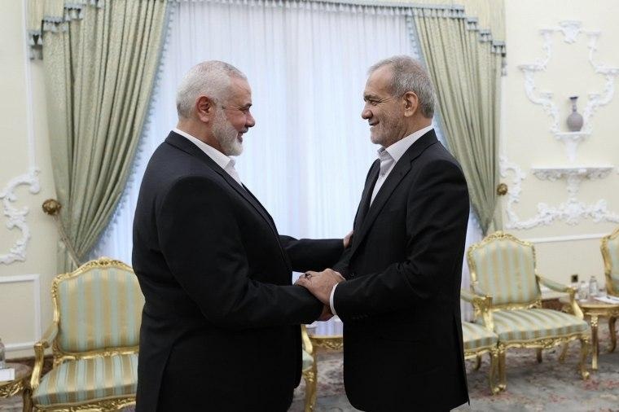
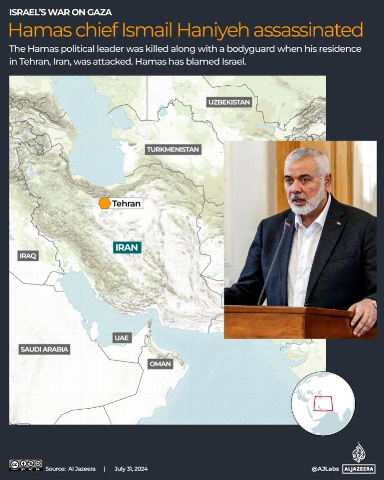

## Claim
Claim: "For the assassination on July 31, 2024, Israeli intelligence tracked Hamas leader Ismail Haniyeh through WhatsApp."

## Actions
```
image_search("Ismail Haniyeh WhatsApp")
image_search("Israeli intelligence Hamas leader assassination July 31 2024")
```

## Evidence
### Evidence from `image_search`
Le Monde reports on the assassination of Hamas chief Ismail Haniyeh (). The Tehran Times reports that Ismail Haniyeh used WhatsApp (). An NBC News article discusses the killing of Hamas leader Ismail Haniyeh ().

Sources: [Le Monde](https://www.lemonde.fr/en/international/article/2024/07/31/hamas-chief-ismail-haniyeh-assassinated-in-tehran_6705742_4.html), [Tehran Times](https://www.tehrantimes.com/news/502689/Ismail-Haniyeh-used-WhatsApp-just-before-assassination-son-says), [NBC News](https://www.nbcnews.com/news/world/hamas-chief-ismail-haniyeh-killed-israeli-airstrike-iran-hamas-says-rcna164425).


### Evidence from `image_search`
The PBS article ([Source](https://www.pbs.org/newshour/world/killing-of-hamas-leader-ismail-haniyeh-by-alleged-israeli-strike-threatens-escalation)) and the CNN article ([Source](https://www.cnn.com/world/live-news/hamas-political-leader-haniyeh-killed-iran-07-31-24)) both contain images of Ismail Haniyeh (, ).

Al Jazeera ([Source](https://www.aljazeera.com/news/2024/7/31/hamas-chief-ismail-haniyeh-killed-in-iran-what-to-know-whats-next)) reports that Hamas chief Ismail Haniyeh was assassinated on July 31, 2024, in Tehran, Iran ().


## Elaboration
The Tehran Times reports that Ismail Haniyeh used WhatsApp. Al Jazeera reports that Haniyeh was assassinated on July 31, 2024. However, the evidence does not explicitly state that Israeli intelligence tracked Haniyeh through WhatsApp for the assassination.

Therefore, the claim cannot be fully verified with the provided evidence. More information is needed to confirm whether Israeli intelligence used WhatsApp to track Haniyeh.


## Actions
```
image_search("Israeli intelligence WhatsApp tracking Ismail Haniyeh")
```

## Evidence
### Evidence from `image_search`
From [Source](https://www.latimes.com/world-nation/story/2024-07-31/killing-of-hamas-leader-likely-to-derail-gaza-peace-talk-inflame-regional-tensions): 
Content: The Los Angeles Times reports on the killing of Hamas leader Ismail Haniyeh. 


## Elaboration
The Los Angeles Times reports on the killing of Hamas leader Ismail Haniyeh. However, the new evidence still does not provide any information about Israeli intelligence tracking Haniyeh via WhatsApp.

The claim remains unverified due to a lack of evidence.


## Actions
```
image_search("Israeli intelligence methods Hamas leader assassination")
```

## Evidence
### Evidence from `image_search`
From [Source](https://www.nbcnews.com/news/world/israel-mossad-assassinates-enemies-munich-olympics-hamas-rcna132908): 
Content: NBC News discusses Israeli intelligence assassinating enemies. 


## Elaboration
The NBC News article discusses Israeli intelligence assassinating enemies. However, the evidence still does not provide any information about Israeli intelligence tracking Haniyeh via WhatsApp.

The claim remains unverified due to a lack of evidence.


## Final Judgement
The evidence confirms that Ismail Haniyeh was assassinated on July 31, 2024, and that he used WhatsApp. However, there is no evidence to support the claim that Israeli intelligence tracked him through WhatsApp for the assassination. Therefore, the claim is not factually accurate. `false`

### Verdict: FALSE

### Justification
The evidence confirms that Ismail Haniyeh was assassinated on July 31, 2024, and that he used WhatsApp, as reported by the [Tehran Times](https://www.tehrantimes.com/news/502689/Ismail-Haniyeh-used-WhatsApp-just-before-assassination-son-says) and [Al Jazeera](https://www.aljazeera.com/news/2024/7/31/hamas-chief-ismail-haniyeh-killed-in-iran-what-to-know-whats-next). However, the provided sources do not offer any information to support the claim that Israeli intelligence tracked Haniyeh through WhatsApp for the assassination.
