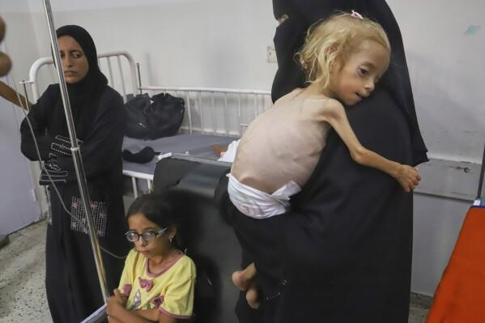
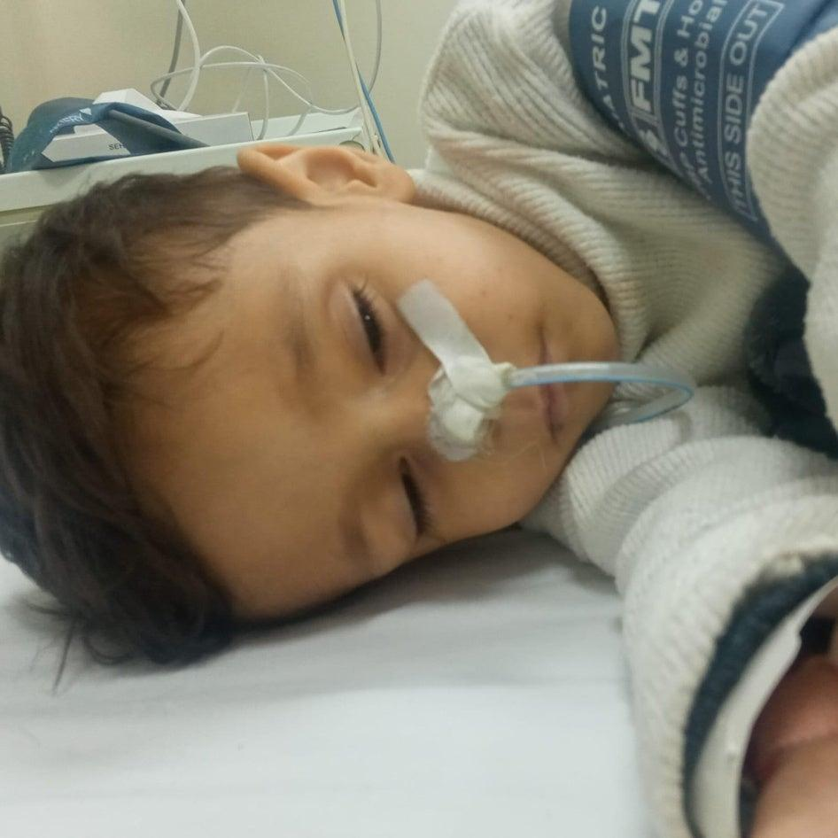
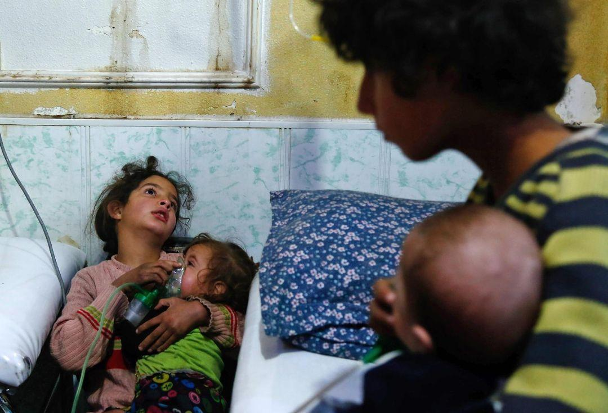

## Claim
Claim: " This image shows a Palestinian girl in the Gaza war in July 2024. She was holding her sister's oxygen mask inside the ambulance. She had already passed away, yet her hand remained on the mask firmly."

## Actions
```
reverse_search()
image_search("Palestinian girl Gaza war oxygen mask")
```

## Evidence
### Evidence from `reverse_search`
The image 

### Evidence from `image_search`
From [Source](https://www.bbc.com/news/world-middle-east-68141039): 
Content: The BBC News website contains an image of a baby in an incubator. 


## Elaboration
The reverse image search did not provide any additional information. The image search found a BBC News article with a picture of a baby in an incubator. The provided evidence does not verify the claim. More information is needed to verify the claim.


## Actions
```
image_search("Gaza war children oxygen mask")
```

## Evidence
### Evidence from `image_search`
The search results include images of children receiving medical attention in Gaza. One image is from euromedmonitor.org (), another is from an Associated Press article (), and a photo gallery from Al Jazeera () also features children.


## Elaboration
The image search results show children in Gaza receiving medical attention, including oxygen masks. However, none of the images match the original claim's description. The evidence does not verify the claim. More information is needed to verify the claim.


## Actions
```
image_search("Gaza children holding oxygen mask")
```

## Evidence
### Evidence from `image_search`
The Associated Press article ([https://apnews.com/article/israel-palestinians-gaza-hospitals-hunger-famine-hamas-war-214626e2038bff28618fd964b2e9c539](https://apnews.com/article/israel-palestinians-gaza-hospitals-hunger-famine-hamas-war-214626e2038bff28618fd964b2e9c539)) contains an image of a child in a hospital . Human Rights Watch ([https://www.hrw.org/report/2024/09/30/they-destroyed-what-was-inside-us/children-disabilities-amid-israels-attacks-gaza](https://www.hrw.org/report/2024/09/30/they-destroyed-what-was-inside-us/children-disabilities-amid-israels-attacks-gaza)) includes an image of a child with a nasal cannula . The website belux.edmo.eu ([https://belux.edmo.eu/photo-of-syrian-girl-holding-babys-oxygen-mask-misrepresented-online/](https://belux.edmo.eu/photo-of-syrian-girl-holding-babys-oxygen-mask-misrepresented-online/)) discusses the misrepresentation of the image .


## Elaboration
The image search results include the image in the claim. The website belux.edmo.eu discusses the misrepresentation of the image. The claim is not verified.


## Final Judgement
The image in the claim has been misrepresented. The website belux.edmo.eu discusses the misrepresentation of the image. The claim is not factually accurate.

`false`

### Verdict: FALSE

### Justification
The image in the claim has been misrepresented, as indicated by the fact-check. The website [belux.edmo.eu](https://belux.edmo.eu/photo-of-syrian-girl-holding-babys-oxygen-mask-misrepresented-online/) discusses the misrepresentation of the image. Therefore, the claim is not factually accurate.
