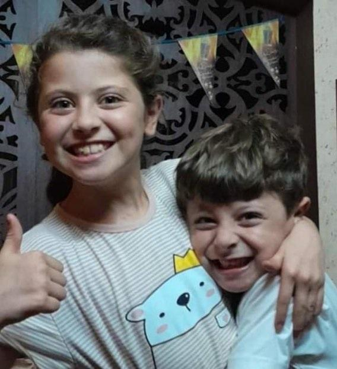
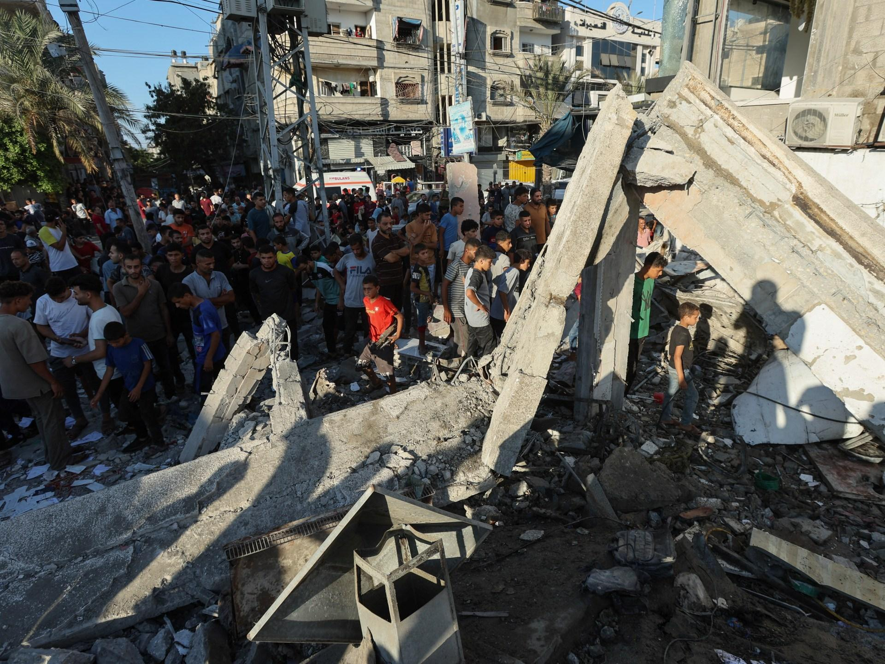
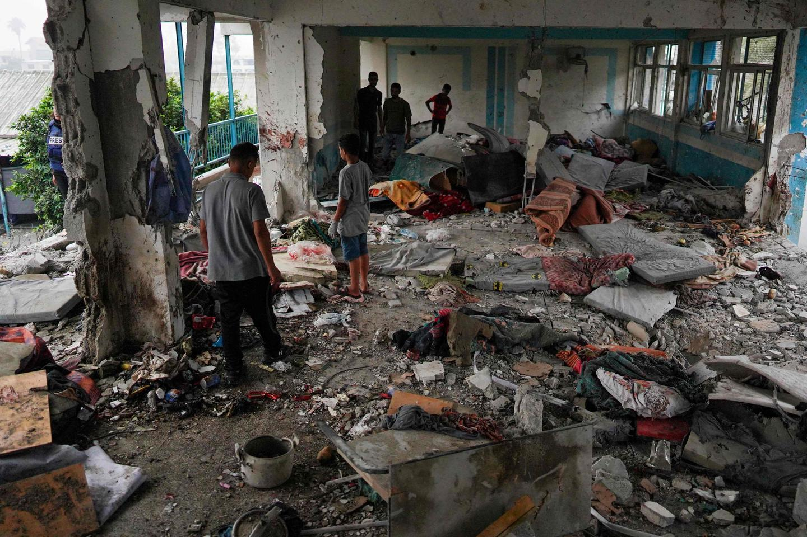

## Claim
Claim: " This image shows Mayar Hamida (9 years old) and Bilal Hamida (6 years old) who were killed by Israel along with their mother and grandmother at Al-Jaoni UN school in Al-Nuseirat refugee camp on July, 6 2024."

## Actions
```
reverse_search()
```

## Evidence
No new evidence found.

## Elaboration
There is insufficient information to verify the claim. The reverse image search did not yield any results. Therefore, the claim cannot be verified.


## Actions
```
image_search("Mayar Hamida Bilal Hamida killed Israel")
image_search("Al-Jaoni UN school Al-Nuseirat refugee camp July 6 2024")
```

## Evidence
### Evidence from `image_search`
The Human Rights Watch report from September 5, 2007, includes an image of a man holding a framed photo.  The search result from Palinfo.com contains an image of two children. 

The provided links are: [Source](https://www.hrw.org/report/2007/09/05/why-they-died/civilian-casualties-lebanon-during-2006-war) and [Source](https://english.palinfo.com/Zionist-Terrorism/2023/11/18/82751/).


### Evidence from `image_search`
Al Jazeera reports that an Israeli attack on a UN school used as a shelter in Gaza killed at least 16 people on July 6, 2024. ([https://www.aljazeera.com/news/2024/7/6/israeli-attack-on-un-school-used-as-shelter-in-gaza-kills-at-least-16](https://www.aljazeera.com/news/2024/7/6/israeli-attack-on-un-school-used-as-shelter-in-gaza-kills-at-least-16)) 

Le Monde reports on an Israeli airstrike in central Gaza that wiped out a shelter in an UNRWA school. ([https://www.lemonde.fr/en/international/article/2024/06/07/israeli-airstrike-in-central-gaza-wipes-out-shelter-in-unrwa-school_6674107_4.html](https://www.lemonde.fr/en/international/article/2024/06/07/israeli-airstrike-in-central-gaza-wipes-out-shelter-in-unrwa-school_6674107_4.html)) 


## Elaboration
The evidence confirms that an Israeli attack on a UN school used as a shelter in Gaza occurred on July 6, 2024, resulting in casualties. However, the evidence does not explicitly mention Mayar Hamida and Bilal Hamida or the Al-Jaoni UN school in Al-Nuseirat refugee camp. The image search did yield an image of two children, but it is not confirmed to be the same children mentioned in the claim.

Therefore, while the date and location of the attack are confirmed, the specific details about the children and the school in the claim remain unverified. Further investigation is needed to confirm the identities of the children and the specific location mentioned in the claim.


## Actions
```
image_search("Mayar Hamida Bilal Hamida Al-Jaoni UN school Al-Nuseirat")
```

## Evidence
No new evidence found.

## Elaboration
The evidence confirms that an Israeli attack on a UN school used as a shelter in Gaza occurred on July 6, 2024, resulting in casualties. However, the evidence does not explicitly mention Mayar Hamida and Bilal Hamida or the Al-Jaoni UN school in Al-Nuseirat refugee camp. The image search did not yield any results.

Therefore, while the date and location of the attack are confirmed, the specific details about the children and the school in the claim remain unverified. Further investigation is needed to confirm the identities of the children and the specific location mentioned in the claim.


## Final Judgement
The fact-check reveals that while an Israeli attack on a UN school in Gaza on July 6, 2024, is confirmed, the specific details about Mayar Hamida, Bilal Hamida, and the Al-Jaoni UN school in Al-Nuseirat refugee camp remain unverified. The image search did not yield any results.

The claim cannot be verified due to the lack of evidence confirming the specific details about the children and the school. `false`

### Verdict: FALSE

### Justification
The claim cannot be verified. While an Israeli attack on a UN school in Gaza on July 6, 2024, is confirmed by sources like [Al Jazeera](https://www.aljazeera.com/news/2024/7/6/israeli-attack-on-un-school-used-as-shelter-in-gaza-kills-at-least-16) and [Le Monde](https://www.lemonde.fr/en/international/article/2024/06/07/israeli-airstrike-in-central-gaza-wipes-out-shelter-in-unrwa-school_6674107_4.html), the specific details about Mayar Hamida, Bilal Hamida, and the Al-Jaoni UN school in Al-Nuseirat refugee camp remain unverified.
