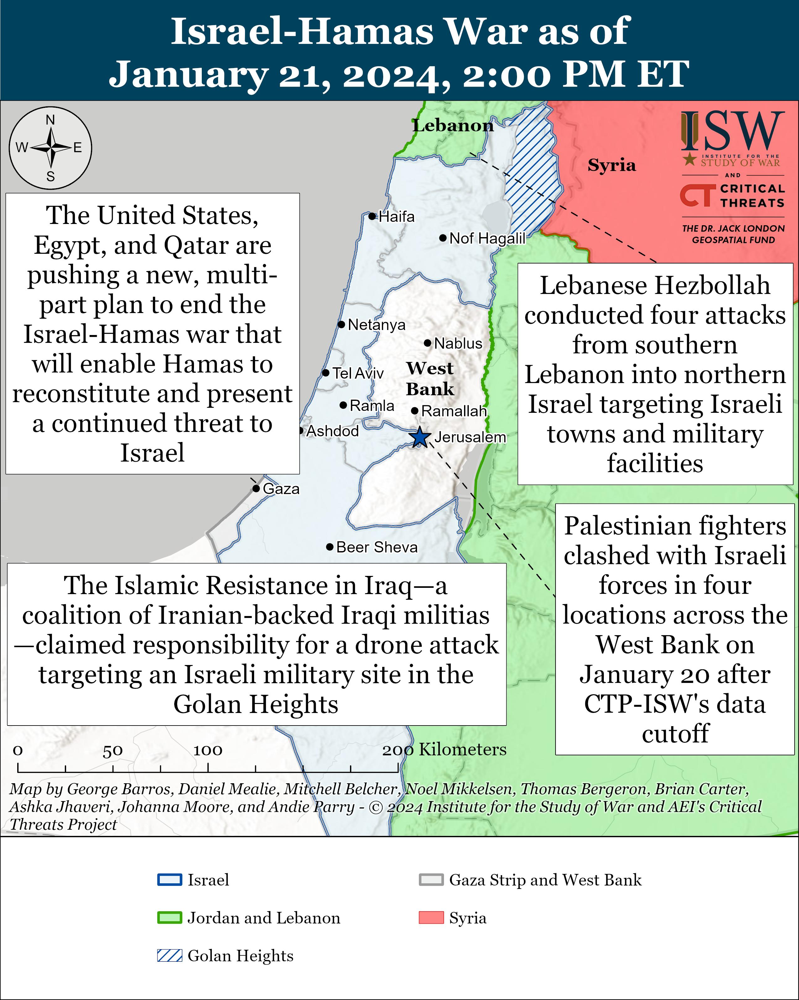
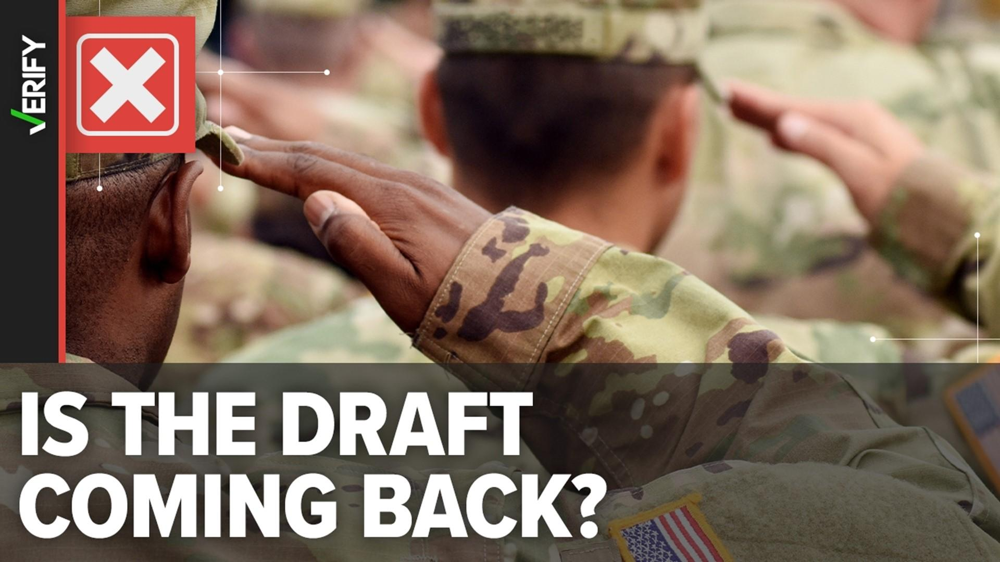

## Claim
Claim: "The US reinstituted draft in 2024 for the Israel-Hamas war."

## Actions
```
image_search("US draft 2024 Israel-Hamas war")
```

## Evidence
### Evidence from `image_search`
One source from RAND does not contain any content. Another source from the Institute for the Study of War and AEI's Critical Threats Project, dated January 21, 2024, provides a map of the Israel-Hamas war, and states that the United States, Egypt, and Qatar are pushing a plan to end the war . A third source from WGRZ.com includes an image with the text "IS THE DRAFT COMING BACK?" .

*   [https://www.rand.org/pubs/commentary/2024/07/the-return-of-the-military-draft.html](https://www.rand.org/pubs/commentary/2024/07/the-return-of-the-military-draft.html)
*   [https://www.understandingwar.org/backgrounder/iran-update-january-21-2024](https://www.understandingwar.org/backgrounder/iran-update-january-21-2024)
*   [https://www.wgrz.com/article/news/verify/israel-hamas-war/no-us-military-draft-executive-order-israel-hamas-war-fact-check/536-e5115746-d86f-45a1-bf43-f180d76f13e0](https://www.wgrz.com/article/news/verify/israel-hamas-war/no-us-military-draft-executive-order-israel-hamas-war-fact-check/536-e5115746-d86f-45a1-bf43-f180d76f13e0)


## Elaboration
The evidence suggests that the US has not reinstituted the draft in 2024 for the Israel-Hamas war. One source includes an image with the text "IS THE DRAFT COMING BACK?" ([https://www.wgrz.com/article/news/verify/israel-hamas-war/no-us-military-draft-executive-order-israel-hamas-war-fact-check/536-e5115746-d86f-45a1-bf43-f180d76f13e0](https://www.wgrz.com/article/news/verify/israel-hamas-war/no-us-military-draft-executive-order-israel-hamas-war-fact-check/536-e5115746-d86f-45a1-bf43-f180d76f13e0)), which implies that the draft is not in effect. Another source from RAND does not contain any content. The third source provides a map of the Israel-Hamas war, but it does not mention the draft.


## Final Judgement
The evidence indicates that the US has not reinstituted the draft in 2024 for the Israel-Hamas war. The search results include a source that directly addresses the question of a draft and states that it is not in effect.

`false`


### Verdict: FALSE

### Justification
The claim is false. Evidence from a WGRZ.com article ([https://www.wgrz.com/article/news/verify/israel-hamas-war/no-us-military-draft-executive-order-israel-hamas-war-fact-check/536-e5115746-d86f-45a1-bf43-f180d76f13e0](https://www.wgrz.com/article/news/verify/israel-hamas-war/no-us-military-draft-executive-order-israel-hamas-war-fact-check/536-e5115746-d86f-45a1-bf43-f180d76f13e0)) directly addresses the question of a draft and states that it is not in effect.
