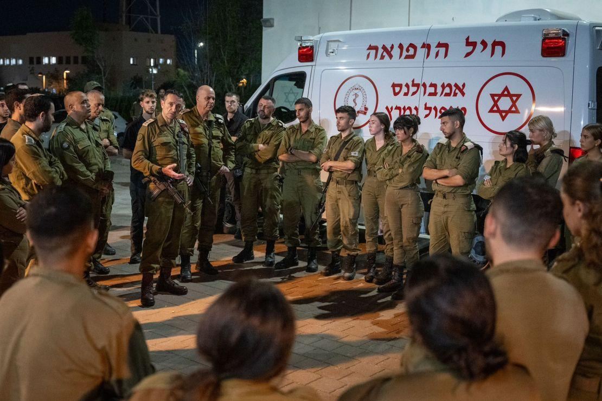
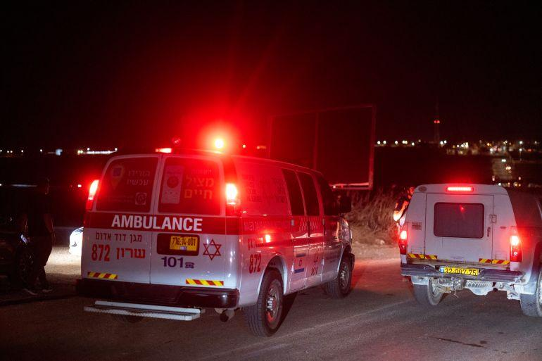
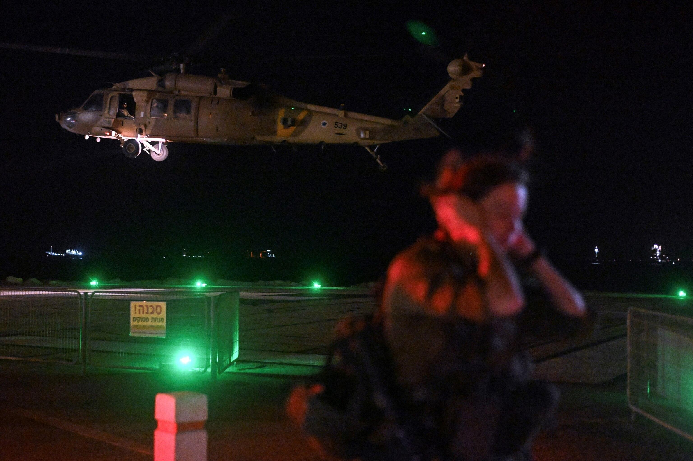

## Claim
Claim: "The chief of the Israeli Defense Forces (IDF), Herzi Halevi, was assassinated in a Hezbollah drone attack on an Israeli military base on October 13, 2024."

## Actions
```
image_search("Herzi Halevi Hezbollah drone attack October 13 2024")
```

## Evidence
### Evidence from `image_search`
CNN published an image of Herzi Halevi with other soldiers (). Al Jazeera reports on a Hezbollah drone attack on an Israeli military site on October 13, 2024, which wounded more than 60 people (). ABC News contains an image of a helicopter ().

Sources: [CNN](https://www.cnn.com/2024/10/14/middleeast/hezbollah-attack-israel-weaknesses-drones-intl-cmd), [Al Jazeera](https://www.aljazeera.com/news/2024/10/13/more-than-60-wounded-in-hezbollah-drone-attack-on-israeli-military-site), [ABC News](https://abcnews.go.com/International/live-updates/israel-hamas-hezbollah?id=114770972&entryId=114771236).


## Elaboration
The evidence suggests a Hezbollah drone attack on an Israeli military site on October 13, 2024, which resulted in injuries. However, there is no information in the provided evidence to confirm that Herzi Halevi was assassinated in the attack. The CNN image shows Herzi Halevi with other soldiers, but it does not provide any context about the date or location.


## Final Judgement
The search results confirm a Hezbollah drone attack on an Israeli military site on October 13, 2024, but do not provide any information about the assassination of Herzi Halevi.

Since the evidence does not confirm the claim that Herzi Halevi was assassinated, the claim is considered false. `false`


### Verdict: FALSE

### Justification
While there was a Hezbollah drone attack on an Israeli military site on October 13, 2024, as reported by [Al Jazeera](https://www.aljazeera.com/news/2024/10/13/more-than-60-wounded-in-hezbollah-drone-attack-on-israeli-military-site), the provided evidence does not support the claim that Herzi Halevi was assassinated in the attack.
